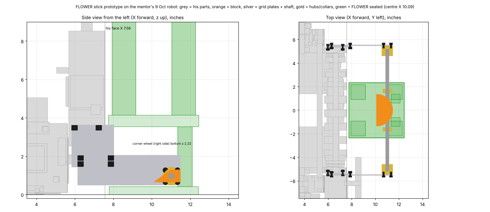

# FLOWER stick prototype: fixed, on the mentor's robot (issue #179)

A quick test of the FLOWER extractor before we build the folding one (`cad/intake-b/` §3). It's the ramp-hook FLOWER
block (`cad/ramp-hook/`) on an 8 mm REX shaft across his front. The shaft is held at both ends by goBILDA Hyper Hubs on
goBILDA grid plates, and the plates bolt to holes his front uprights already have: **no drilling, no cutting.** It
doesn't fold.

Checked on 10 Oct against his 9 Oct Robot.step with `tools/robot-cad/module_check.py flower_stick` and
`flower_stick_seated`. Nothing clashes: the only contact is a POLLEN staged in his CAD. Seated on a FLOWER
(`tools/robot-cad/flower.py`), the FLOWER touches only the block, with its lower bracket 0.17 in ahead of his roller.

| | |
|---|---|
| Shaft | X 11.02, z 0.96 (X 11.33 with the forward reach) |
| Block tip | X 11.49: 3.93 in ahead of his face |
| FLOWER seated | its centre 2.53 in ahead of his face (X 10.09) |
| Robot length | **19.52 in. Breaks the 18 in start (R102)**; deployed it's inside 18 × 24 in (R105) |
| Lowest part | the B plates and hubs, 0.49 in off the tiles |
| Under his corner wheel | the right B plate's top is z 2.06; the wheel's bottom is 2.22 |

**This is a practice-field part only.** It can't start a match. The folding version is the one that does.

## Parts

All goBILDA, all checked on gobilda.com on 10 Oct.

| Part | SKU | Qty |
|---|---|---|
| Grid plate 7 × 7 (56 × 56 mm), plate A | 1116-0056-0056 | 2 |
| Grid plate 5 × 17 (40 × 136 mm), plate B | 1116-0040-0136 | 2 |
| Hyper Hub, 8mm REX bore, clamping | 1310-0016-4008 | 2 |
| 8mm REX shaft, 264 mm, uncut | 2106-4008-2640 | 1 |
| Clamping collar, 8mm REX, 9 mm long | 2910-0920-4008. Any 8mm REX collar from stock works: the discontinued 10 mm 2910-1020-4008, or a 2920 set-screw collar. They only back up the block's set screws. | 2 |
| M4 × 12 socket head | 2800-0004-0012 | 12 |
| M4 × 8 socket head (B into the hubs) | 2800-0004-0008 | 8 |
| M4 nylon-insert lock nut | 2812-0004-0007 | 12 |
| M3 self-tapping set screws, about 6 mm (2 per block) | any | 6 |

**Print** (PETG, 5 walls, 40 % infill; settings as in `cad/ramp-hook/README.md`):
- `stl/block_060.stl`, `block_065.stl`, `block_070.stl`: the same block with its bottom 0.60, 0.65 or 0.70 in off
  the tiles (top 1.25, 1.30, 1.35). The shaft hole is at the same height in all three, so **swapping blocks is the
  height adjustment.**
- `cad/ramp-hook/fit_coupon.stl` first, so the bore fits the shaft.
- `block_070` has only 2.5 mm of plastic under the shaft. Print it, but expect it to be the one that cracks.

## Build

Grid positions count goBILDA's 8 mm holes. On each upright's web, use the two **4 mm holes 0.63 in above the
upright's bottom end**: these are at X 5.98 and X 7.24, z 3.48. The flaps module uses the same two holes; you can't
fit both at once.

1. **Plate A on each upright's web, outside face.** Put A's top-row holes 1 and 5 on the web's two holes. A hangs
   below the upright (to z 1.43), and its front edge is 0.47 in past his face. Fit 2 × M4 × 12 from outside, with
   lock nuts inside the channel, flats up and down. His Dual Block sits about 0.3 mm below the nuts.
2. **Plate B outside A,** lengthwise front to back. Line up B's top two rows on A's bottom two rows, with B's rear
   column on A's column 2. Fit 4 × M4 × 12 (A's columns 2 and 7), nuts on A's inside face. B now runs forward under
   the corner wheel.
3. **Hubs.** Put each Hyper Hub on B's inside face, on B's 2nd row from the bottom, 2nd column from the front.
   Fit 4 × M4 × 8 from outside into the hub's tapped holes. Don't clamp the hubs yet.
4. **Shaft and block.** Slide the shaft through one hub, then a collar, the block (curved face forward), a collar,
   and into the other hub. Centre the block. Clamp both hubs. Tighten the block's 2 M3 set screws onto the shaft's
   flats, square to the tiles. Push the collars against the block's sides and clamp them. They're backups for the
   set screws, and they sit just outside the FLOWER's grey uprights.
5. **Check on a tile:** block bottom 0.60 to 0.70 in, top 1.25 to 1.35 in, flat top level. The B plates, hubs and
   shaft must all be 0.45 in or more off the tiles. Spin the corner wheel by hand over the right B plate.

**Adjustments built in:**
- **Height:** swap the printed block (0.60 / 0.65 / 0.70). Rocking the block a few degrees on its set screws also
  trims the front edge's height.
- **Reach:** move B forward one column on A, and the hub stays on B's same holes. The block goes 8 mm forward
  (`REACH=1 python3 build.py`). That puts the FLOWER's bracket 0.49 in ahead of his roller instead of 0.17, at the
  cost of 8 mm more roll back to the roller. Checked clear too.
- **Sideways:** loosen the collars and set screws and slide the block along the shaft.

## Check on the robot before you build

These need the real robot; none are guesses in the drawing.

- [ ] His CAD has two loose **M4 hex screws just below each upright, at X 6.0, z 1.6 and 2.2**, heads out to |Y| 5.46,
      with nothing visible for them to hold. They fall exactly on plate A's column-1 holes. If they're on the robot,
      swap each for one 4 mm longer, through A. Their hex heads then sit at B's rear edge, so use button heads
      (2802 series). If they aren't, ignore this.
- [ ] Room inside each upright for the lock nuts on the two z 3.48 holes (his Dual Block sits about 0.3 mm below).
      If one won't seat, use a plain M4 hex nut, which is thinner.
- [ ] The bottom of the right corner wheel is 0.16 in above the right B plate. Check it at full travel.
- [ ] Is anything mounted on the outside of either upright's web that the CAD doesn't show? Look for wires and
      the flaps.
- [ ] Measure the robot's front-to-back length with the stick on. It should be about 19.5 in.

## Test on the practice field

A FLOWER loaded with 4 POLLEN, staged the way the match stages them. Drive in under driver control, slowly, until the
block stops on the grey uprights. Stay there, with the intake roller running. Film from the side at 60 fps or more.

| Set | Approach | Runs |
|---|---|---|
| A | centred, square | 20 |
| B | 1 in off-centre, left | 10 |
| C | 1 in off-centre, right | 10 |
| D | 2° yawed, CCW | 10 |
| E | 2° yawed, CW | 10 |

For each run, record:
- the block used (060 / 065 / 070), the reach (0 / 1) and the set;
- **POLLEN out**: 0 to 4, counted at the roller;
- **time**, from the block touching the uprights to the last POLLEN at the roller. Read it off the video. The model
  says about 1.2 s;
- whether the robot ended centred (the curved front should pull it in), and anything that caught: the ring's lip,
  the collars on the uprights, a POLLEN wedged under the bracket.

Run set A with `block_065` first. If set A empties at least 19 of 20, run B to E. If it doesn't, try 070 and then 060
before changing anything else. Then try the forward reach on whichever block did best.

- **Size rules:** fixed, the robot is about 19.5 in long, so it can't start a match (R102, 18 in). Once moving it's
  within 18 × 24 in (R105). The folding version (`cad/intake-b/`) stows to 17.96 in.
- **What to bring back:** the table, and a measurement of the real FLOWER's pocket edge (the base plate's
  thickness). That's the number `doc/ramp-hook.md` says decides a short block against a long one.

## Files

- `build.py`: the module, in his robot's frame. It writes `flower-stick-proto.step` (insert at the origin of his
  Onshape assembly) and the block STLs. `BLOCK=060|065|070` and `REACH=0|1` pick the variant.
- `proto.png`: the picture above, drawn from his Robot.step.
- `block_template.pdf` (`template.py`): a 1:1 paper template for cutting the block from 3/4 in plywood, hardwood or HDPE when there is no printer.
- To re-check: `python3 tools/robot-cad/module_check.py Robot.step flower_stick_seated`, run from a scratch folder.
