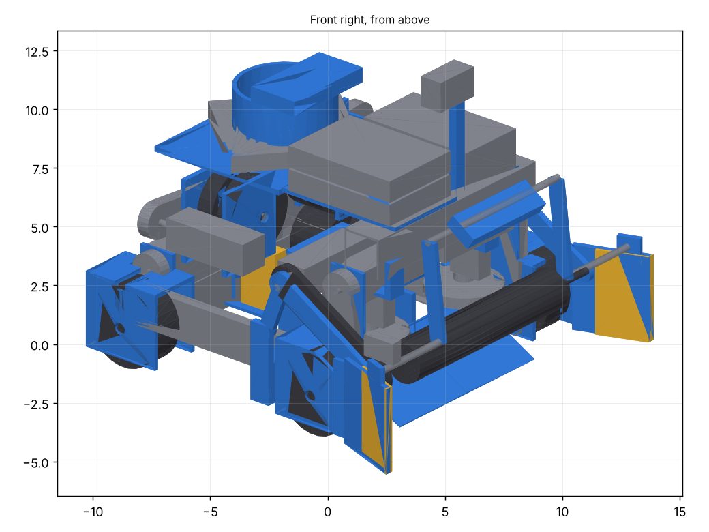
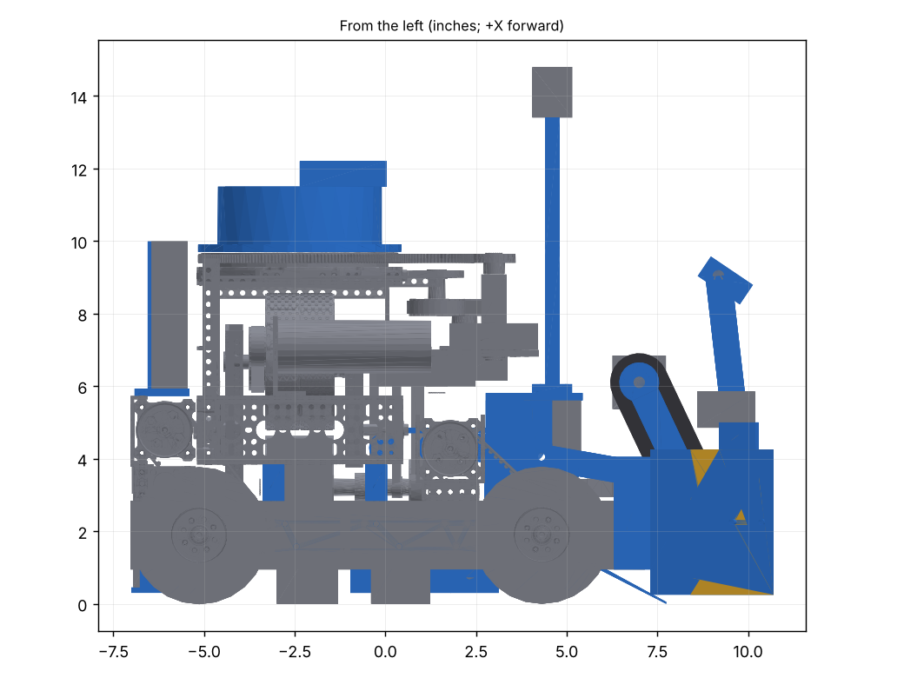

# The printed clean-sheet robot: layout v1 (10 Oct 2026)

Issue #172. The concept and its reasoning are in [doc/printed-chassis.md](../../doc/printed-chassis.md). This is the
layout CAD: every module at its real size and place, checked for clashes. The mentor's own goBILDA launcher and drive
corners are in it, placed by their axles. **Screws, gear teeth, springs and the lane's drive belt are not drawn yet**
(v2). Nothing here is built.

    python3 cad/printed-chassis/build.py          # checks, then writes printed-chassis.step, stl/, parts.md, views/
    CHECK_ONLY=1 python3 cad/printed-chassis/build.py

Frame: +X forward, +Y left, +Z up, inches, origin on the floor under the body's centre; the STEPs are in millimetres.

**The mentor's modules.** His launcher (with `cad/transfer`'s changes) and his four drive corners come from the CAD
chat's exports on `claude/robotics-meeting-notes-lq2y55` (`cad/modules/launcher-module`, `cad/modules/drive-module`).
They're too big for this branch, so two scripts convert them into a local cache (`.cache/`, not in git), and the build
uses them when they're there:

    git show origin/claude/robotics-meeting-notes-lq2y55:cad/modules/launcher-module/launcher-module.step.gz | gunzip > /tmp/lm.step
    git show origin/claude/robotics-meeting-notes-lq2y55:cad/modules/drive-module/drive-module.step.gz | gunzip > /tmp/dm.step
    cd cad/printed-chassis && python3 launcher_module.py /tmp/lm.step && python3 drive_module.py /tmp/dm.step

Without the cache, the build draws its own stand-ins (the earlier printed launcher and goBILDA corners), which this
README no longer describes.

## What the checks say

| Check | Result |
|---|---|
| Starting outline (R102) | **17.73 × 17.75 in**, 14.8 in tall: designed 1/8 in a side inside the 18 in cube, for print error, soft faces, screw heads and cables (v2's screws must stay inside it too). The flap tips are the front; the electronics rack and the rear drive mounts the back. Nothing deploys but the extractor. |
| Extractor down (R105) | 20.2 in front to back, of 24 |
| Width behind the face | 15.24 in: nothing behind the face is wider (his shafts' ends at ±7.62) |
| Static clashes | none, with his launcher and corners in (shafts in their own hubs, belts on their own pulleys and bolted faces excepted, by name in `ALLOWED`; his modules' own parts aren't checked against each other) |
| The roller rising 1.3 in on its swing arms | clear at 0, 0.33, 0.65, 1.0 and 1.3 in; the axle moves at most 0.06 in forward |
| The extractor, every 10° from down to stowed, roller down and up | clear |
| A NECTAR and a POLLEN on their path (the mouth's edges where they meet the stars, the lane, the column, the turret's bore, the hood) | touch only what should: roller, stars, floor, lane rollers, ceiling, his feeder, pad and flywheels, the hood's lid |
| A NECTAR rolling in across the roller's width | clear of the extractor and the flaps; 0.72 in under the extractor's stub shafts |
| The 4-piece count | roller axle to his backstop 12.43 in, inside the 12.26 to 12.60 window. The backstop sits on ±0.2 in slots, which reach 12.23 to 12.63, so it's set on the robot with real pieces |
| Printed parts within 180 mm each way | all fit (room for a brim on a 210 mm bed, and less warp). Big flat parts are printed in two halves and bolted |

## In Onshape

`printed-chassis.step` (in git, small) holds our parts. The whole robot with his launcher and corners is about 340 MB,
too big for git: the build writes it as `.cache/printed-chassis-full.step.gz`, to share through the team's Drive.

1. **Create → Document → Import** the STEP. Leave **Flatten assembly off**.
2. Right-click **FRAME - fix** → **Fix**, then lock each **MOVES** group (the lock icon at the right of its row).
3. Add the mates the groups' names give (`cad/full-robot/ONSHAPE.md`, section 2, explains Revolute mates):

| Group | Mate | Limits |
|---|---|---|
| MOVES 1 intake arms | Revolute about the arms' pivot (on the front bracket, Y axis) | 0 to 18° (the roller rises 1.3 in) |
| MOVES 2 extractor | Revolute about the stub shafts | 0 (down) to 146° (stowed, as drawn) |
| MOVES 3 to 6 wheels | Revolute on each wheel's shaft | none |
| MOVES 7 and 8 star wheels | Revolute on each star's vertical shaft | none |

Colours: blue is printed, grey is bought, yellow is a soft face (TPU or foam).

## Layout

| | Where | Notes |
|---|---|---|
| Rails | goBILDA 1121 low-side, 360 mm (14 hole), webs at \|Y\| 5.35 (his track), their holes at the axles' height, front ends 0.15 in behind the face | 0.15 in back so his rear motors clear his launcher's rear channel |
| Drive corners (the mentor's) | his corner exactly, each placed by its axle: the 72 mm shaft in a 1309 hub in the rail's web and in bearings in the wheel's pattern plates, its 24T pulley outboard of the wheel, the 435 RPM motor lying along Y on the rail's top, clamped in a 1-hole U-channel mount (front) or 1201 mounts and a 1107 cross channel (rear) | axles X 5.26 and −5.13, wheelbase 264 mm (11 rail holes; his is 240). His right corners differ from his left (FR's motor 0.74 in further forward, its shaft 0.1 in further out), so both right corners are mirrors of his left ones: one design, four times |
| Odometry pods | two goBILDA 4-bar pods (96 mm wheel version), both on the right, on printed adapters inside the rail | the left side under the launcher has its feeder belt and gate servo |
| Flaps | root blocks at the front corners, ahead of the wheels and bolted to the rails' ends; tips at X 10.7, Y ±8.875 (3.4 in ahead, 1.255 in out) | PETG-CF, 6 mm; they are also the extractor's side plates. Their soft face is a separate plate on three M3 screws (TPU on a PETG backer; bare PETG or foam for the drop test) |
| Roller | goBILDA 48 mm Gecko wheels, as the mentor's, ±4.35 in, axle 1.0 ahead of the face, 2.4 off the tiles | no vector wheels: his star wheels centre the pieces |
| Roller arms | inside the wheels, at \|Y\| 5.0 to 5.3 over the rails; pivot X 4.3, z 4.05, on the front brackets; the 1620 RPM motor on the right arm above the roller (275 mm belt) | inside the wheels because his belts run outside them; the pivot is level with the roller's mid-float, so it rises nearly straight up |
| Front brackets | printed, one a side, bolted to the front drive motor's U-channel mount | hang the star wheel's servo and carry the arm's pivot |
| Star wheels (the mentor's) | two 3.5 in flexible stars (SWYFT Intake Wheels, 30A, cut into 16 flaps) lying flat, 2.36 in behind the face, ±3.15 in (tips 2.80 apart, as his), at z 3.2: a NECTAR's middle, just over the rails | each driven from above by a continuous servo: a round 8 mm hardened shaft into his one-way needle clutch (HF081412), pressed into a printed hub that drives the star's hex adapter. The servo and its coupling are still TBD |
| Ramp and mouth floor | the whole mouth's width (±4.8, inside the rails), in halves | so a piece taken in off-centre climbs to the lane's height too, where the stars reach it |
| Lane | five TPU-roller shafts, walls at \|Y\| 1.86, a ceiling of free rollers from X −0.55 to 4.5 | the ball moves at the tread's speed, not half of it |
| Launcher (the mentor's) | his goBILDA launcher module with `cad/transfer`'s changes (flywheel motors out and up, the feeder on a yoke with its gate servo, the pad, the backstop, the turret servo and both encoders), placed by the launch column at X −2.37 | the turret's drive gear points forward, as his |
| Hood | printed, on the turret's top | a placeholder until the launcher rig settles its shape |
| Electronics | both hubs standing on edge in a printed rack on the rear motors' cross channel, plugs to the back (X −6.9 to −5.9, z 5.9 to 10.0); the battery on edge across the robot, low between the rails under that channel; the Limelight on a two-piece mast on the left front bracket, lens about 14 in up | his CAD has no electronics: **ask him where he wants them, and which battery the team uses** |

### What changed, and why

- **The mentor's launcher and drive corners, as he designed them.** The user chose goBILDA for the corners, flywheels
  and turret mount, and his launcher is a goBILDA module. Placed in this chassis, his launcher's side channels sit
  where an inboard drive belt would run; his corners avoid that with the pulley outside the wheel. So the corners are
  his too, and the intake arms moved inside the wheels.
- **The electronics moved to the back.** His turret drive and encoders point forward, through where the tray was.
  Standing the hubs on edge at the back puts their plugs where a person can reach them, and the battery sits low.
- **The lane's ceiling is free rollers, not a driven top run.** A ball on a moving tread under a ceiling that can't push
  back rides at the tread's speed; under a still foam ceiling it rolls at half.
- **The roller is the mentor's (48 mm Geckos) and his star wheels centre the pieces**; the stars are lifted to the
  lane's height by a ramp the whole mouth wide.
- **The flaps are PETG-CF with a swappable soft face.** The flap carries the extractor's stub, so it stays stiff.
- **The 17.75 in outline and parts within 180 mm** (the user's tolerances); the body-designs chat re-scored the outline:
  it costs nothing.

## Bought parts (sources)

goBILDA part numbers are from goBILDA's site (Oct 2026). Counts are for one robot. His launcher's and corners' parts
are in `cad/modules/launcher-module` and `cad/modules/drive-module` on the CAD chat's branch.

| Part | Source | Count | For |
|---|---|---|---|
| 1121-0014-0360 low-side U-channel, 360 mm | goBILDA | 2 | rails |
| The mentor's drive corners: 96 mm mecanum wheels, 72 mm shafts, 1309 hubs, 1611 bearings, 1504/1505 plates, 24T pulleys, 59T (front) and 55T (rear) belts, 435 RPM Yellow Jackets, 1-hole U-channel mounts, 1101/1106 plates, Quad Blocks, 1201 mounts, the 1107-0013-0336 rear channel | goBILDA | 4 corners | drive |
| The mentor's launcher module: the 3208-0004-0001 turret kit, 96 mm flywheels, channels and blocks, 6000 RPM motors, and `cad/transfer`'s feeder, gate servo, pad and backstop | goBILDA and printed | 1 | launcher |
| 2303-4008-0036 36T pinion, servo hub, 3412-0009-0295 belt, Speed servo | goBILDA | 1 each | turret drive and encoder B (`cad/modules/turret-kit`) |
| REV-11-1271 Thru-Bore encoder, OctoQuad | REV, Digital Chicken Labs | 2, 1 | turret angle |
| 3110-0001-0002 4-bar odometry pod | goBILDA | 2 | Pinpoint odometry |
| 5203-2402-0003 Yellow Jacket, 1620 RPM | goBILDA | 1 | roller and lane |
| 3417-4008-0024 24T HTD5 pulleys, 3412-0009-0275 belt | goBILDA | 2, 1 | roller |
| 3632-4008-0048 48 mm Gecko wheels | goBILDA | about 8 | the roller, as the mentor's |
| SWYFT Intake Wheel 3.5 in, 7 mm hex (SR-INTAKEWHEEL-35-7mm), cut into 16 flaps as the mentor's | swyftrobotics.com ($24.99 for 4) | 2 | centre pieces into the lane (30A TPE: squishy enough to squeeze a NECTAR 0.41 in a side; bench-check it) |
| One-way needle clutch HF081412 (8 x 14 x 12 mm drawn cup; the mentor's is Amazon Sankoly-US SK230309GZZC-6P) | Amazon | 2 (6-pack) | the star wheels' one-way drive, pressed into a printed hub (13.9-13.95 mm bore); CHECK with calipers and which way it free-wheels |
| 8 mm round hardened shaft (ground steel, h6), short | any (McMaster, Misumi) | 2 | the clutch runs on it: not REX |
| Continuous servos | as the mentor's (TBD) | 2 | drive the star wheels |
| 2000-0025-0002 Torque servo | goBILDA | 1 | extractor |
| 1611-0514-4008 flanged bearings, 8mm REX shafts and standoffs | goBILDA | stacks | roller, lane, extractor (`parts.md`) |
| 608 bearings | any | 8 | ceiling rollers |
| Foam, 1/2 in | any | | the flaps only if the drop test says TPU bounces |
| M3 / M4 heat-set inserts, M4 socket heads | any / goBILDA | | v2 counts them |

Every printed part is listed in `parts.md` with its material. The STLs in `stl/` are **v1 layout shapes, not ready to
print**: no screw holes, inserts, bores or ribs yet.

## Open (v2, and before anything is printed)

1. **Screws, inserts and service paths**, drawn and checked as `cad/intake-b` and `cad/transfer` do
   (`tools/robot-cad/fastener_check.py`), each module's way out checked; a build order; a two-robot parts list.
2. **For the mentor:** where the hubs and battery go (here: the back), which battery, how his launcher frame bolts down
   (his CAD shows it floating 1 in over the rails), and the star wheels' servo, shaft and adapter (the wheels are SWYFT's; the clutch is identified).
3. **The front of the frame.** Nothing ties the rails together at the front but the flaps' root blocks and the front
   brackets; v2 adds a cross member, or shows those are enough.
4. **The lane's round-belt drive and idler, the roller's spring, the ceiling's pins and bands**: as `cad/transfer`,
   redrawn on this frame.
5. **The hood's real shape**, from the launcher rig.
6. **CHECK items**: the hubs' and battery's sizes, the servo boxes, the pulleys' flange width.
7. **Rig tests** (doc/printed-chassis.md): the drop test (TPU, bare PETG, foam), the roller's grab rate, the free-roller
   lane's speed, and how far a star wheel's flaps bend under a NECTAR.
