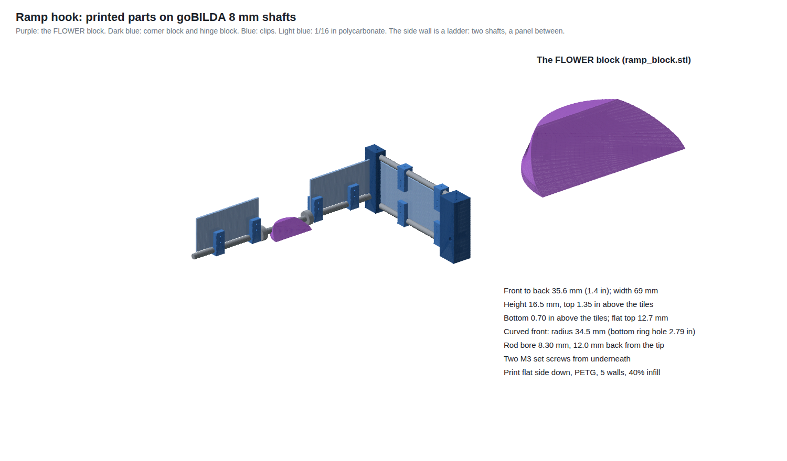

# Ramp hook: printed parts on a goBILDA 8 mm shaft

The whole ramp hook (`doc/ramp-hook.md`) from three goBILDA 8 mm shafts, 1/16 in polycarbonate and printed parts:

- **The front:** one shaft across the hook. The FLOWER block and the curtain clips thread onto it.
- **The side wall:** a ladder of two shafts, a bottom one and a top one, with a polycarbonate panel clipped
  between them. It's the hook's backbone: the block's push goes front shaft → corner block → side wall → hinge.
- **The corner block** joins the front shaft to the side wall's two shafts at the front-right corner.
- **The hinge block** holds the side wall's back ends at the chassis' front face and turns on a fourth shaft
  carried by the chassis, so the hook swings up to stow. Nothing here has been fitted to a
robot or a real FLOWER yet: print, test on Thursday, adjust the numbers at the top of `parts.py`, and print again.

## What's here

| File | What it is | Print |
|---|---|---|
| `ramp_block.stl` | The FLOWER block: 1.4 in front to back, 0.7 to 1.35 in above the tiles, curved front | 1 |
| `curtain_clip.stl` | Slides on a shaft and holds a panel in its slot: upright on the front shaft and the side wall's bottom shaft, flipped over on the top shaft | 8 |
| `corner_block.stl` | The front-right corner: the front shaft's end and both side-wall shafts, blind bores at three heights | 1 |
| `hinge_block.stl` | The side wall's back end; turns on an 8 mm hinge axle across the chassis' face | 1 |
| `end_block.stl` | Spare: holds a shaft end against goBILDA channel (M4, 16 mm apart), if the front shaft's left end needs one | 0 to 1 |
| `fit_coupon.stl` | Four short bores at 0.1 mm steps, to find your printer's fit on the shaft | 1, first |
| `parts.py` | Makes the STLs. Every size is a constant at the top | `pip install trimesh manifold3d shapely` |
| `render.py` | Draws the picture above | |

## Why it's shaped like this

- **The curved front** has a 34.5 mm radius, just inside the bottom ring's 2.79 in hole (manual, Fig 9-12). The
  two grey uprights stand at the back of the hole, with their inside corners about on its circle. So the curve
  nests between them: driving in, it touches both corners, which **centres the robot sideways and stops it at the
  right depth.**
- **The side section:** a front face up to 1.35 in, a 0.5 in flat top, then a slope down toward the robot. Driven
  against the uprights in `tools/ramp-hook/ramp.py`, it emptied all 4 POLLEN in every bounce guess, even stopped
  0.15 in short.
  - A taller front (1.6 in or more) shoves the bottom POLLEN back instead of lifting it.
  - Under about 1.25 in front to back, the model loses the last POLLEN back into the pocket.
  - That's a 2-D model, so try a shorter block on Thursday too.
- **The bottom is 0.7 in above the tiles,** 0.27 in over the bottom ring's 0.43 in, so it won't catch the lip. The
  model empties every case with the bottom anywhere from 0.6 to 0.85 in.
- **The shaft runs through the block,** 12 mm behind the tip, under the flat top, halfway up (1.02 in above the
  tiles). It can't run behind the block, because the POLLEN roll out over the block's back edge. Where the bare
  shaft passes the uprights, it's about 4 mm clear of their faces.

## Buy (goBILDA, or any 8 mm shaft)

Check part numbers and lengths on gobilda.com; these are the kinds of parts, not a parts list.

| Item | Notes |
|---|---|
| goBILDA 8 mm REX shafts: front 330–356 mm (stock 336), side wall 2 × 200–217 mm (stock 216), hinge axle about 60–70 mm (stock 64) | The bores are blind, so each shaft works over a range, and goBILDA's stock lengths fall inside it: no cutting. Their rounded corners sit on an 8 mm circle, so they slide in the round bores, and the set screws bite on a flat. Any 8 mm round shaft works too: cut it into the range, file the end and chamfer it |
| goBILDA 2000 Series servo, Torque version (about 25 kg·cm) | Turns the hinge axle 90° to stow. Holding the hook level takes about 7 kg·cm (about 0.5 kg, balance point 5.4 in out): 3.5× margin. The Speed version (about 9 kg·cm) is too close |
| goBILDA 4001 Series clamping servo-to-shaft coupler (25-tooth spline to 8 mm REX) | Joins the servo's spline to the hinge axle's inner end |
| goBILDA servo plate or bracket | Holds the servo against the chassis' front face with its spline on the hinge line. No printed mount unless no kit plate lands the spline there |
| 8 mm flanged bearing and a small bracket, 1 | On the chassis' right side, carrying the axle's outer end so the servo takes no side load |
| 2 to 4 goBILDA clamping collars for 8 mm REX | Either side of the block: they locate it sideways. Better than set screws alone |
| M3 screws: 2 set screws for the block, 3 for the corner block, 3 for the hinge block, 1 per clip, 2 per clip to clamp the panels | Self-tapping into the printed holes |
| 1/16 in polycarbonate: two curtain panels about 4.9 × 2.2 in, one side panel about 7 × 2.7 in | The curtains' tops are 3.5 in above the tiles, under the FLOWER's 3.55 in bracket. The side wall tops out at about 4 in |

## Print (send your friend this section and the STLs)

- **Fit coupon first.** Slide the shaft into its four bores and pick the one that's snug but slides. Change `FIT` in
  `parts.py` by the step that fitted (the bores are `FIT` − 0.1, `FIT`, + 0.1, + 0.2) and re-run. Or have your
  friend scale the bore in the slicer.
- **Material:** PETG (tough, a little give) or nylon. PLA cracks when the robot drives into the uprights.
- **Settings:** 0.2 mm layers, 5 walls, 40 % infill, 5 top and bottom layers. The block's walls around the shaft are
  about 4 mm, so wall count matters more than infill.
- **Orientation:** every STL is already flat side down. The block prints on its flat bottom with no supports. The
  bore is horizontal, so it will be a little oval at the top: the coupon tells you how much.
- **Units:** the STLs are in millimetres. If the block comes in at 1/25 or 25 times the size, the slicer guessed
  inches.

## Assemble

1. Push the side wall's two shafts into the hinge block's two bores, thread two clips on each (flip the top two
   over), and push the shafts' other ends into the corner block. Slide the side panel into the clips and screw it.
2. Thread the front shaft through two clips, a collar, the FLOWER block, a collar and two more clips, then into the
   corner block's sideways bore from the inside.
3. Line the FLOWER block up with the middle of the intake; tighten the collars and its set screws. Tighten the
   corner block's and hinge block's set screws.
4. Slide the curtain panels into the front clips and screw them.
5. Mount the servo against the chassis' front face, about 3.8 to 5.3 in right of centre, spline pointing right.
   Push the coupler onto the spline, then the hinge axle through the coupler, the hinge block and the bearing on
   the chassis' right side. Lock the hinge block's set screw and clamp the coupler with the hook level. The axle
   sits 10 mm in front of the chassis' face and 40 mm up (`PIVOT_Z`); if the servo plate puts the spline
   somewhere else, change the hinge block to match, not the servo.
   - Let the hinge block's back rest on the chassis' face when the hook is level, so the FLOWER's shove goes into
     the chassis, not the servo's gears.
   - The intake's mouth has to stop about 3.6 in right of centre to leave the servo room.
6. Check with the hook down on a tile: the block's bottom 0.7 in above the tiles, its top 1.35 in, and the hook
   level from the hinge to the front.

**The front shaft's left end is free.** The whole front hangs off the corner block. If the block flexes when it
meets the FLOWER, add a diagonal brace from the left end back to the chassis, or an end block on a short channel.

## Test on Thursday

1. Before anything else, measure how far apart the uprights' inside corners are. If the curve doesn't seat between
   them, change `ARC_R`.
2. Push the block in by hand with 4 POLLEN staged, 5 times, and film it. Count the POLLEN that come out.
3. Print a shorter block too (set `DEPTH = 1.0 * IN`) and compare. The model says 1.4 in, but it's 2-D and has
   never met a real wiffle ball.
