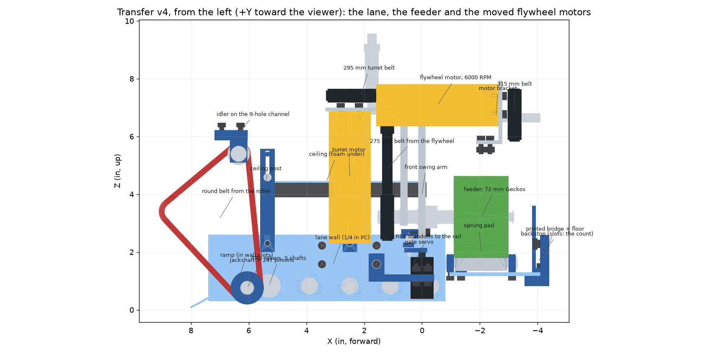
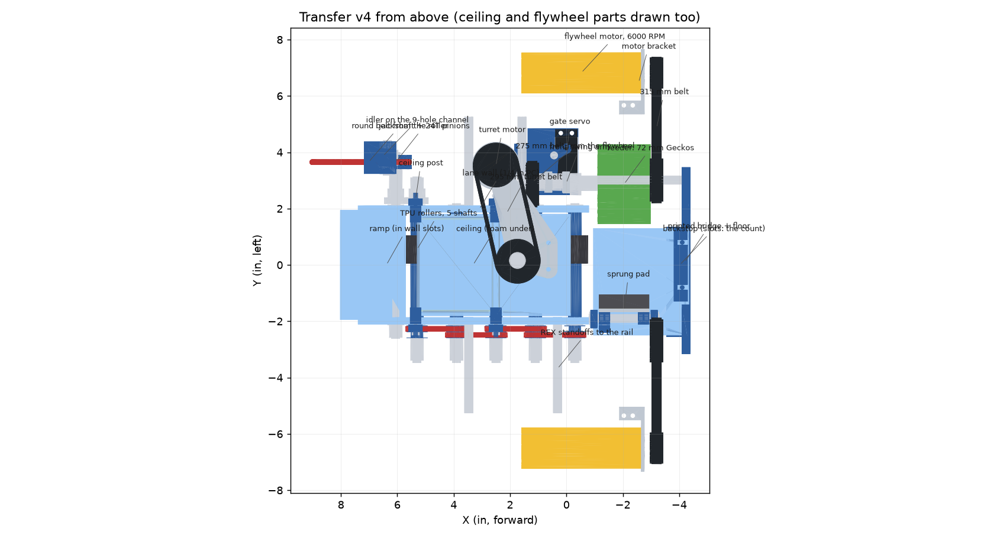

# The transfer: intake roller to the launcher (v4, 8 Oct 2026)

> **This reworks the mentor's launcher**, not just adds to it: the whole launcher and turret move forward 0.8 in, his
> flywheel motors move out and up (6000 RPM now), the left flywheel gets a longer shaft that drives the feeder, the
> turret gets a belted motor, and the plates, blocks and standoffs that held his motors under the flywheels go, as do
> his launcher's front cross-channel and front U-beams. Show him this before anything is ordered. The list is under
> "Changes it needs in the mentor's CAD".

The lane from our intake roller into the mentor's flywheels, drawn in the robot CAD's frame so `dhs-transfer.step` lands
in place in Onshape beside `cad/intake-b/dhs-intake-b.step`. `build.py` holds every number. Frame: +X forward, +Y left,
+Z up, inches, origin on the floor under the chassis centre (7.56 in behind the front face). Earlier versions are in git
history.

**Build and service come first.** Where a feature cost a lot of parts or a hard pit repair, it went: one driven feeder
against a sprung pad instead of two feeders on swing arms with gears; a ceiling on pins in slots instead of links.

**How it works:**
1. The intake roller pushes each ball up the ramp onto a flat lane of five shafts of small rollers (the mentor's
   offset-roller design, scaled to the lane's height), under a flat sprung ceiling that presses it onto them.
2. The lane pushes it in between the feeder (left) and a sprung foam pad (right), under the flywheels, until it stops
   against a backstop that sets it on the launch column (X -2.045, under the turret's axis). The rest queue nose to
   tail behind it.
3. The feeder spins whenever the flywheels do. It hangs on a yoke that swings about the left flywheel's shaft. Swung
   out (waiting), it clears the waiting ball.
4. To feed, the gate servo swings the yoke in: the feeder pinches the ball against the pad and drives it straight up
   into the flywheels.

**Drives:** the transfer has no motor of its own.
- **Lane:** the intake roller's motor runs the roller and the lane together. A printed pulley on the roller drives a
  goBILDA round belt to a jackshaft under the ramp, and a goBILDA 24T gear pair turns lane shaft 0 the lane's way.
- **Feeder:** belted to the left flywheel's shaft.
- **Gate:** one servo swings the feeder's yoke in and out.

**The count is the lane's length.** Balls queue nose to tail from the backstop to the intake roller's axle (X 8.62),
and a ball counts as held once its centre is behind that axle. The team's rule is at most 4 pieces, at most 3 of them
NECTAR (a lane that took 4 NECTAR would take 5 POLLEN):
- every legal load must fit: the longest, 3 NECTAR + 1 POLLEN, needs 12.26 in from the backstop to the axle;
- every illegal one must not: the shortest, 5 POLLEN, needs 12.60 in; 4 NECTAR needs 12.67 in.

The backstop sits mid-window, 12.43 in behind the axle (X -3.81), on ±0.2 in slots: set it on the robot with real
balls. No sensor, no software count.

(`views/` is drawn by `tools/robot-cad/transfer_views.py` from the build's meshes; rerun it after a change.)

## What changed in v4, and why

| v3 | v4 | Why |
|---|---|---|
| A motor drove the lane, and another the feeder | **No transfer motor.** The intake roller's motor drives the lane (a round belt and a gear pair); the feeder is belted to the left flywheel's shaft; a servo gates the feeder | FTC allows 8 DC motors. Drive (4), intake (1), flywheels (2) and the turret (1) use all eight. Neither transfer motor fitted anywhere without clashing, either. |
| 8 lane shafts, 0.8 in apart | **5 shafts, 1.4 in apart** | Fewer parts, same support: a ball rides 0.14 in lower between shafts at most. |
| 1/8 in polycarbonate walls on made brackets | **1/4 in polycarbonate walls on goBILDA REX standoffs** (1516-4008-0800) to the drive rails' own holes | No made brackets. The walls come off from inside the lane, with four flat-head screws each. |
| Feeder shaft in bearings in the mentor's channels | **The feeder hangs on a yoke**: two 1/4 in aluminium arms that turn on the left flywheel's shaft | The belt from that shaft keeps fixed centres, and the gate servo swings the feeder in to feed and out to wait. His launcher channels lean 5.4°, so their bearing holes miss the feeder's axis anyway. |
| A 5-hole channel replacing his front 3-hole | **His 3-hole stays**: the feeder shaft passes under it | One less change to his launcher. |
| Belts drawn as two strips, lengths unchecked | **Every toothed belt is a goBILDA length on fixed centres**, drawn wrapped; the lane's round belt runs over a fixed idler | No tensioners: the centres are set for the belt, and the idler keeps the round belt's length within about 3% as the roller floats. |
| No screws | **Every screw, nut and standoff drawn and checked** | |
| Ramp on brackets that didn't hold it; floor hangers that didn't reach anything | **The ramp slides into slots in the walls; the floor sits on a printed bridge bolted behind the launcher's rear channels** | |

## Numbers

| | |
|---|---|
| Lane | Flat, ball-bottom at z 1.3, centreline Y 0. **Shafts:** five, 1.4 in apart, X 5.3 to -0.3, each carrying one 24 mm × 1 in printed TPU roller on one side, alternating. Shafts 1 to 4 are goBILDA 144 mm REX (2106-4008-1440); shaft 0 is 168 mm (2106-4008-1680), longer on the left for the drive's pinion. **Bearings:** goBILDA 1611 flanged, pressed into both walls. **Chain:** the shafts chain in pairs on 3/16 in polycord loops, outside the right wall (one printed two-groove pulley per shaft, 16 mm pitch diameter). **Walls:** 1/4 in polycarbonate, inner faces at \|Y\| 1.86, z 0.3 to 2.6, X -0.8 to 7.4, under the front drive motors; a NECTAR clears their encoder caps by 0.05. |
| Lane drive | From the intake roller's motor (goBILDA 5203 1150 RPM, `cad/intake-b/`). **Belt:** a printed 20 mm pitch diameter pulley on the roller, in a gap in its left vector wheels (3.4 to 3.9 in), drives a goBILDA 3405-0005-0334 5 mm round belt (334 mm) in the plane Y 3.65, round a printed 24 mm pulley on a jackshaft and over an idler. **Jackshaft:** goBILDA 2106-4008-1680 (168 mm), under the ramp at X 6.05, z 0.76, across the lane in flanged bearings in both walls. It turns the way the roller does; a pair of goBILDA 2303-4008-0024 24T pinions, outside the left wall, turns lane shaft 0 the other way, as the lane needs. **Idler:** a goBILDA 3401-4008-0016 (16 mm pitch diameter) on a 2106-4008-0320 shaft (32 mm) in two 1611 bearings, in a printed fork hung from four web holes of the old intake's 9-hole channel (X 6.35, z 5.40). The roller floats 1.3 in; with the idler there the belt's path changes by about 3%, so the belt stays stretched 5.3% to 8.5%. **Speed:** 1150 × 20 / 24 = 958 RPM at the lane shafts, 47 in/s of roller tread, so about 24 in/s of ball (the ball rolls under the still ceiling at half the tread's speed). |
| Ramp | X 8.0 z 0.05 to X 5.7 z 1.3, 1/16 in polycarbonate. Its edges sit 0.1 in deep in slots routed in the walls' inner faces. |
| Ceiling | Flat, 1/16 in polycarbonate with 0.5 in soft foam (polyethylene or EVA, 2–3 lb/ft³), X 5.3 to -0.15. **Pins:** a printed pin block screwed up into the ceiling's edge at each corner (M3, from below; the foam is cut away round the heads) reaches out over the wall; an M3 shoulder screw (4 mm shoulder × 10 mm) through the slot of a printed post on the wall's outer face threads into a heat-set insert in the block's end. Two posts a side, X 5.35 and 2.5, each held by a flat-head screw from inside the lane; the slots are 0.85 in long. **Clearance:** the foam face is 2.6 in over the lane, so a POLLEN presses the foam 0.2 and a NECTAR lifts it 0.82. **Bands:** about 1–2 lbf preload, hooked on the posts. |
| Feeder | One: two goBILDA 72 mm Gecko wheels (softest durometer) on a goBILDA 120 mm REX shaft (2106-4008-1200) along X, over X -2.99 to -1.10 (the flywheels' span). Swung in (feeding, as drawn) its axle is at Y 2.87, z 3.30 and its tread's inner edge at Y 1.45: a POLLEN presses 0.10 into it, a NECTAR 0.15. It grips a ball up to centre z 4.04 (POLLEN) and 4.27 (NECTAR). |
| Feeder drive and yoke | **Belt:** the left flywheel's 96 mm shaft becomes a goBILDA 2106-4008-1440 (144 mm), out through his front channel's bearing. A 3417-4008-0016 16T on it drives a 3417-4008-0024 24T on the feeder's shaft by a 3412-0009-0275 belt (87.3 mm centres). The feeder spins whenever the flywheels do, at 16/24 of their speed: about half their surface speed (1561 RPM, 232 in/s, at the flywheels' 2341 RPM free). **Yoke:** two 1/4 in aluminium arms ahead of the front launcher channel, each with a 1611 bearing on the flywheel shaft and one on the feeder shaft, so the belt's centres never change. The feeder's shaft reaches back 3 in from the arms to the wheels; a clamping collar and an e-clip hold it. **Gate:** a goBILDA 2000-0025-0003 Speed servo, spline up, under the yoke, on a printed bracket captured on the left lane wall's lower front REX standoff. A printed horn and pushrod, on M3 shoulder screws, swing the yoke by a printed tab on the front arm. Swung in, the feeder pinches the ball and drives it up (as drawn); swung out, about 10°, it clears a waiting ball (NECTAR by 0.45 in, POLLEN by 0.50). |
| Pad | Opposite the feeder: 1/8 in aluminium with 0.5 in soft foam, hinged along X at its foot (Y -1.90, z 1.62). **Hinge:** two printed knuckles with REX bores, bolted to the plate's foot, on a goBILDA 2106-4008-0640 steel REX shaft (64 mm) that turns in round holes in two printed blocks on the feeder floor, held by its e-clips outside the blocks. **Stop:** a printed block outboard of the front knuckle, below the hinge, screwed from under the floor through a ±0.1 in slot (the slot sets the POLLEN squeeze); the band pulls the pad's top in, so the knuckle's foot swings out onto it. **At rest:** the foam face is at Y -1.05, so a POLLEN presses it 0.2 and centres at Y 0.15. **For a NECTAR:** it swings back 0.77 at the ball's centre height (z about 3.0), about 29° (atan2(0.77, 3.0 - 1.62) = 29.2°), and the NECTAR centres at Y -0.21. |
| Floor and backstop | **Floor:** 1/8 in polycarbonate between the feeder and the pad, at the lane's height, resting on the shelf of a printed bridge bolted behind the launcher's two rear channels. **Backstop:** printed, an L, its foot screwed through the floor into the shelf in ±0.2 in slots. |
| Flywheel motors | goBILDA 5203-2402-0001 6000 RPM (1:1) Yellow Jackets, moved out and up, along X at (Y 6.92, z 7.02) left and (Y -6.71, z 7.03) right, faces at X -2.65 pointing back. **Brackets:** 1/8 in aluminium, bent, on the launcher's side channels' top flanges. **Belts:** from their 16T pulleys to his 41T: goBILDA 315 mm (left) and 320 mm (right). **Speed:** 6000 × 16 / 41 = about 2340 RPM at the flywheels free; probably 1900 to 2100 loaded (an estimate, not measured). A 24T motor pulley would raise it, with a new belt length. |
| Turret drive (the mentor's to agree) | His goBILDA gear-driven turret kit's 64T drive gear gets its own shaft (2106-4008-0720, 72 mm), in a 1611 bearing in the kit's 1231 mount and one in a new 1/8 in aluminium plate bolted under the front 8-hole channel's bottom flange. A goBILDA 5203-2402-0019 312 RPM motor hangs from that plate beside the lane (axis at X 2.50, Y 3.52) and drives the shaft 1:1 by a 3412-0009-0295 belt (two 3417-4008-0024 24T): the turret turns at about 113 RPM (the kit is 2.75:1). A motor can't hang under the gear, because the lane runs there, and no other place round the ring has room (checked). |

## Parts

**goBILDA** (the build counts them; the fasteners are `tools/robot-cad/fastener_list.py`'s):

| Part | Count | What |
|---|---|---|
| 2000-0025-0003 | 1 | Speed servo: the gate (positional, two positions) |
| 1516-4008-0800 | 8 | 80 mm REX standoff: the walls to the rails |
| 1611-0514-4008 | 20 | flanged bearing: five lane shafts × 2, the jackshaft × 2, the idler × 2, the yoke × 4 (two on the flywheel shaft, two on the feeder's), the turret gear shaft × 2 |
| 2106-4008-1440 | 5 | 144 mm REX shaft (e-clips): lane shafts 1 to 4, and the left flywheel's new shaft |
| 2106-4008-1680 | 2 | 168 mm REX shaft (e-clips): lane shaft 0 and the jackshaft |
| 2106-4008-1200 | 1 | 120 mm REX shaft (e-clips): the feeder |
| 2106-4008-0720 | 1 | 72 mm REX shaft (e-clips): the turret's drive gear |
| 2106-4008-0640 | 1 | 64 mm REX shaft (e-clips): the pad's hinge |
| 2106-4008-0320 | 1 | 32 mm REX shaft (e-clips): the idler |
| 2303-4008-0024 | 2 | 24T mod 0.8 pinion: the jackshaft to lane shaft 0 |
| 3401-4008-0016 | 1 | 16 mm round-belt pulley: the idler |
| 3405-0005-0334 | 1 | 5 mm round belt, 334 mm: the lane drive |
| 2910-1020-4008 | 1 | 8mm REX clamping collar: the feeder shaft, against the front arm's bearing |
| 3632-0014-0072 | 2 | 72 mm Gecko wheel, softest durometer: the feeder |
| 3417-4008-0016 | 3 | 16T HTD5 pulley: the two flywheel motors, and the left flywheel's shaft (drives the feeder) |
| 3417-4008-0024 | 3 | 24T HTD5 pulley: the feeder, the turret motor, the turret gear's shaft |
| 3412-0009-0275 | 1 | HTD5 belt, 275 mm: the feeder |
| 3412-0009-0295 | 1 | HTD5 belt, 295 mm: the turret |
| 3412-0009-0315, -0320 | 1 each | HTD5 belts: the flywheels |
| 5203-2402-0001 | 2 | 6000 RPM (1:1) Yellow Jacket: the flywheels |
| 5203-2402-0019 | 1 | 312 RPM Yellow Jacket: the turret |
| 8mm REX spacers | stacks | the lane shafts' outer ends, the jackshaft, the idler, the feeder shaft, the left flywheel's shaft, the turret gear's shaft |

The intake roller's motor (5203-2402-0005, 1150 RPM) and the roller's lane pulley are `cad/intake-b/`'s.

**Other bought parts:**
- 3/16 in polycord: 4 welded loops, each cut 8% short;
- foam, for the ceiling and the pad;
- six M3 shoulder screws (4 mm shoulder): four × 10 mm for the ceiling's pins, two for the gate's pushrod;
- M4 heat-set inserts, for the printed parts, and M3 ones for the ceiling's pin blocks and the gate's horn and tab;
- bands.

**Made:**
- **Cut:** the two walls (1/4 in polycarbonate, with routed slots and countersinks); the ramp, ceiling and floor
  (polycarbonate); the two yoke arms (1/4 in aluminium); the pad plate (1/8 in aluminium); the two flywheel motor
  brackets (1/8 in aluminium, bent); the turret motor plate (1/8 in aluminium).
- **Printed** (STLs in `stl/`): the five TPU rollers, the lane spacers and pulleys, the jackshaft's pulley, the idler's
  hanger, the ceiling posts and pin blocks, the gate's horn, pushrod, tab and servo bracket, the pad's knuckles, hinge
  blocks and stop, the feeder bridge and the backstop. The roller's lane pulley is printed from `cad/intake-b/stl/`.

## Building and servicing it

| Module | Comes off with | What's in it |
|---|---|---|
| Ceiling | Unhook four bands, lift | plate, foam, four shoulder-screw pins |
| A lane wall | Four flat heads from inside the lane (ceiling off) | wall, its bearings, the ramp (slides out) |
| Lane shafts | A wall off, polycord off | shaft, roller, spacers, pulley, e-clips |
| Lane drive | The round belt off its pulleys (it stretches off); the jackshaft, like a lane shaft, with a wall off | jackshaft, its pulley, pinion and bearings; lane shaft 0's pinion |
| Idler | Four screws from above the 9-hole channel's web | hanger, pulley, shaft, two bearings |
| Feeder and yoke | The feeder belt and the gate's pushrod pin; then the yoke off the flywheel shaft's front end | arms, four bearings, the feeder's wheels, shaft, collar and 24T pulley, the gate tab |
| Gate servo | Four tab screws (nuts on the tabs); the bracket comes off its REX standoff with the left wall off | servo, horn, bracket |
| Pad | Two hinge-block screws from under the floor | plate, foam, knuckles, hinge rod, blocks, band (the stop stays on the floor) |
| Turret motor | Belt off, then four face screws from above (before the pulley) | motor, 24T pulley |
| Battery | Undo the strap, lift it out of the cradle | battery |
| A hub | Its cover (one thumb screw, lift off), unplug, then four M3 from behind through its corner tabs | the hub |
| Electronics plate | Battery and cradle out, then four M4 down through the tongue (nuts under the chassis flanges) | plate, switch holder |

The standoffs stay on the rails. They go on during the chassis build, before the outer wheel plates and the pods,
because their screws go in from outside the rails. The fastener check's "service order" notes are these and the other
orders in the table above, and every other screw has a key path.

## Electronics bay

The battery, both hubs and the power switch live in one bay at the back of the robot, above the rear drive motors.
The CAD said this was the only free space with access from outside: X −7.5 to −4.4, full width, from the chassis top
(z 5.73) up. It's group "elec" in `build.py`.

- **The plate:** one piece of 3/16 in 5052 aluminium, cut and bent. The upright stands on the rear angle's top flange
  (1103-0041-0328). A tongue runs back over both rear chassis members and bolts to their top flanges' 8 mm grid with
  four M4, nuts underneath, where the drive motors leave room (between the encoder caps, |Y| < 1.87). Nothing on a
  goBILDA part is drilled. The plate's M3 holes are tapped (3/16 in gives 4 mm of thread).
- **The hubs** (Control Hub left, Expansion Hub right) hang on the plate's back face with their faces out. Every port
  plugs in from behind or from above, and the LEDs are visible. Each is held by four M3 × 8 through the corner tabs'
  through-holes (REV's drawing: 143 × 103 × 29.5 mm, holes 128 × 88), screwed in from behind into the plate. Taking a
  hub off is its cover's thumb screw, unplug, and four screws. Wires to the drive motors drop straight down
  between the rear chassis members.
- **The battery** (REV slim, 113.5 × 90.5 × 23 mm) stands between the hubs in a printed PETG cradle. It lifts straight
  out from above, with a hook-and-loop strap through the cradle's slots. Its lead, the switch and the Control Hub's
  XT30 are all within a few inches of each other.
- **The power switch** (REV-31-1387) sits in a printed holder on top of the plate, rocker up. It's reachable from
  above and behind, as inspection wants.
- **The Pinpoint** (goBILDA 3110-0002-0001, from goBILDA's model) lies flat, its IMU's yaw axis vertical, just ahead of
  the left launcher side channel's front end, beside the left flywheel motor (X 0.86 to 2.54, Y 4.30 to 5.88, 6 in up).
  A printed 0.2 in PETG plate bolts down onto the top of that channel (two M4 into its 8 mm grid, nuts inside the
  channel) and reaches forward past its end. The Pinpoint's own four M4 x 12 go up from below through the plate into its
  threaded holes; they're reachable there because nothing is under the plate past the channel's end.
- **Clearances:** the hubs' faces are 0.70 in inside the rear frame (the covers 0.06), and the bay stays inside the 18 in start cube.
  The top of the bay is z 10.7 (the switch's roof, 11.3). A future turret hood that sweeps lower than that more than
  3 in behind the turret's axis would hit it, so the hood has to be checked against the bay.
- **To check on a real hub:** the corner tabs' thickness (4 mm assumed; M3 × 8 suits 3 to 4 mm). Each hub is 0.1 in clear of
  the cradle's walls.

### Covers and switch

- **Hub covers:** each hub has a 1/16 in clear polycarbonate cover, bent twice. It hooks over the plate's top edge and
  drops down behind the hub, inside the frame's back face, to 0.35 in above the hub's bottom. A knurled M3 thumb
  screw through its front lip holds it, reached from above with no tool. The LEDs show through it. Cables leave by
  the open bottom and the open ends, with 0.58 in between the hub's face and the cover for plugs. A hit from behind
  lands on the cover, which spreads it over the plate, and lift-off is one screw.
- **Switch roof:** the switch holder has a roof 0.33 in over the rocker, closed in front and at the sides. A falling
  ball can't reach the rocker. A finger reaches it over the plate's top edge from behind.

### Wiring

Left-side devices go to the Control Hub, right-side ones to the Expansion Hub, so most runs stay on their own side.
Each hub's motor edge faces the battery: the XT30s, the switch and the RS485 link are all at the middle.

| Hub port | Device | Run (in) | Cable at least (in) |
|---|---|---|---|
| CH motor 0 | drive, front left | 16 | 24 |
| CH motor 1 | drive, rear left | 4 | 8 |
| CH motor 2 (encoder: velocity) | flywheel, left | 13 | 20 |
| CH motor 3 | intake and lane (floats 1.3 in: leave a 2 in loop at the carriage) | 19 | 29 |
| CH servo 0 | gate servo | 12 | 19 |
| CH I2C bus 1 | Pinpoint (its pods: left about 7 in, right about 17 in, so cables of 12 and 25 in) | 11 | 17 |
| CH USB 3.0 | Limelight (up the mast) | 18 | 27 |
| CH USB 2.0 | webcam (proposed: on the mast, pitched down) | 20 | 29 |
| EH motor 0 | drive, front right | 16 | 23 |
| EH motor 1 | drive, rear right | 4 | 8 |
| EH motor 2 (encoder: velocity) | flywheel, right | 13 | 20 |
| EH motor 3 (encoder: position) | turret | 17 | 25 |
| EH servo 0 | extractor servo | 22 | 31 |
| EH servos 1 to 3 | the three goBILDA indicator lights (placement from the indicator chat) | | |

**How the runs were found.** `tools/robot-cad/cable_routes.py` (on the map `tools/robot-cad/occupancy_map.py` builds) finds the shortest path from each port to each device
through the robot's occupancy map, on a 0.1 in grid. Every moving part's sweep (roller, extractor, feeder, pad) and
the balls' paths through the lane and up the column are blocked. It prefers to stay within 0.4 in of structure, where a
run can be tied. The "run" column is that path, and "at least" adds 30% plus 3 in for routing and plugs.
`doc/media/wiring-routes.png` draws them all. Every device has a path; none crosses a ball path or a moving part.

**Build them as three trunks, not as the drawn paths:**
- **Left trunk:** from the Control Hub, down behind it and forward along the top of the left launcher side channel.
  It passes the Pinpoint and the left flywheel motor, then goes down the front left upright to the intake motor, with
  the loop for its float. The drive FL and gate servo branches drop off it.
- **Right trunk:** the same on the right, to the right flywheel, drive FR and the extractor servo.
- **Turret:** its motor is on the left but its port is on the Expansion Hub. Run it across under the launcher's rear
  channel with the right trunk's bundle, or swap it with the intake onto the Control Hub if that's easier on the
  robot.
- **USB:** along the left trunk to the front, then up the Limelight's mast. Don't run it over the top of the launcher:
  the turret turns there.

**Not wired yet:** a hood servo on the turret (if one is added) needs a loop through the turret's rotation; the turret
must have hard limits, not continuous rotation.

## Changes it needs in the mentor's CAD

`cad/full-robot/build.py` and the "launcher" group in `build.py` apply these; the mentor decides how to make them.

- **The launcher and turret move forward 0.8 in.** The lane's length sets the piece limit. Checked: the moved launcher
  touches nothing on the chassis or our front.
- **The flywheel motors move out and up**, along X beside the launcher frame, on brackets on its side channels, belted
  to his 41T pulleys (above), and become goBILDA 6000 RPM (1:1) Yellow Jackets. They used to sit under the flywheels,
  with the 7x11 plates, 1-hole channels, mini quad blocks, dual blocks, 16T pulleys, belts and the standoffs and spacers
  that held them. The feeder and the pad go there now.
- **The left flywheel's 96 mm shaft becomes a 144 mm one** (2106-4008-1440), out through his front channel's bearing,
  to carry the feeder's yoke and the 16T that drives the feeder.
- **The turret gets a motor** (above, "Turret drive"): the kit's drive gear on its own shaft, a plate under his front
  8-hole channel, a 312 RPM motor and a belt.
- The launcher's front cross-channel, its two dual blocks and the two U-beams under it go (the lane's balls run where
  they are).
- The old intake's 11-hole channel goes up 30 mm. The lane's idler hangs from his 9-hole channel's web, on four of its
  existing holes.
- His pinwheel, its servo and his two star wheels go (our extractor and this lane replace them).
- His right flywheel already has a pivot shaft under it (at about Y −3.2, z 4.8). It's likely the start of his sprung
  flywheel arm. It's kept and clear.

## Software

- **Motors:** drive 4, intake and lane 1, flywheels 2, turret 1: eight, the FTC limit. **Servos:** the extractor and
  the gate.
- **The intake and the lane always run together.** One motor drives both, so reversing the intake reverses the lane
  and sends queued balls back toward the roller.
- **The feeder spins whenever the flywheels do.** Feeding is the gate servo alone: in feeds, out waits. Its two
  positions are tuned on the robot.
- **The turret:** its encoder reads 2.75 × 537.7 counts per turret turn (the kit's 2.75:1, 1:1 belt).

## Checked

`tools/robot-cad/transfer2_check.py` runs against the mentor's Robot.step (7 Oct, lined up by the rails, with the
edits above) and our front, by exact mesh intersection:
- **Clashes:** nothing in the transfer or the launcher changes touches the robot, the front or each other, except
  parts meant to touch (shafts in bearings, belts on pulleys, plates on what they bolt to).
- **Balls:** a NECTAR and a POLLEN rolled along the lane into the feeder and driven up the column touch nothing but
  the rollers, the ceiling, the feeder, the pad and the flywheels.
- **Pad:** swung back for a NECTAR, it touches nothing.
- **Electronics bay:** the plate, hubs, battery, cradle and switch touch nothing but the chassis flanges the plate
  stands on.

`tools/robot-cad/front2_check.py` sweeps the front's roller (rising) and extractor (every 10°) against all of it:
clear.

`tools/robot-cad/fastener_check.py` covers every screw in the front, the transfer and the Limelight mount. For each it
checks that the shank passes only through holes, the head and nut clear everything, a key reaches the head, and a
tapped hole gives enough thread.
Fastener check (`tools/robot-cad/fastener_check.py`, front, transfer and Limelight): 153 screws, 0 problems, 38 with a service order.

## Open

- **The flywheels don't touch a POLLEN** (3.19 in gap; a POLLEN is 2.80). The mentor's sprung flywheel arm is the fix.
- **The mentor must agree** to the turret drive and to the longer left flywheel shaft.
- **The lane loads the intake motor.** A full lane held against the backstop takes about 1.7 kg·cm at the roller, maybe
  20% of the motor's stall. Keep the ceiling foam's preload light, and watch the motor's current. A pulley swap changes
  the lane's ratio.
- **Shots slow the flywheels a little more:** the feeder takes its pulse from the left flywheel's shaft.
- **The flywheels' speed is an estimate** (about 2340 RPM free, 1900 to 2100 loaded), not measured.
- **Tune on the robot:** the gate servo's two positions, and the yoke's in and out.
- **Flywheels at 145 mm (Option B).** Each module moves in two 8 mm holes on the launcher frame; one hole either way
  gives 129 or 161 mm. At 145 a NECTAR entering the column grazes the right module's front 3-hole channel by about 1 mm:
  swap it for goBILDA's 2-hole channel, which ends 24 mm higher. The flywheels take goBILDA 24T pulleys (16T on the
  motors, 1.5:1, 4000 RPM free) in place of the custom 41T.
- **The gate servo holds the pinch for a whole volley.** The pad's band sets the pinch (about 1.5 lbf); its reaction on
  the feeder, 3.35 in below the yoke's pivot, is about 0.7 kg·cm at the servo through the horn and pushrod: under 10% of
  the Speed servo's stall. If testing shows more, a band pulling the yoke in (the servo only pulling it out) takes it.
- **The TPU rollers:** print one first: TPU 95A, 3 walls, 20% gyroid infill, 0.2 mm layers. On a ball it should grip a
  ball moving along the lane and slip, not grab, under a ball held still. Too grabby: fewer walls; too slippery: more
  walls or a softer TPU. Then print the other four the same.
- **The rail holes:** the mentor's rails sit 0.4 mm out of level along their length in his CAD (almost certainly a
  mate in his assembly, not the real channel). The walls' standoff screws are flat heads, which centre themselves, so a
  bigger hole wouldn't help: cut the walls without their eight standoff holes, bolt the standoffs to the rails, hold
  each wall against them and drill its holes through, then countersink (it's our polycarbonate).