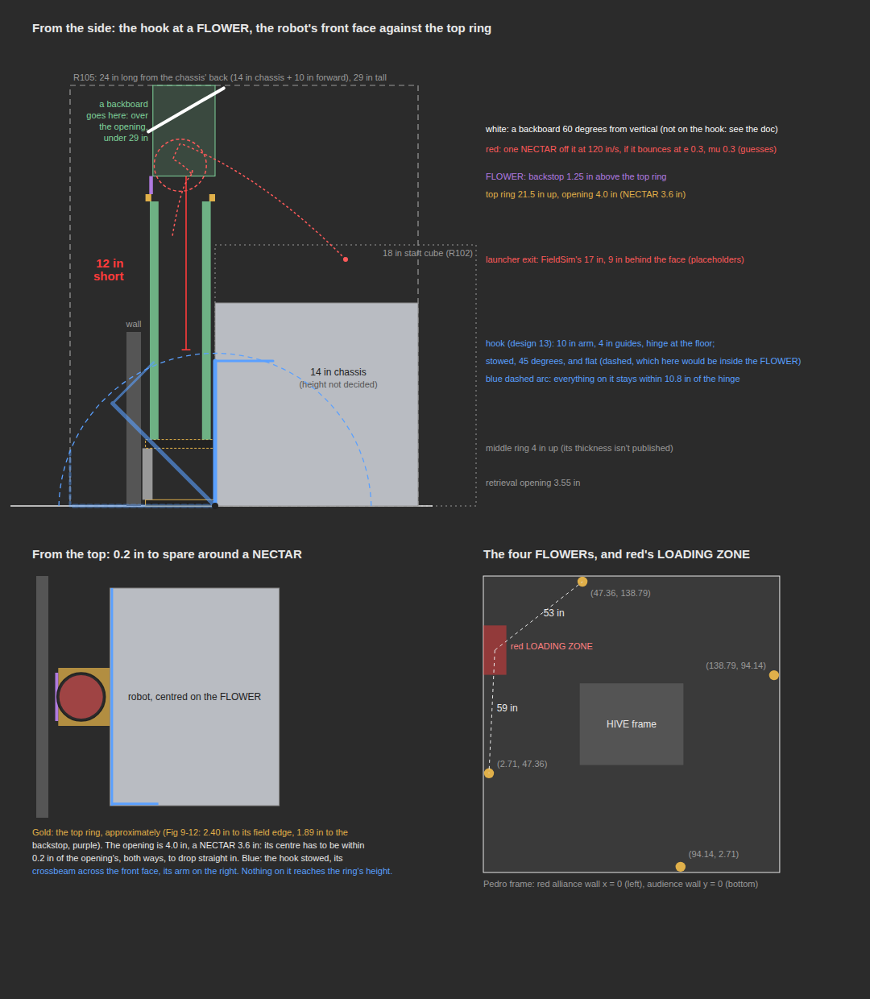

# A two-job hook: spill hook and FLOWER backboard? (issue #158)

> **A record, not current numbers.** Simulated before 6 Oct 2026 12:00 UTC, when each TIP took a fixed 1.0 s and
> spilled pieces stopped rolling too soon; the numbers read high. Current numbers: the README and
> [shape-matrix.md](shape-matrix.md). Names since 6 Oct 2026: "option 3" is the **Flat Intake**, the hooks are
> folded into the **Ramp Hook**, the long U / side walls are **Side Rails**, the front C is the **Front Pen** (dropped).

The idea (5 Oct 2026): another team shoots NECTAR into a pivoted blocker, and the blocker drops it into the
top of a FLOWER. Our large right hook (design 13, README "In the Qualifier Auto") already pivots about one
hinge, with two positions: flat (the spill hook) and stowed upright. Could a third position, part-way up,
turn the same arm and crossbeam (or a plate added to them) into a backboard?

Exploring and simulating only. No robot was attached and nothing here was measured. Everything robot-side
is either the simulator's existing design or marked as a placeholder.

**Short answer.**

1. **Rules.** A NECTAR in a FLOWER is worth more than one in the CELL: 7 to 13 points against about 4.
   But only in the last 60 s of TELEOP. In AUTO it is a MAJOR FOUL (G410), so it adds nothing there.
   One wording question goes to the Q&A before anyone builds: §10.5.2 says "placing".
2. **Geometry.** The hook can't be the backboard. Everything on it stays within 10.8 in of a hinge at
   the floor, and a backboard has to be above 22.75 in. That is **12 in short**, at any angle. A
   backboard is a separate plate high on the robot: folded inside the 18 in start cube, swung out over
   the FLOWER, its top under 29 in (R105). That means a third mechanism, not a third servo position.
3. **Physics.** `FieldSim` can't model it. Its robot parts are upright boxes, and a bounce there has no
   friction or spin change. Its FLOWER has no top ring or backstop. A separate 2-D model
   (`tools/flower-backboard/plate.py`) can't predict a hit rate either, but it shows three things:
   - **Slow shots only.** A plate works only with a slow, gentle shot (100–140 in/s).
   - **Yaw sets the ceiling.** Sideways, the launcher's yaw spread alone leaves 79% in, because the
     opening has 0.2 in to spare.
   - **No plate may do as well.** A slow, high lob straight into the opening, using the FLOWER's own
     backstop, does about as well in the model as any plate (51–79%).
4. **Worth it?** Not yet. A capped FLOWER is worth 7 to 13. The model's hit rate is at most 79%, and lower
   if the launcher's slow shot is off by 5% or 2°. It also costs a new mechanism, precise parking against a
   FLOWER, and the last ~15 s of the match. A TIP is 20 points and counts toward both POLLINATOR RPs. A
   FLOWER counts toward neither. The cardboard test below answers the open questions in an afternoon.
   Test the no-plate lob first: if it works, no mechanism is needed at all.

`sim-review/flower-backboard.html` is the same picture, to zoom into. Redraw it with
`python3 tools/flower-backboard/draw.py --plate 60 25 120 low` and rerun the sweep with
`python3 tools/flower-backboard/plate.py` (about 15 minutes on 4 cores, no build).

## 1. The rules

All quotes are from the *2026-2027 FIRST Tech Challenge Competition Manual*, BIOBUZZ, **Version TU03**,
downloaded from `ftc-resources.firstinspires.org/ftc/game/manual` on 5 Oct 2026. Check later Team Updates
and the Q&A before relying on any of it.

### What a FLOWER is

- **Where, how many, fixed or loose.** §9.7: *"The FLOWER is a structure on the FIELD in which POLLEN and
  NECTAR can be placed into the top, and POLLEN can be removed from the bottom. There are four FLOWERS on
  the FIELD attached to the perimeter wall."* §9.2: *"4 FLOWERS"*. They are bolted to the wall and don't move.
  Knocking pieces out of one is covered by G418 (below). G425.B forbids humans *"deliberately hitting or
  shaking the perimeter wall to descore NECTAR or POLLEN from the FLOWER"*.
- **Sizes**, §9.7: *"The opening on the top of each FLOWER is approximately 4 in. (10.15 cm) in diameter and
  is approximately 21.5 in. (54.6 cm) above the TILES"*; *"There is a backstop on top of each FLOWER to help
  guide POLLEN and NECTAR into the FLOWER. This backstop is 1.25 in. (3.15 cm) tall"*; *"a Retrieval Opening
  at the bottom of the FLOWER … approximately 3.55 in. (9.0 cm) tall and 3.57 in. (9.1 cm) deep"*. Fig 9-12
  adds 2.40 in from the opening's centre to the ring's field edge, and 1.89 in to the backstop side.
- **Who it belongs to.** Nobody, until the end. §10.5.2: *"The ALLIANCE that has the top-most NECTAR of its
  color that meets the criteria for scoring in a FLOWER owns that FLOWER and will earn points for every POLLEN
  and NECTAR that meet the scoring criteria for that FLOWER, regardless of which ALLIANCE placed the POLLEN
  and/or NECTAR in the FLOWER."*
- **What's in it at the start.** §10.3.1 A.i: *"4 POLLEN in each of the 4 FLOWERS (16)"*. No NECTAR.
- **Where they are** (AdvantageScope's field CAD, `biobuzz-staged-pieces.csv`, Pedro frame), each centre
  2.71 in from its wall:
  - W (2.71, 47.36) and N (47.36, 138.79) are on red's side in AUTO (G402: *"columns A, B, C constitute
    the red side"*).
  - E (138.79, 94.14) and S (94.14, 2.71) are on blue's side.
  - From the centre of red's LOADING ZONE, W is 59 in away and N is 53 in. E and S are across the field.

### NECTAR against POLLEN

- **Size and count**, §9.8: *"POLLEN are approximately 2.8 in. (7.1 cm) … NECTAR are approximately 3.6 in.
  (9.1 cm) … There are 40 POLLEN, 8 red NECTAR, and 8 blue NECTAR total"*. §9.8 also says *"POLLEN and NECTAR
  are not perfectly spherical and may vary in size"*. That matters when the opening is 4.0 in.
- **Weight.** AndyMark lists NECTAR at 0.091 lb and POLLEN at 0.055 lb (`HiveCalibration`). That makes a
  NECTAR 1.65 POLLEN of torque in a CELL.
- **Where NECTAR starts**, §10.3.1 B: *"3 NECTAR in each upward-facing CELL of corresponding color (6)"* and
  *"5 NECTAR are in each ALLIANCE AREA of corresponding color (10)"*. G426: one more enters *"each time the
  HIVE of their corresponding ALLIANCE color is TIPPED"*, or *"when 60 seconds or less remain in the MATCH,
  all remaining NECTAR can be entered"*. G427: only through the LOADING ZONE.
- **What it scores** (Table 10-2):

| Where | AUTO | TELEOP | Notes |
|---|---|---|---|
| CELL: makes a TIP | 20 a TIP | 20 a TIP | Any piece. *"LAUNCHING into the upward-facing CELL is the only allowed way to earn a HIVE TIP"* (§10.5.1) |
| CELL: still in an upward CELL at the end | – | 2 each | NECTAR or POLLEN (§10.5.1, §10.5 C) |
| FLOWER: in an owned FLOWER | – | 2 each | Every piece in the scoring volume, to the owner |
| FLOWER: Bottom NECTAR Bonus | – | 5 | *"The ALLIANCE that has the bottom-most NECTAR of its color that meets the criteria for scoring in a FLOWER earns points"* |
| GARDEN | – | 1 each | *"NECTAR belonging to either ALLIANCE and POLLEN scores in the GARDEN for the ALLIANCE that corresponds with the color of the GARDEN"* |

  Only NECTAR decides who owns a FLOWER and who gets its bonus. POLLEN only adds 2 points to the owner.
  G418.B lets robots *"only remove POLLEN from the bottom"*, so a NECTAR in a FLOWER stays there. G408
  forbids CONTROLling the other alliance's NECTAR.

### What a NECTAR in a FLOWER does

- **Points.** AUTO: none. G410: *"ROBOTS may not enter NECTAR into the FLOWER scoring volume until the last
  60 seconds of the MATCH. Violation: MAJOR FOUL per NECTAR."* That is 20 to the other alliance (Table 10-4).
  TELEOP: only from 1:00 left (*"FLOWER Ownership Unlocked 1:00"*, the match timeline).
  - The first NECTAR of our colour in a FLOWER earns the 5-point bonus. If it is also the top-most, it
    makes the FLOWER ours: 2 points for it and for every other piece in the scoring volume. So it is worth
    **5 + 2 × (pieces in the volume)**.
  - An emptied FLOWER gives 5 + 2 = **7**.
  - A full-from-the-start FLOWER gives **11 to 13**. Of its 4 staged POLLEN (CAD centres 1.4, 4.3, 7.2 and
    10.1 in up), 2 or 3 reach above the middle ring. Which it is depends on the scoring volume, *"between the
    top ring and the middle ring"*, whose exact edge is only in CAD Reference 10-4 (not measured).
  - A second NECTAR of ours in the same FLOWER adds 2 and keeps it on top.
- **End of the match.** §10.5 D: *"Assessment of SCORING ELEMENTS scored in a FLOWER will occur throughout
  the MATCH with final assessment taking place at the end of TELEOP after all SCORING ELEMENTS and ROBOTS
  have come to rest"*. So it has to stay in until everything stops. Knocking it out while scoring isn't
  a foul: G418 J, *"A ROBOT knocks out a scored POLLEN while attempting to score another POLLEN"*. But it
  costs the points.
- **Ranking points.** None directly. The RPs are SWARM (LEAVE + PARK, 16 points), POLLINATOR 1 (4 TIPs) and
  POLLINATOR 2 (7 TIPs) (Table 10-3), plus WIN/TIE. A FLOWER helps only by adding to match points toward
  a WIN.
- **The HIVE.** No rule ties a FLOWER to the HIVE or a TIP. The real cost: a NECTAR in a FLOWER is a NECTAR
  not launched into the CELL, and NECTAR is the heaviest torque there is for a TIP.
- **Denying the other alliance.** It does deny them. Ownership goes to *"the top-most NECTAR"*. Our NECTAR
  on top of theirs takes the FLOWER and every piece in it, theirs included. They keep their own bottom
  bonus. Taking a FLOWER they own with n pieces in it is a swing of 4n + 2 points (2n they lose, 2n + 2 we
  gain), plus our 5-point bonus if it is our first NECTAR there. It cuts both ways: their
  NECTAR on top of ours takes it back. The column holds roughly 6 POLLEN or 4–5 NECTAR between the rings
  (17 in), so the last NECTAR that fits wins.
- **Placed or shot?** Not clear, and **the first Q&A question**. §10.5.2: *"Placing SCORING ELEMENTS into
  the top of the FLOWER is the only allowable way to score. ROBOTS must follow G418 while interacting with
  the FLOWER."* §10.1: *"ROBOTS conclude the MATCH by claiming ownership of the FLOWERS by placing NECTAR"*.
  G418's own words are neutral: *"only enter POLLEN and NECTAR into the top of a FLOWER"*, with the intent
  *"to only allow POLLEN and NECTAR to enter through the top of the top ring"*. Read together, "placing …
  into the top" most likely means *the top, not the side or bottom*, not *placed, not launched*. But a
  launch off our own deflector is exactly the case to ask about. The other team doing it is not a ruling.

### Is a NECTAR in a FLOWER worth more than what we already do?

| A NECTAR... | Points | When |
|---|---|---|
| launched into an empty upward CELL | about 4: a TIP (20) needs about 8 POLLEN of torque (§12.3 calibration), and a NECTAR is 1.65 of them. Plus 2 if it is still in an upward CELL at the end | all match |
| first of ours into an emptied FLOWER | 7 | last 60 s |
| first of ours into an untouched FLOWER | 11–13 | last 60 s |
| on top of the other alliance's NECTAR in a FLOWER with n pieces | a 4n + 2 swing, + 5 if our first there | last 60 s |

Per NECTAR, a FLOWER is worth about twice the CELL, but only in the last 60 s of TELEOP, and only if it
goes in. Per second the numbers are guesses. The simulator's times (40 in/s, 0.35 s a piece in the
intake, 0.45 s a shot) are placeholders:

- **A FLOWER cycle.** Pick up NECTAR in the LOADING ZONE (about 1.5 s), drive 53 in to the N FLOWER
  (about 2.5 s), settle against it (about 1 s, a guess), deploy and fire (about 0.8 s), drive 89 in to the
  W FLOWER (about 3.6 s), settle and fire (about 1.8 s), and drive 59 in back to PARK (about 2.8 s). That
  is roughly 14 s for 2 FLOWERs: 14 to 26 points if every shot goes in, about 1 to 2 points a second. At a
  50% hit rate it is 0.5 to 1.
- **A TIP in TELEOP.** 20 points for about 8 POLLEN in two loads. In the Qualifier Auto that took about 9 s
  with preloads helping. In TELEOP it is probably 15–20 s: about 1 to 1.3 points a second. Each TIP also
  counts toward POLLINATOR 1 and 2, and brings in a NECTAR.

**So, yes: per NECTAR it is worth more, which by the issue's rule means going on to Phase 2.** It is worth
most in the last 10 to 15 s, when another TIP can't be finished but a FLOWER near the LOADING ZONE can
still be capped on the way to PARK. Before then, TIPs are the better use of time because of the RPs.

### Limits on the mechanism

- **Size.** R102: *"the ROBOT must be fully self-contained within an 18 in. … by 18 in. … by 18 in. high
  volume"* at the start. R105.A: *"After the start of the MATCH, ROBOTS may expand beyond the STARTING
  CONFIGURATION but at all times must remain within a 18 in. (45.70 cm) by 24 in. (61.0 cm) by 29 in.
  (73.65 cm) tall sizing volume when fully expanded"*. R105.B: *"ROBOTS must be physically constrained to fit
  within these limits without the use of software"*. The commentary adds: *"A ROBOT that can mechanically
  exceed the sizing limit would be in violation even if the ROBOT has software limiting the position of the
  extension"*. G416 makes it a match rule. With a 14 in chassis and the 10 in hook, design 13 already uses
  all 24 in. Anything else reaching forward has to stay inside the hook's 10 in, and everything under
  29 in.
- **Launching into our own mechanism.** No rule forbids it. LAUNCH (Glossary): *"the SCORING ELEMENT is shot
  into the air, propelled across the floor to a desired location or in a preferred direction, or thrown in a
  forceful way"*. G407 says a bounce is not CONTROL: *"E. 'deflecting' (being hit by a SCORING ELEMENT that
  bounces into or off a ROBOT)"* and *"F. SCORING ELEMENTS that have been LAUNCHED by a ROBOT that are no
  longer in contact with the ROBOT"*. Either way it is one piece, well under G407's 4. G409 (catching a
  TIP's spill) is about spills, not our own shots. A raised backboard must be folded before any TIP spills
  near it.
- **Reaching into or over a FLOWER.** Allowed, with care. G418 intent: *"The intent is not to disallow
  ROBOTS from contacting the FLOWER or interactions that occur when attempting allowed scoring actions"*,
  with examples *"A. contacting the FLOWER while attempting to enter or remove SCORING ELEMENTS"*. G415
  forbids *"grabbing, grasping, attaching to"* field elements, but *"ROBOTS with a concave shape that wraps
  partially around a FLOWER for purposes such as to aid in alignment would not be in violation of this rule"*.
  A notch in the front face that seats on the FLOWER is legal, and it's the way to get the 0.2 in. G418 H
  is the line not to cross: *"deliberately holds a NECTAR up to the side of the FLOWER pipes such that it
  meets the FLOWER scoring criteria"*. G304.D keeps the robot *"not contacting or in the scoring volume of a
  FLOWER"* at the start.
- **Too early.** G410 again. A shot fired at 1:01 that lands at 0:59 is a judgement call. Fire only after
  the field timer shows 1:00. G204 covers an opponent shoving us into an early score: *"a red ALLIANCE
  ROBOT deliberately drives into a blue ALLIANCE ROBOT that is lined up to score NECTAR into a FLOWER with 65
  seconds left"*.

**Questions for the Q&A** (open since 28 Sep 2026):

1. Does a NECTAR LAUNCHED by a ROBOT into a ROBOT-mounted deflector, which then falls through the top ring,
   count as *"placing … into the top of the FLOWER"* (§10.5.2)?
2. Is the scoring volume's lower edge the top or the bottom of the middle ring? Do the 4 staged POLLEN count?
3. While our deflector is over a FLOWER's opening, could it be ruled as blocking the other alliance from
   that FLOWER? G411 talks about access to SCORING ELEMENTS, not scoring locations.

## 2. Geometry

The drawing at the top has three panels: from the side, from the top, and the field.

- **The FLOWER** (manual, above):
  - opening 4.0 in across, its top 21.5 in up, backstop to 22.75 in;
  - the top ring's field edge 5.11 in from the wall (2.71 + 2.40);
  - a NECTAR (3.6 in) has 0.2 in to spare all round.
  Not published, so not measured: the rings' thickness, the ring outline beyond Fig 9-12's three
  dimensions, the middle ring's exact height (about 4 in), and the scoring volume's exact edges.
- **Where the robot can sit.** Its front face against the top ring, 5.11 in from the wall, centred on the
  FLOWER. A concave notch (G415) would let it sit deeper and centre itself. A notch is a new part, and
  none is drawn.
- **The hook can't reach.** Design 13 is a 10 in arm with 4 in guides, hinged at the bottom of the front
  face (`AutoStudyTest.hook`, `RobotAssets.hookComponent`). Every point on it is within √(10² + 4²) =
  10.8 in of the hinge, at any angle. A backboard has to be above the backstop, 22.75 in up: 12 in out of
  reach. Changing the hinge doesn't rescue one-arm-two-jobs:
  - **Raise the hinge** so the arm reaches 23 in over the opening. That needs the hinge about 9.5 in up and
    a 13.8 in arm. Then "flat" is a 43° ramp, not the flat spill hook. Swinging past horizontal, the arm
    sticks out 13.8 in: 14 + 13.8 = 27.8 in, over R105's 24.
  - **Keep the hinge low and add a mast** to the crossbeam that reaches (2.4 in forward, 23 in up). The mast
    is 23 in from the hinge. Flat, with the hook's 10 in reach, it would stand about 21 in tall at the end
    of the arm, right under the falling spill. The spill hook works because it is low (G409 touches,
    README "The best of them").
- **What does fit.** A separate plate on its own pivot near the top front of the frame:
  - **Out over the FLOWER:** 6 in long, tilted 30–80° from vertical (60° is the forgiving one, section 3),
    its low end above the backstop and its top at or below 29 in. A plate nearer vertical doesn't fit: it
    reaches past the wall or above 29 in. That keeps it within about 5 in forward of the face, inside the
    hook's 10 in.
  - **Folded:** back over the top, inside the 18 in cube.
  - **Cost:** a third mechanism with its own actuator (a servo, or a spring and latch that deploys once).
    It must be folded whenever a TIP could spill on it (G409), and while shooting at the CELL if it sits in
    the launch path.
  - **Not measured:** the frame height, the launcher's exit and where on the frame the plate's pivot could
    go. They depend on the build team's robot.

## 3. Physics

**`FieldSim` can't answer this, so no `FieldSim` number is reported.** What it lacks for a piece off an
angled plate:

1. **A tilted surface.** Robot parts are boxes standing on the tiles, turned only in yaw (`FieldSim.box`,
   `collideRobot`). A plate pitched part-way up can't be described.
2. **Friction and spin at impact.** `bounce` reflects only the normal velocity (restitution) and leaves the
   sliding velocity and the spin alone. Spin matters only in flight (lift) and on the tiles (rolling). Off
   a steep plate, friction and spin decide where the ball goes.
3. **Restitution off our plate.** The robot's is `MEASURED_ROBOT_RESTITUTION` = 0.4 (the lab's drop test, 10 Oct 2026, provisional; 0.1 until then, a guess made for
   frame bumps, not for a NECTAR hitting a plate at 3 to 5 m/s).
4. **The FLOWER's top.** A FLOWER is a 2 in tube (`PLACEHOLDER_FLOWER_RADIUS_IN`) that holds its staged
   POLLEN. There's no top ring, no backstop, no 4 in opening, no scoring volume, and nothing catches a ball
   from above.
5. **A NECTAR launch.** Exit height (17 in) and position, spin and spread are placeholders. The 0.8°
   angle spread is a guess, and §9.8 says the pieces aren't round.

**What `plate.py` does instead.** A 2-D slice through the FLOWER's centre:
- the ring, backstop and opening from the manual;
- a hollow-shell ball with restitution *e*, Coulomb friction *μ* and spin;
- FieldSim's launcher spread (1.5% speed, 0.8° angle and yaw);
- the robot against the ring;
- only plates that fit R105 and the wall.

It isn't a prediction. It shows how much the answer moves with what nobody has measured (*e*, *μ*, the
launcher's spin) and with aim. A ball that misses sideways misses whatever the plate does. That miss comes
from yaw alone, so the script computes it once (D) and multiplies every number by it. In the slice, each
number is from 30–40 shots that use the same random draws on every row, so rows compare fairly. Each is
still ± about 8 points.

A. The best allowed plate for each guess at the unknowns (*e*, *μ*, launcher spin *rω/v*, + = backspin):

| e | mu | spin | plate angle from vertical | plate height | launch speed | arc | in |
|---|---|---|---|---|---|---|---|
| 0.15 | 0.0 | 0.0 | 30° | 24 in | 100 in/s | low | 79% |
| 0.15 | 0.3 | 0.0 | 30° | 24 in | 100 in/s | low | 79% |
| 0.15 | 0.6 | 0.0 | 50° | 24.5 in | 100 in/s | low | 79% |
| 0.3 | 0.0 | 0.0 | 50° | 24.5 in | 100 in/s | low | 79% |
| 0.3 | 0.3 | 0.0 | 40° | 24 in | 100 in/s | low | 79% |
| 0.3 | 0.6 | 0.0 | 50° | 24.5 in | 100 in/s | low | 79% |
| 0.5 | 0.0 | 0.0 | 80° | 24.5 in | 100 in/s | low | 74% |
| 0.5 | 0.3 | 0.0 | 50° | 24.5 in | 100 in/s | low | 79% |
| 0.5 | 0.6 | 0.0 | 50° | 24.5 in | 100 in/s | low | 79% |
| 0.3 | 0.3 | 0.2 | 50° | 24 in | 100 in/s | low | 79% |
| 0.3 | 0.3 | -0.2 | 30° | 24 in | 100 in/s | low | 79% |

("Plate height" is the height of the ball's centre where it meets the plate. The plate's low end is just
above the backstop.)

B. The plate tuned for the middle guess (40°, 24 in, 100 in/s, low arc), when the real ball is different:

| e | mu | spin | in |
|---|---|---|---|
| 0.15 | 0.0 | 0.0 | 79% |
| 0.15 | 0.3 | 0.0 | 79% |
| 0.15 | 0.6 | 0.0 | 71% |
| 0.3 | 0.0 | 0.0 | 71% |
| 0.3 | 0.3 | 0.0 | 79% |
| 0.3 | 0.6 | 0.0 | 71% |
| 0.5 | 0.0 | 0.0 | 53% |
| 0.5 | 0.3 | 0.0 | 55% |
| 0.5 | 0.6 | 0.0 | 59% |
| 0.3 | 0.3 | 0.2 | 65% |
| 0.3 | 0.3 | -0.2 | 79% |

C. The same plate at the middle guess, with the launcher off by a fixed amount as well as its spread:

| launch speed off by | angle −2° | angle as set | angle +2° |
|---|---|---|---|
| −10% | 0% | 0% | 28% |
| −5% | 2% | 38% | 75% |
| as set | 12% | 79% | 79% |
| +5% | 30% | 79% | 79% |
| +10% | 63% | 79% | 75% |

D. Yaw alone: FieldSim's 0.8° yaw spread, over the 11.4 in from the exit to the opening, leaves 79% of shots
within 0.2 in sideways. That is the ceiling for every plate and every lob.

F. Plate angle against launch speed at the middle guess, with the best allowed height for each angle and
the better arc:

| plate angle | 100 in/s | 120 in/s | 140 in/s | 170 in/s | 200 in/s | 240 in/s |
|---|---|---|---|---|---|---|
| 30° | 71% | 3% | 0% | 0% | 0% | 0% |
| 40° | 79% | 0% | 0% | 0% | 0% | 0% |
| 50° | 79% | 42% | 5% | 0% | 0% | 0% |
| 60° | 79% | 79% | 69% | 40% | 13% | 8% |
| 70° | 79% | 79% | 29% | 29% | 11% | 11% |
| 80° | 79% | 58% | 74% | 47% | 18% | 29% |

(0° to 20° don't fit: a near-vertical plate over the opening either reaches past the wall or rises
above 29 in.)

E. No plate: a lob aimed to drop through the opening's centre, the rim and backstop still there:

| launch speed | arc | in, e 0.15 | in, e 0.3 | in, e 0.5 |
|---|---|---|---|---|
| 100 in/s | low | 44% | 42% | 28% |
| 100 in/s | high | 79% | 69% | 51% |
| 120 in/s | low | 10% | 2% | 0% |
| 120 in/s | high | 75% | 55% | 55% |
| 140 in/s and faster | either | 0–2% | 0–2% | 0% |

What the sweep says:

- **Only slow shots work.** In this model a plate works with a slow shot (100–140 in/s) and nothing faster.
  The launch must rise just over the ring's near edge, so the ball reaches the plate gently and drops.
  - Plates 30–50° from vertical need exactly 100 in/s.
  - A 60° plate, more a hood than a backboard, is the forgiving one: 79% at 100 and 120 in/s, 69% at 140
    (table F). It is the one drawn above.
  - Shooting at the CELL takes far more speed, so the launcher needs a second, slow, repeatable setting.
- **Aim matters.** On the 40° plate, a shot 5% slow drops to 38%, and 2° low to 12% (table C). On the 60°
  plate at 120 in/s, 5% fast or 2° high still gives 79%. Only slow and low together fails (24%).
- **What we haven't measured moves it less than aim does.** The tuned plate gives 53–79% across the
  guesses (table B). A bouncier ball (*e* 0.5) is the worst case.
- **Sideways is the ceiling.** 0.8° of yaw over 11.4 in is 0.16 in, against 0.2 in to spare: 79% at best
  (D). A notch that seats the robot on the FLOWER (G415) and a launcher that throws straight matter as
  much as the plate. A robot parked even 0.1 in off-centre loses more.
- **The plate barely beats no plate.** A slow, high lob straight into the opening (100 in/s, 74° up)
  gets 51–79%, with the backstop catching what overshoots (table E). That needs no new mechanism. It is
  the first thing the cardboard test should try. The model's ring is a 2-D slice of a round ring, so a
  real lob that's slightly off may glance off it differently.

## 4. Is it worth it?

| | Shooting at the CELL | NECTAR into a FLOWER off a plate |
|---|---|---|
| AUTO | TIPs, 20 each; LEAVE and PARK | 0, and a MAJOR FOUL (20 to them) for every NECTAR (G410) |
| TELEOP | 20 a TIP; POLLINATOR RPs at 4 and 7 TIPs; 2 for each piece left in an upward CELL | 7–13 a FLOWER, about 4n + 2 swing taking theirs. Last 60 s only. Contested: their NECTAR on top takes it back |
| Points per NECTAR | about 4 | 7–13 × the hit rate (at most 79% in the model; unmeasured) |
| Points per second (guesses) | about 1–1.3 | about 1–2 if every shot goes in; 0.5–1 at 50% |
| Mechanism | the launcher we have | a new plate high on the frame, its own actuator, folded during spills; a front notch to seat on a FLOWER. Or none, if the lob works |
| Aiming | at a 20 × 14 in CELL | 0.2 in of room; parked against the FLOWER, square to it; a second, slow launcher speed held within a few % |
| Software | what the Autos already do | a TELEOP sequence: seat, deploy, fire one, fold; a G410 guard on the match clock |

**Not before the cardboard test.** The expected value is two FLOWERs at the end of a match:

| Case | Points |
|---|---|
| Best: two untouched FLOWERs at 79% | about 2 × 12 × 0.79 ≈ 19 |
| Likely: two emptied FLOWERs at 50% | about 2 × 7 × 0.5 = 7 |

The same ~15 s spent on POLLEN for a TIP that doesn't finish is worth 0. So the FLOWER wins only at the
very end, and only if the plate is reliable. As an alliance, the partner robot may be the better one to
cap FLOWERs, if it has a lift or a deflector that reaches. The hook stays a spill hook either way.

## 5. Cardboard-and-tape test (needs a field, a FLOWER and a launcher that throws NECTAR)

Goal: measure *e*, *μ* and the spin before anyone designs a plate, and see whether a hood drops a NECTAR in
at all.

**Build** (no robot needed for steps 1–3):

- [ ] A cardboard plate, 6 in × 8 in, taped to a stand or a stick. Set its angle with a protractor and its
      height with a tape measure: the low edge 23.25 in above the tiles (0.5 in above the backstop), at 60°
      from vertical, leaning toward the robot, reaching from about 0.5 in off the wall to the robot's face.
      Make a 70° and a 45° one too.
- [ ] The same plate in the material we'd really use (polycarbonate, or foam-faced). Cardboard bounces
      differently, so test both.
- [ ] Mark the FLOWER's opening centre on tape on the wall above it. Mark 5.1 in out from the wall on the
      tiles: where the robot's face sits against the ring.

**Measure, without the robot:**

1. [ ] **Bounce (*e*).** Drop a NECTAR from 24 in onto the plate laid flat on the tiles, beside a tape
       measure. Film at 240 fps, 3 drops. *e* = √(rebound / drop). Repeat on the plate material.
2. [ ] **Friction (*μ*).** Tilt the plate until a NECTAR slides rather than rolls. Note the angle, 3 times.
3. [ ] **Hand drops into the FLOWER.** Drop 10 NECTAR from 1 in above the opening, centred by eye. Count how
       many go in without touching. Then drop 10 off the plate. This checks the 4.0 in opening against real,
       not-round NECTAR (§9.8).

**With the launcher** (the robot or a launcher rig, never before 1:00 on a match clock):

4. [ ] Park with the front face against the top ring, centred on the FLOWER: tape a line on the tiles
       through the FLOWER's centre, perpendicular to the wall. Note the launcher's exit height and its
       distance behind the face.
5. [ ] **First, no plate:** lob 20 NECTAR high and slow (about 100 in/s, steeply up) straight at the
       opening. Count in / out. If this goes in as often as a plate, stop here: no mechanism is needed.
6. [ ] Launch 20 NECTAR at each of 3 slow speeds (about 100, 120, 140 in/s) at each plate angle (45°, 60°,
       70°). Count in / out, and note where each miss went (near rim, backstop, out the side). Also record
       the launcher's actual speed for each shot, from the film. The model says 5% slow costs half.
7. [ ] Move the robot 0.1 in, 0.25 in and then 0.5 in sideways and repeat the best setting: how much does a parking
       error cost?

**Film:**

- [ ] From the side, level with the top ring, perpendicular to the shot: the flight, the hit, the drop.
      Slow motion (240 fps) with a tape measure in the frame.
- [ ] From above or behind the robot, along the shot: the sideways miss, which is what limits it in the
      sweep.
- [ ] One clip of the launcher's exit, for the spin. Draw a line on the NECTAR with a marker and count
      turns between frames.

Put the numbers in this issue (#158): *e*, *μ*, spin, and in/out at each angle and speed. With those,
`plate.py`'s table B shrinks to one row, and that row says whether to build it.
