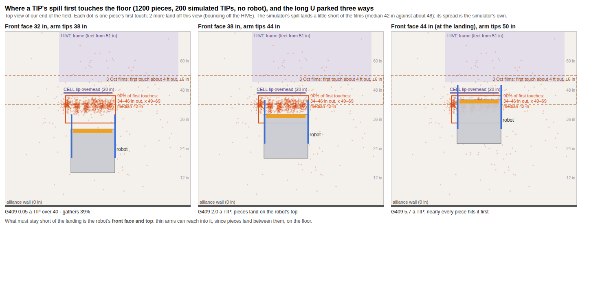
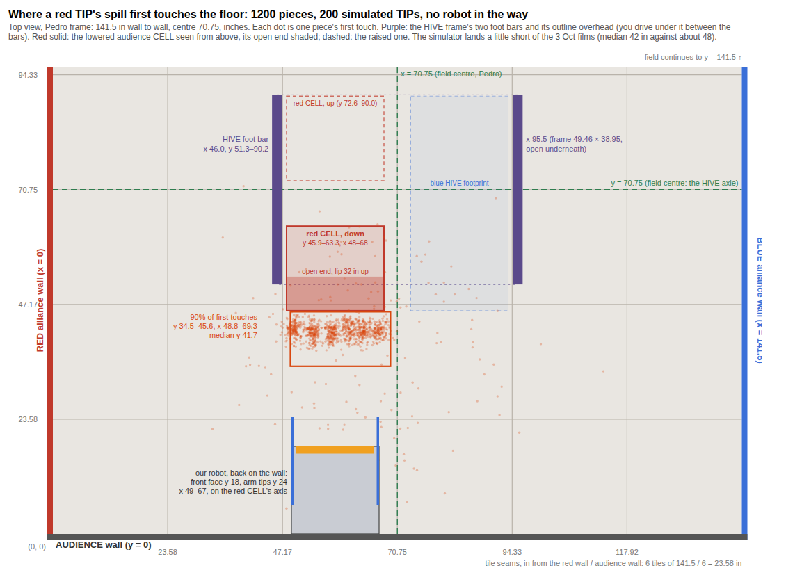
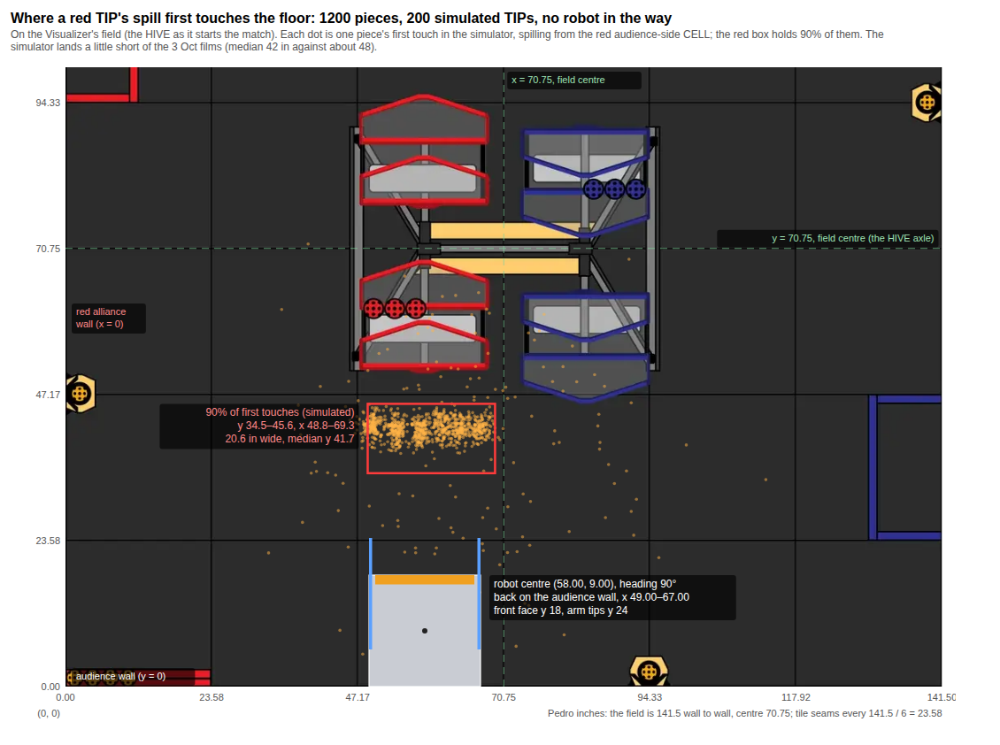
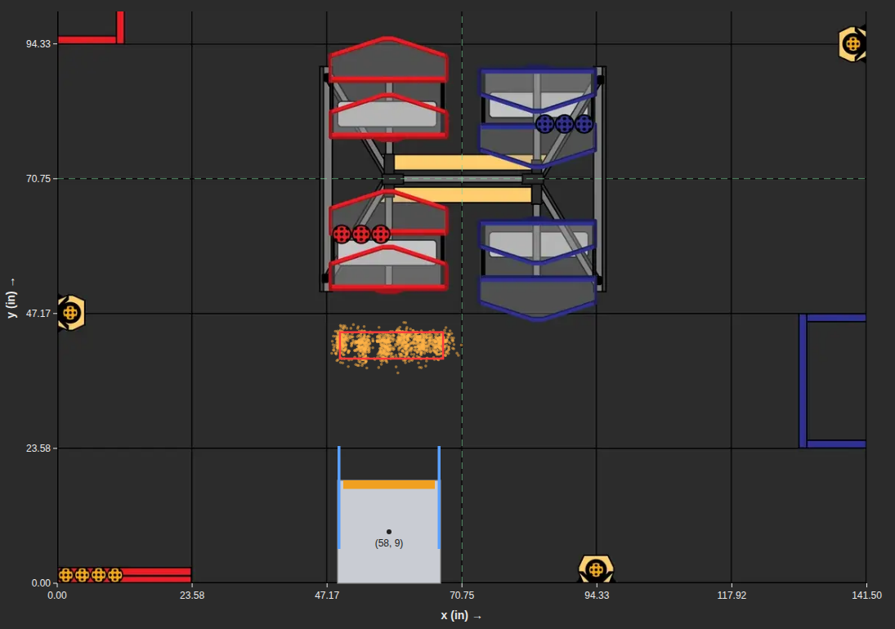
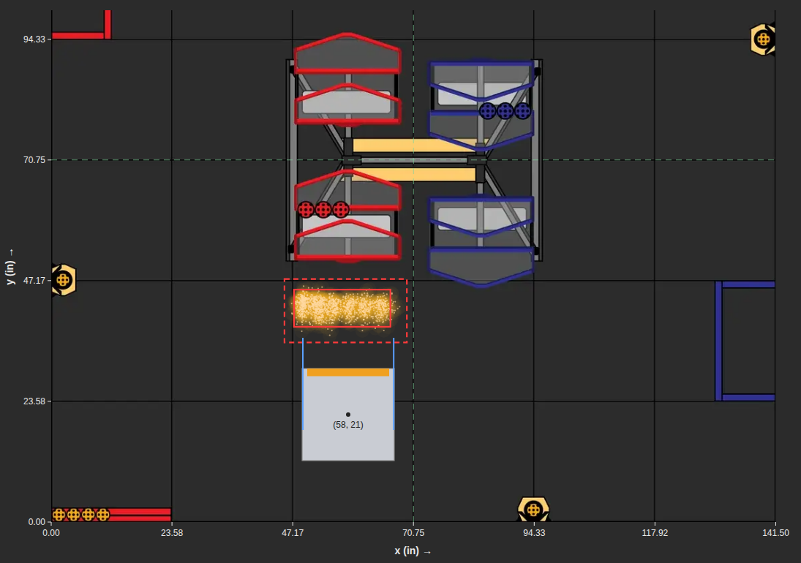
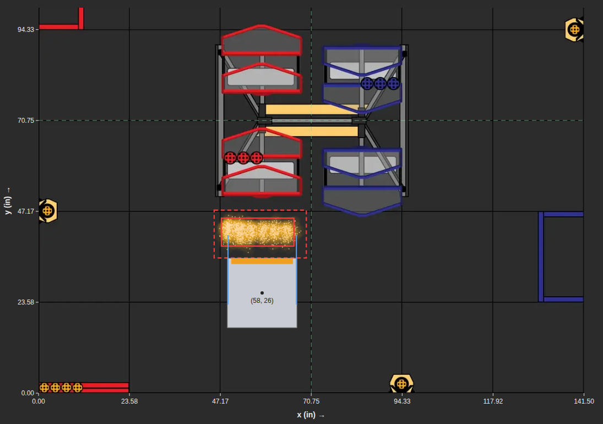

# Where a TIP's spill lands: how the picture developed

For the portfolio: each version of `sim-review/spill-window.png`, oldest first, and what changed and why.
All are simulator results (`FieldSim`), in the Pedro frame (inches, origin where the red alliance wall
meets the audience wall). Drawn by `tools/spill-window/draw.py`. Branch `claude/dazzling-maxwell-je04gu`,
5 Oct 2026.

| # | Picture | What changed | Why |
|---|---|---|---|
| 1 |  | First try: 200 simulated TIPs, each piece's first touch of the tiles, the long U (side walls slid 6 in forward) parked three ways. | To see where the spill lands before deciding where to park. |
| 2 |  | One picture of the real field: red alliance wall on the left, the audience wall behind the robot, tile seams, field centre 70.75, the HIVE's foot bars and the lowered CELL seen from above. | Three panels were hard to read, and the field wasn't recognisable. |
| 3 |  | The Visualizer's BIOBUZZ field as the background, instead of hand-drawn walls and HIVE. | Don't reinvent the wheel: everyone already knows that picture. |
| 4 |  | Each piece drawn where it first hits *anything* (tiles, HIVE feet, a piece already down), not where it first reaches the tiles. Axes labelled like a graph, captions removed. | Pieces landing on the pile rolled off and reached the tiles far away, which scattered the dots. G409 stops applying once a piece touches anything else, so first contact is what matters. |
| 5 |  | 8 POLLEN in the CELL, each piece at its true size. Dashed box: every piece. Solid box: 90% on each axis. The plain 18 in robot at the closest spot with no G409 touch in 200 TIPs: front face 35 in from the audience wall, centre (58, 26). | Find how close a robot can wait, by trial, before adding walls or flaps. |
| 6 |  | The same spill with the long U (side walls slid 6 in forward, out from the TIP's start) at its closest clean spot: front face 30 in, arm tips 36 in, centre (58, 21). | The arms keep 41% of the spill against the plain robot's 17%, with no G409 touch in 200 TIPs (`SideWallSpillTest.howCloseCanTheLongUPark`). |
| 7 |  | The long U with its front face where the plain robot was clean (35 in), arms reaching into the landing to 41 in, centre (58, 26). | Surround the spill instead of standing short of it: 52% of it stays within 12 in of the landing, against 23% for the plain robot and 6% with none, but its arms are hit before the tiles in 121 of 200 TIPs (`surroundTheLanding`). |
