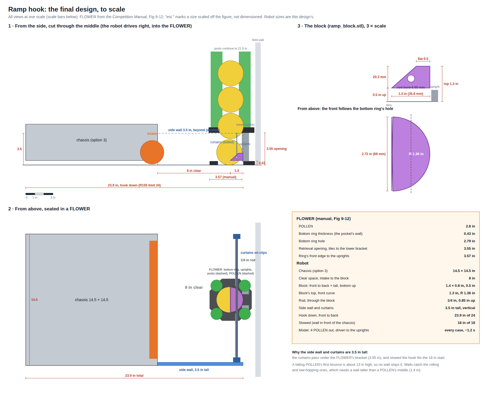
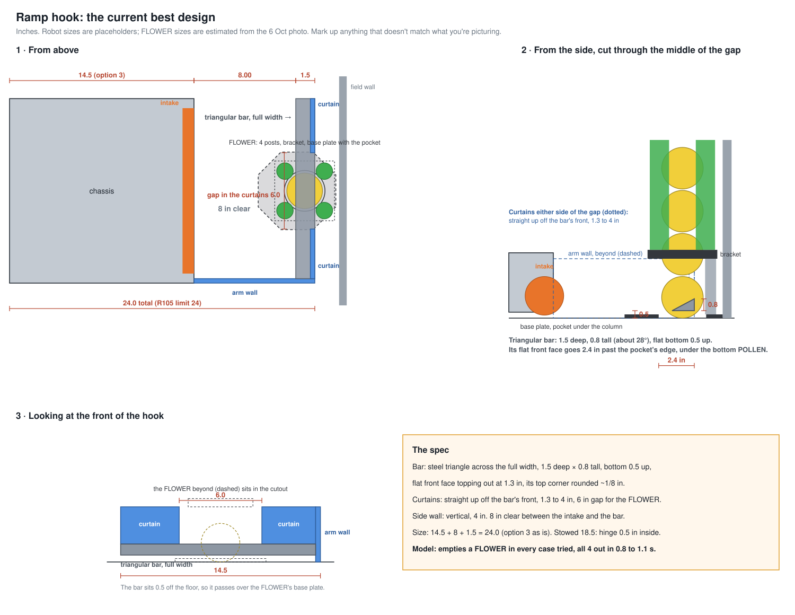

# The ramp hook: spill hook and FLOWER emptier in one arm

Exploring and simulating only. No robot was attached and nothing here was measured. Every robot number is a
placeholder for Thursday's cardboard to replace.

## Final design (6 Oct 2026)

Redraw with `python3 tools/ramp-hook/final_sheet.py`. Printable parts, what to buy and how to assemble:
[`cad/ramp-hook/`](../cad/ramp-hook/README.md).

- **Hook:** the small right hook on option 3's 14.5 in chassis. There's 8 in of clear space in front of the intake,
  and a vertical side wall down the right side.
- **FLOWER block:** 3D printed, threaded on a 1/4 in rod across the hook's front. It's 1.4 in front to back, its top
  1.3 in above the tiles (under a POLLEN's centre), its bottom 0.5 in up (over the bottom ring's 0.43 in), with a
  0.5 in flat top. Its front is curved to the bottom ring's 2.79 in hole, so it nests between the two grey
  uprights.
- **Driving:** push in until the block meets the uprights, and stay there. The FLOWER sets the depth and centres
  the robot. In `ramp.py` against the manual's FLOWER, all 4 POLLEN come out in every bounce guess, the last
  at the intake in about 1.2 s.
- **Side wall and curtains: 3.5 in tall, vertical.**
  - The curtains sit beside the block, and the FLOWER's lower bracket is 3.55 in up, so they have to stay under it.
  - Stowed, the wall stands in front of the chassis: 14.5 + 3.5 = 18 in, exactly the start limit.
  - Taller buys little. A falling POLLEN lands at about 200 in/s and, at the simulator's 0.5 bounce, first
    bounces about 13 in high, over any wall we could fit. The second bounce peaks around 3 in, and after that
    it's rolling.
  - A wall stops the rolling and low-hopping POLLEN, which needs it taller than a POLLEN's centre (1.4 in).
    3.5 in does that with margin.
  - Going taller needs the hinge set back inside the frame (by the extra height), and a notch where the
    curtains pass the bracket.
- **To measure on Thursday:** the uprights' inside corners (does the curve seat?), whether the block drags on the
  ring (raise to 0.55 to 0.6 in), and a shorter block (1.0 in) side by side with the 1.4 in one.

## Meeting notes, 6 Oct 2026

Present: Travis, Nathan, CJ and a mentor.

- **The design options and the simulation work.** We went through the body shapes on
  `claude/biobuzz-robot-body-designs-hi386c` (README "The best of them" and "On option 3"): the **rigid V**, the
  **front C**, the **large and small right hooks**, and the ones we did less with (the funnels, the long U).
  Travis understood the rigid V especially well. The students followed the reasoning, and the rules questions
  behind it: G409 touches from a falling spill, and G407's 4-piece limit inside the guides.
- **The new idea.** One student remembered a video of another team: a **thin ramp, rotated down and driven into a
  FLOWER**, emptied it very fast. The team suggested **combining it with the small hook**: give the hook's
  outside edge an inward ramp. Put it down and drive it into the FLOWER, and the POLLEN roll out and are guided
  into the intake. The same hook, held out while we wait for a TIP or pick up, deadens the pieces that land in it.
- **Hungry Hungry Hippos.** We talked about hippo-style grabbers and found no rule either way. No clear answer
  expected, so **the plan is the hook**.
- **Next:** cardboard prototypes on Thursday. The mentor will post the other team's video.

## The manual's FLOWER (Fig 9-12), and what it means (6 Oct 2026, late)

From the Competition Manual's Fig 9-12, as the mentor shared it:

- **Bottom ring:** 0.43 in thick, hole 2.79 in across. A 2.8 in POLLEN is only about 2.0 in wide at 0.43 in up,
  so it sits on the tiles inside the hole, in a snug pocket with a 0.43 in wall all round.
- **The grey uprights** (the backstop the bottom POLLEN rests against) stand at the back of the hole. The figure's
  3.57 in runs from the ring's front edge to their face. Scaled off the figure, the ring has about 0.93 in of flat
  top in front of the hole, which puts the uprights' face **about 2.65 in past the hole's front edge**. Measure
  this one; it's scaled, not dimensioned.
- **Retrieval opening:** 3.55 in tall, from the tiles to the lower bracket.

`ramp.use_manual_flower()` switches the model to these numbers. Triangle parked against the uprights (and 0.15 in
short of them), bottom 0.5 in up. POLLEN out of 4 in the three bounce guesses:

| triangle, deep × tall | against the uprights | 0.15 in short |
|---|---|---|
| 0.5 to 1.0 × 0.6 or 0.8 | 0 to 1 (one lucky 4) | 0 (one lucky 4) |
| 1.25 × 0.6 | 4,4,2 | 4,4,4 |
| 1.25 × 0.8 | 3,4,4 | 4,4,4 |
| **1.5 × 0.8** | **4,4,4** | 4,4,3 |
| 1.75 × 0.6 | 4,4,4 | 4,4,4 |
| 2.0 × 0.8 | 4,4,4 | 4,4,4 |

- **With the real 0.43 in pocket, a ramp under 1.25 in doesn't empty the FLOWER in the model.** The last POLLEN
  rolls back over the pocket's wall. From 1.5 in it empties every case, with the last at the intake in 1.1 to
  1.3 s.
- **Seated, a 1.5 in triangle is entirely inside the FLOWER.** Its back edge is about 1.15 in inside the hole's
  front edge, so it doesn't stick out past the hook's front at all when you're against a FLOWER.
- **The mentor's block (sketch on Fig 9-12):** a small block driven against the uprights, lifting the bottom
  POLLEN. Modelled as a vertical face toward the uprights, a flat top, then a slope down toward the robot, 1.4 in
  deep, bottom 0.5 in up. POLLEN out of 4 in the three bounce guesses:
  - 1.9 in tall: 0,0,0 (its face meets the POLLEN above its middle and pushes it back);
  - 1.6 in tall: 3,3,3 against the uprights, 0 when 0.15 in short;
  - **1.3 in tall, 0.5 in flat top: 4,4,4 against the uprights and 4,4,4 when 0.15 in short**, the most forgiving
    shape so far;
  - 1.0 in deep, 1.3 tall: 0,0,0.
  **So the sketch works at 1.4 in deep, with its top at 1.3 in.**
- **Clearance is tight underneath.** The triangle's bottom (0.5 in) rides 0.07 in above the ring's top (0.43 in).
  On foam tiles it could drag. Raise the bottom to about 0.55 to 0.6 in, keeping the front face's top under
  1.3 in.

## Drive in to the backstop and stay (6 Oct 2026, late: the mentor's actual idea)

Drive the triangle in until it hits the backstop and **stay there**. The triangle props up the bottom POLLEN, and
the stack rolls down a short ramp: each POLLEN is shoved along by the ones above it. `ramp.py` already carries
the stack's weight. In a traced run (1.0 in triangle, 0.25 in pocket edge), POLLEN 1 to 3 come out fast. Only
the **last one**, with nothing above it, rolls off slowly and can settle back into the pocket.

Parked at the backstop, 0.8 in tall. POLLEN out of the FLOWER (of 4) in each of the three bounce guesses:

| triangle, front to back | pocket edge 0 | 0.1 in | 0.18 in | 0.25 in | 0.43 in |
|---|---|---|---|---|---|
| 0.5 in | 4,4,4 | 4,4,4 | 4,4,4 | 0,0,0 | 0,0,0 |
| 0.75 in | 4,4,4 | 4,4,4 | 4,4,4 | 4,4,4 | 0,0,0 |
| 1.0 in | 4,4,4 | 4,4,4 | 4,4,4 | 4,3,4 | 0,0,0 |
| 1.25 in | 4,4,4 | 4,4,4 | 4,4,4 | 0,2,0 | 0,0,0 |

- **A very short ramp works if the pocket's edge is about 1/4 in or lower.** That's the mentor's point: the
  stack does the work. A 0.75 in triangle empties every case up to 0.25 in, and a 0.5 in one up to 0.18 in.
- **Every short triangle fails at 0.43 in.** That's the backboard study's number, and nobody has measured it.
- The 0.25 in column isn't smooth (1.25 in does worse than 0.75), so the model is on a knife edge there. A
  measurement beats more modelling.
- **The deciding measurement is the pocket edge's height:** the base plate's thickness, or how far a POLLEN sinks
  into the hole, whichever is less. The photo suggests a thin plate, perhaps 1/4 in.

## Drive to the backstop, then back off (6 Oct 2026, late; replaces version 2's stop)

**The idea (mentor):** no curtain wrap and no stop to set. Drive the triangle straight in until its front hits
the grey upright the bottom POLLEN rests against (the FLOWER's backstop), then back off. `ramp.py` has this as
`run(..., dwell=, back_speed=, back_dist=)`: drive in to `tip_depth`, wait, reverse `back_dist` inches at
`back_speed`, stop. The model's backstop is where the bottom POLLEN's back sits, 3.2 in past the pocket's front
edge, estimated.

- **Staying at the backstop** needs a long triangle: about 2.0 in front to back for 12 of 12. At 1.25 to 1.5 in
  it empties only 0 to 7 of 12.
- **Backing all the way out** (5 in) empties the first POLLEN fast, then the rest drop back into an empty pocket.
- **Backing off about 1 in works with short triangles.** Drive in to the backstop, wait 0.1 s, back off, stop.
  Emptied of 12 (back-off at 6 and 12 in/s, two pocket depths, three bounce guesses):

| triangle, deep × tall | back 0.5 in | back 0.8 in | back 1.0 in | back 1.3 in |
|---|---|---|---|---|
| 0.75 × 0.6 | 4 | 4 | 8 | 12 |
| 0.75 × 0.8 | 1 | 4 | **12** | **12** |
| 1.0 × 0.6 | 6 | 9 | 12 | 12 |
| **1.0 × 0.8** | 6 | **12** | **12** | **12** |
| 1.25 × 0.6 | 8 | 12 | 12 | 12 |
| 1.25 × 0.8 | 9 | 12 | 12 | 12 |

  All 4 out in 1.3 to 1.6 s, a little slower than parking at the right depth. But the drive is "push until it
  stops, back off an inch", with the FLOWER setting the depth.
- **Pick:** a printed triangle **1.0 in front to back, 0.8 in tall**, bottom 0.5 in up, about 4 in wide. Back off
  1.0 in: anything from 0.8 to 1.3 in still empties every time.
- **Photos wanted:** the pocket from the side with a POLLEN in it, and the backstop from above. That checks the
  3.2 in and how deep the pocket is.

## Current design, version 2: a stop on the bracket and a printed insert (6 Oct 2026, late)

Mock-up: https://claude.ai/artifact/HfHKiovcn5d3wgXp7PATXR (private until shared). The three views
(`sim-review/ramp-hook-views.svg`, redrawn by `python3 tools/ramp-hook/views.py`) show version 2.

- **Side wall and curtains:** the vertical 4 in side wall. At the front, curtains from 0.75 to 3.9 in (under the
  FLOWER's bracket, about 4.0 in) on a flat 0.75 × 0.25 in strip, either side of a gap.
- **Cheeks:** two vertical plates at the gap's edges, 5.2 in apart (the bracket is about 4.7 in wide), from 0.5 to
  4.65 in up. They carry the insert and the stop, and guide the POLLEN back toward the intake.
- **The stop:** a crossbar between the cheeks at the bracket's height (4.0 to 4.6 in), about 2.85 in behind the
  hook's front. **Drive in until the bracket's front meets it.** That sets the depth, and the cheeks centre the
  robot sideways. It adds no length, because the insert reaches under the bracket.
- **The insert:** 3D printed, 5.2 in wide, in the gap only. It's a triangle in section, 1.25 in front to back and
  0.8 in tall, bottom 0.5 in up, with its front face topping out at 1.3 in. Seated, its front is 2.1 in past the
  pocket's edge. `ramp.py`, `run(wedge=(0.5, 0.8, 1.25), tip_depth=2.1)`: all 4 out in about 1.0 s, at the intake
  in 1.2 s. **29 of 30 runs empty with the depth anywhere from 1.9 to 2.3 in**, so the stop has 0.2 in of slop
  each way.
- **Size:** 14.5 + 8 + 1.25 = 23.75 of 24, so option 3's chassis fits. **Stowed, the 4.65 in cheeks make the start
  about 19.2 in.** Hinge the hook about 1.2 in inside the frame, or let the stop fold.
- **Measure first:** how far the bracket's front face sits from the pocket's edge. The stop's 2.85 in comes from
  the photo's scale, and the stop moves with that number.

## Current design: a full-width triangular bar, curtains straight up (6 Oct 2026, evening)

Mock-up: https://claude.ai/artifact/HfHKiovcn5d3wgXp7PATXR (private until shared). Three views with dimensions:

Redraw it with `python3 tools/ramp-hook/views.py`.

- **Side wall:** the 8 in right arm, vertical, 4 in tall, running from the chassis to the hook's front.
- **The bar:** at the very end of the side wall, a **triangular steel bar straight across the full width**
  (about 14.1 in). It's a right triangle in section, **1.5 in front to back and 0.8 in tall** (about 28°): a
  vertical front face whose top is 1.3 in up, just under the bottom POLLEN's centre (1.4 in), a top sloping
  down toward the robot, and a flat bottom 0.5 in up, clear of the FLOWER's base plate. Its front reaches 2.4 in
  into the FLOWER's opening.
- **Curtains:** vertical panels **straight up off the bar's front**, from 1.3 to 4 in, either side of a **gap of
  about 6 in** where the FLOWER's column, bracket and legs come in. The gap width is estimated from one photo,
  so measure it. There are no sleeves, and the front is one line.
- **Clear space:** 8 in from the intake to the bar's back edge.
- **Why a triangle, not a round rod:** the empty-FLOWER photo shows the bottom POLLEN sits in a pocket in the
  base plate. In `ramp.py` a round rod lets it roll back in, but the triangle's sloped top bridges the pocket's
  edge.
- **How short it can be:** `run(wedge=(0.5, h, depth))`, intake 8 in behind the bar's back edge. Results for
  pocket edges of 0.25 and 0.43 in, reaches of 2.1 and 2.6 in, and the three bounce and friction guesses:
  - **1.5 in deep, 0.8 tall** works in every case: all 4 out in 0.83 to 1.08 s, the last at the intake in 1.0 to
    1.35 s. That's a little faster than the long bar.
  - 1.5 in deep, 0.6 tall, and 2.0 in deep at either height, also work everywhere.
  - **1.0 in deep fails** with a 0.43 in pocket at a 2.6 in reach: the whole bar is inside the pocket, so the
    POLLEN drop back in off its back edge. At 1.0 in, keep the reach near 2.1 in, or don't go that short.
  - The earlier long bar (2.75 deep, 0.6 tall, 12°) works too: 1.06 to 1.36 s.
  - **Taller fails.** A tall, steep triangle (6 Oct sketch): a vertical front face rising to 1.6, 2.0 or 2.4 in, and
    a steep back 1.4 in deep. It empties in 0 of 8 cases: the front meets the bottom POLLEN at its middle (1.4 in)
    and shoves it straight back into the pocket. The same shape with its front stopped at 1.3 in empties in
    8 of 8 (1.1 to 1.2 s). Flipped point-first, it fails at every height. **Keep the front face's top under about
    1.3 in; the back can be as steep as you like.**
  - **Half-round is worse than the triangle.** A half-round bar, flat side down, 1.0 to 2.0 in wide, bottom 0.3 or
    0.5 in up: at best it empties in 6 of 12 cases (1.3 in wide), and only when pushed 2.6 in in. At a 2.1 in reach
    it fails every time, and at 2.0 in wide (top 1.3 to 1.5 in) it always fails. The round front meets the
    POLLEN too high and too square to lift it well, and the round back drops it close to the pocket's edge.
  - **A slightly rounded nose is fine.** The 1.5 x 0.8 triangle with its top front corner rounded to 0.15 in
    radius still empties in 12 of 12 (0.82 to 1.2 s). At 0.3 in radius it drops to 9 of 12.
  - **Raising the bar doesn't add roll.** Bars with their tops at 1.2 or 1.3 in and their bottoms at 0.5, 0.7 or
    0.9 in. The triangles empty in 12 of 12 at every height. They're fastest at 0.5 in (0.83 to 1.08 s) and a
    little slower at 0.9 in (1.0 to 1.23 s). The half-rounds stay at 3 to 6 of 12. The POLLEN's speed comes from
    how far it drops from the bar's top to the tiles, and the top is capped near 1.3 in either way. Raising the
    bottom only makes the bar thinner and its slope gentler.
- **Size:** 14.5 + 8 + 1.5 = 24.0 in, so **option 3's chassis fits as it is.** Stowed, the 4 in side wall sticks
  out in front, which makes 18.5 in: hinge the hook 0.5 in inside the frame, or make the wall 3.5 in tall.
- **For the spill:** the front is a 4 in wall except the 6 in gap, and the bar runs under the gap too.

### Next step: a hard stop, and a short printed insert (6 Oct 2026, late)

**How forgiving is the depth?** The table counts emptied runs out of 6 (pocket edges of 0.25 and 0.43 in, three
bounce and friction guesses). Bars are 0.8 in tall with their bottoms 0.5 in up. Columns are how far the bar's
front goes past the pocket's edge:

| bar, front to back | 1.7 | 1.9 | 2.1 | 2.3 | 2.5 | 2.7 | 2.9 | 3.1 |
|---|---|---|---|---|---|---|---|---|
| 0.75 in | 0 | 6 | 6 | 2 | 0 | 2 | 3 | 2 |
| 1.0 in | 0 | 6 | 6 | 6 | 4 | 2 | 0 | 2 |
| 1.25 in | 0 | 6 | 6 | 5 | 6 | 5 | 2 | 0 |
| 1.5 in | 0 | 6 | 6 | 6 | 6 | 6 | 5 | 2 |

- Every bar needs at least 1.9 in, to get under the POLLEN's centre.
- Past that, **the bar's length is the depth tolerance.** Its back edge has to land just outside the pocket's
  edge. A 1.5 in bar tolerates about 1.9 to 2.7 in (0.8 in of slop). A 1.0 in bar tolerates 1.9 to 2.3 in (0.4 in),
  and a 0.75 in bar only 0.2 in.
- **So the long bar is buying driving slop.** With a hard stop that sets the depth, the bar can be short.

**Ideas, to try in cardboard:**

1. **Stop and centre on the FLOWER's bracket.** The black bracket is about 4.0 to 4.6 in up, solid, and squarer
   than the posts. Raise the curtains at the gap's edges to about 4.75 in and give the gap a V lead-in that seats
   on the bracket's front corners. Driving in until it seats sets the depth and centres the robot sideways at the
   same time. It adds no length, because the bar still reaches under the bracket, which sits higher. G415 allows
   *"a concave shape that wraps partially around a FLOWER for purposes such as to aid in alignment"*. Measure
   how far the bracket's front sits from the pocket's edge, so the bar's reach lands at about 2.1 in.
2. **Or stop on the field wall.** It's the most rigid reference, and the FLOWER is fixed 2.71 in from it. But the
   pads would stick out about 2.3 in past the bar's front, which costs that much of the 24 in.
3. **Triangle only in the gap.** A 3D-printed triangular insert, about 4 in wide (the pocket is about 3.2 in),
   bolted or friction-fit in the gap. Outside the gap, a flat strip at the curtains' feet. That's less sloped
   surface under the spill, and printed inserts of several sizes can be swapped on Thursday. With a stop, 1.0 to
   1.25 in front to back is enough; 1.25 keeps some slop.
4. **G409, the spill.** A sloped insert in the spill's path could be ruled as helping to keep pieces. A 4 in insert
   is far less area than the full-width bar, and the curtains above it are hit by falling pieces anyway.
   **Question for the Q&A:** does a passive ramp on a robot count as catching or controlling a TIP's spill if a
   falling piece lands on it?

The sections below are earlier steps (the ramp front, the rod, sleeves). Their physics stands; their geometry is
superseded.

## The design (corrected 6 Oct 2026)

**The ramp is the hook's front.** The C has one tall wall, the 8 in right arm: about 4 in tall and **vertical**. In
place of a tall crossbeam, its front is a **thin ramp across the full 14.5 in width, held clear of the tiles**
and carried by the arm. At a FLOWER its edge sits about 1 in up, resting on the ring. It slopes down 12° and
stops **0.5 in above the tiles**, with no floor plate. Driven into a FLOWER, the edge slides under the bottom
POLLEN. The column rolls down the ramp, drops the last 0.5 in onto the tiles and rolls to the intake, 8 in back.
`ramp.py` models it with `float_z=0.5`: all 4 out in 1.0 to 1.2 s and the last at the intake in 1.15 to 1.4 s,
across slopes of 10 to 15°, back edges 0.3 to 0.75 in up, and the bounce and friction guesses. That's no slower
than a ramp running down to the floor.

- **Current layout (mock-up v6): 8 in of clear space, then a short ramp.** There's 8 in of open floor between the
  robot's face and the ramp's back edge, then the ramp. The ramp is **2.3 in long**, the shortest that works:
  its edge has to reach 2.1 in into the FLOWER's opening to get under the bottom POLLEN. A steeper ramp doesn't
  get shorter, because its edge rises above the POLLEN's centre. In `ramp.py` at 20°, a 2.4 in reach leaves one
  in, and at 30° every reach fails. The arm carries the ramp, so it runs 10.3 in. 13.7 + 10.3 = 24.0, so the
  chassis is trimmed 0.8 in from option 3 (14.5 would make 24.8). Stowed, the 4 in wall makes the start 17.7 in.
  The model gives 1.06 s for all 4 out and 1.38 s for the last at the intake.
- **A steel rod for the front (mock-up v7).** Keep 24 in total, and make the front a 1/4 in steel rod across the
  hook in place of a ramp: 14.5 + 9.25 in of clear space + 0.25 = 24.0, so option 3's chassis fits as it is.
  `ramp.py`'s `run(rod_z=...)`, with the intake 9.5 in behind the rod:
  - **With no lip in front of the bottom POLLEN, it works.** It's as fast as the ramp or a little faster: all 4
    out in 0.95 to 1.1 s and the last at the intake in 1.2 to 1.5 s. That holds for any rod centre 0.6 to 1.2 in
    up, 2.1 to 2.9 in into the opening.
  - **With the 0.43 in lip, it fails every time.** The bottom POLLEN rolls off the rod and drops behind the lip.
  - Both teams' photos show the bottom POLLEN on a flat base with no obvious lip, but the backboard study's
    drawing has one. **Measure it on Thursday: lip or no lip decides rod or ramp.**
  - The rod hangs off the right arm across 14 in. Under its own weight 1/4 in steel sags about 0.01 in. But it's
    springy sideways: about 50 lb/in where it meets a FLOWER, 7 in out, so a 5 lb bump moves it 0.1 in. A brace
    to the chassis' left corner, or a second short arm on the left, fixes that. The start is 18.5 in stowed (the
    4 in wall), so hinge the hook 0.5 in inside the frame.
- **Size:** nothing sticks out past the ramp, so option 3's 14.5 in chassis fits as it is: 14.5 + 8 = **22.5 in of
  24**. The shorter chassis (A2) and the side tongue (B) below are no longer needed.
- **Start: 0.5 in over.** Stowed, the 4 in vertical wall sticks out 4 in in front of the chassis (14.5 + 4 = 18.5
  of 18). Hinge the hook at least 0.5 in inside the frame, or make the wall 3.5 in tall.
- **Carrying the ramp:** only the right arm holds it, and the left end is free across 14.5 in. It has to be stiff
  enough not to sag onto the tiles or flex when it hits the FLOWER's ring. Use a stiffened plate or a bent lip
  along its back edge.
- **Spill:** the arm still catches the spill. Along the front, pieces rolling outward have to climb the 1 in
  ramp to escape (faster than about 37 in/s), and anything landing on the ramp rolls in toward the intake.
- **3D mock-up:** https://claude.ai/artifact/HfHKiovcn5d3wgXp7PATXR (private until shared). Its balls move as
  `ramp.py` simulates them.

The sections below came before this correction. Their physics holds. Their geometry (a tongue on a tall
crossbeam, or on the arm's side) is superseded.

## The idea

The small right hook (design 14: an 8 in arm and a crossbeam, hinged at the bottom of the chassis' front face) gets
two "inward ramps":

1. **A tongue on the arm's outer side** (version B, drawn). A thin plate, about 2 in wide, sticking out through a gap
   in the arm's wall at floor level, about 2 in ahead of the chassis, and sloping down into the hook. The robot
   runs along the wall and strafes into the FLOWER. The tongue slides under the bottom POLLEN, and the column rolls
   down it, into the hook and along the intake's face. The arm keeps its full 8 in, so the hook's spacing for
   catching the spill in AUTO doesn't change. (Version A, the tongue on the crossbeam, empties more directly but
   costs that spacing: see "Where the tongue goes".)
2. **The arm's inside wall leans in** over the hook's floor. A piece rolling into the wall is sent down into the
   tiles instead of back out across the hook. That's the "deadening".

Redraw it with `python3 tools/ramp-hook/draw.py` and rerun the tables with `python3 tools/ramp-hook/ramp.py`
(about 15 s on 4 cores, no build).

**Short answer.**

- **Physics:** it works in the model, and quickly: all 4 POLLEN at the intake in **1.1 to 1.4 s**, counted from
  an inch short of the FLOWER. The simulator's placeholder, `RobotDesign.flowerPullS`, gives 2.0 s, plus 0.35 s a
  piece through the intake. Two numbers decide it:
  - the tongue's **slope: 10 to 15°**;
  - **how far in its tip goes: at least 2.1 in** past the opening's edge.
- **Size:** on the arm's outer side the tongue fits R105 with the full 8 in arm: 17.15 in across of 18, and 22.5 in
  long of 24. On the crossbeam it would need the arm cut to 6.85 in, which loses the spacing that catches the
  spill.
- **Rules:** use it only before 1:00 left. After that a NECTAR can be at the bottom of a FLOWER, and pushing it
  out breaks G418.

## What the FLOWER gives us

- **It already matters.** The Qualifier Auto (qual-right-v3, README on the body-designs branch) makes TIP 2 from our
  preloads plus **the far FLOWER's 4 POLLEN**, and its FLOWER step is 2.3 s long. A faster FLOWER is time the route
  can spend on PARK, which the hooks cost.
- **4 POLLEN per FLOWER**, 16 on the field at the start (§10.3.1). Two of the FLOWERs (W and N) are on red's side
  in AUTO.
- **POLLEN only comes out of the bottom** (§9.7, G418.B *"only remove POLLEN from the bottom"*), through the
  retrieval opening: 3.55 in tall, above a bottom ring 0.43 in tall.

## The rules it touches

Quotes and section numbers are from Competition Manual TU03, as `doc/flower-backboard.md` on
`spike/158-flower-backboard` quotes them. Check later Team Updates and the Q&A before relying on them.

- **G418.B: POLLEN only, out of the bottom.** Emptying the column through the retrieval opening is exactly that.
  **NECTAR may never come out.** G410 keeps NECTAR out of FLOWERs until 1:00 left, so before then a FLOWER holds
  only POLLEN and the tongue is safe. After 1:00 the bottom piece may be a NECTAR (the Bottom NECTAR Bonus is
  for exactly that one), and the tongue would push it out. **Rule for drivers: no tongue in a FLOWER after 1:00.**
- **G418 intent and G415: contact is fine.** G418 allows *"contacting the FLOWER while attempting to enter or
  remove SCORING ELEMENTS"*. G415 forbids *"grabbing, grasping, attaching to"* field elements, but allows a
  concave shape that wraps round a FLOWER to align. A tongue that slides in and rests on the ring is probably on
  the right side of that, but it is the first question for the Q&A. The other team doing it is not a ruling.
- **G407: 4 pieces.** The hook's inside counts. Arrive empty, or with few enough pieces that 4 more stay legal
  (the README's "Over 4 inside" column counts this for spills). In the Qualifier Auto we reach the far FLOWER
  having fired, so we arrive empty.
- **G409: the spill.** Held down while we wait for a TIP, the hook is the spill hook. Touches are already counted
  for design 14 (README: touched in most runs). A leaning wall covers more floor from above, so expect a few
  more touches.
- **R105: 18 × 24 in.** See "Where the tongue goes".

**Questions for the Q&A:**

1. Is driving a thin robot ramp into a FLOWER's retrieval opening, so that the staged POLLEN roll out, allowed
   under G415 and G418?
2. If a NECTAR is at the bottom of a FLOWER and a robot's ramp pushes it out by accident, what's the penalty?

## Where the tongue goes

The tongue has to reach 2.65 in in front of the crossbeam's face: the tip 2.4 in past the opening's edge, plus the
ring's thickness (0.25 in, a guess). Two places it can go:

| | **A. On the crossbeam** | **B. On the arm's outer side** (drawn) |
|---|---|---|
| How you use it | Drive straight at the FLOWER | Strafe sideways into it (mecanum) |
| Where the POLLEN go | Down the tongue, straight back to the intake | Across the arm into the hook, then sideways along the intake toward the open left side |
| R105 on option 3 | 14.5 + 8 + 2.65 = **25.1 in > 24**: the arm has to be **≤ 6.85 in** | 14.5 + 2.65 = 17.15 in wide ≤ 18: fits with the 8 in arm |
| R105 on design 14 (18 wide × 16) | 16 + 8 + 2.65 = 26.65: the arm ≤ 5.35 in | Already 18 wide: doesn't fit |
| As the spill hook | Unchanged, but a shorter arm moves its line | The ramp over the arm is a way out for pieces rolling outward |

**Or shorten the chassis (A2).** Version A only breaks R105 by 1.15 in, so a chassis 13.35 in long (14.5 wide)
keeps the full 8 in arm and the tongue on the crossbeam: 13.35 + 8 + 2.65 = 24.0 in. There's precedent: design 13
is 14 in long, the front C 12 in. The hook's spacing for the spill doesn't change, because the chassis gets
shorter at the back, not the hook. It costs the build team 1.15 in of length for the drivetrain, intake and
launcher, and it leaves zero margin. The 2.65 in comes from a tip 2.4 in in plus a 0.25 in ring thickness that
is a guess. With the minimum 2.1 in tip and the ring measured, the chassis may only need to be 13.6 to 13.7 in.
**Measure the ring on Thursday before anyone cuts metal.** If the build team can give up the length, A2 is
simpler to drive than B: straight in, no strafing, and the POLLEN roll straight to the intake.

**B is the one that does both jobs.** The 8 in spacing is what catches the spill in AUTO: the arm runs from the
spill's near 90% line to its far one. Cutting it to 6.85 in for A would put the near edge of the spill on the
chassis, and a spill piece touching the chassis is the G409 foul. So **build B**, and keep A only as a fallback if
B's sideways roll doesn't feed the intake.

What B has to get right:

- **The gap in the arm's wall** has to be wider than a POLLEN (2.8 in) for the FLOWER's POLLEN to come in: 3.2 in
  is drawn. During a spill, a piece rolling outward meets the tongue there, rising 12° to about 1.05 in at its
  tip. It escapes only if it's rolling faster than about 37 in/s (a hollow shell climbing 1.05 in); slower ones
  roll back in. Put the gap near the chassis, where the spill runs thinnest (README: the arm's far end sits
  under the spill's edge).
- **The roll along the intake.** The POLLEN come off the tongue at about 15 to 20 in/s, heading across the hook
  toward its open side, along the intake's face. A full-width intake has about 0.7 s of contact to grab each one,
  and table E's lean on the walls slows any rebound. Whether the rollers catch POLLEN going sideways is the
  cardboard test.
- **Driving:** strafe into the FLOWER with the robot running along the wall. Mecanum can do that, but it's the
  one move a driver hasn't practised. Route it in AUTO; in TELEOP the drivers will need practice.
- **Which side:** the arm is on whichever side faces the centre line at the end we start (README, the hooks in
  the Qualifier Auto). The tongue only works with the FLOWER on the arm's side. Check this for the far FLOWER on
  both alliances before committing to an arm side.

## Physics

`tools/ramp-hook/ramp.py`, in the same style as `tools/flower-backboard/plate.py`. `FieldSim` can't answer this.
It takes a FLOWER's POLLEN one at a time and has no ring, window or ramp.

The model is a 2-D slice through the FLOWER's centre:

- **From the manual:** the 4 staged POLLEN (2.8 in, centres 1.4 / 4.3 / 7.2 / 10.1 in), the 0.43 in ring and the
  3.55 in opening.
- **The tongue:** straight and thin, resting on the ring's outer top corner. So inside the tube it rises toward its
  tip, and outside it runs down to the hook's floor plate.
- **The run:** the robot drives the tongue in from an inch out and stops with the tip a set depth in. The intake is
  8 in behind the tip.
- **The POLLEN:** hollow shells, with bounce (e) and friction (mu) swept because nobody has measured them.

Each cell below gives the time until the last POLLEN is out of the tube, then the time it reaches the intake.

**A. The tongue's slope** (ring 0.43 in, drive in at 12 in/s, tip 2.4 in in):

| ramp slope | e 0.25, mu 0.3 | e 0.4, mu 0.4 | e 0.55, mu 0.6 |
|---|---|---|---|
| 5° | 1.56 s / 1.74 s | 1.46 s / 1.65 s | 1.34 s / 1.51 s |
| 10° | 1.26 s / 1.40 s | 1.13 s / 1.26 s | 1.22 s / 1.36 s |
| 15° | 1.03 s / 1.15 s | 1.01 s / 1.13 s | 1.12 s / 1.25 s |
| 20° | 1 stays in | 1 stays in | 1 stays in |

**B. How far in, how fast** (slope 10°, e 0.4, mu 0.4):

| tip past the opening's edge | drive 6 in/s | drive 12 in/s | drive 24 in/s |
|---|---|---|---|
| 1.5 in | 4 stay in | 4 stay in | 4 stay in |
| 1.8 in | 4 stay in | 1.50 s / 1.66 s | 4 stay in |
| 2.1 in | 1.40 s / 1.55 s | 1.10 s / 1.25 s | 0.97 s / 1.12 s |
| 2.4 in | 1.42 s / 1.56 s | 1.13 s / 1.26 s | 1.01 s / 1.15 s |
| 2.7 in | 1.43 s / 1.55 s | 1.13 s / 1.25 s | 1.02 s / 1.14 s |

**C. If the ring isn't what we think** (slope 10°, 12 in/s, tip 2.4 in): 1.26 to 1.44 s to the intake for every ring height
from 0 to 0.6 in. The ring doesn't change the answer, because the tongue rests on it either way.

**D. The simulator's FLOWER pull, for comparison:** 4 × 0.5 s = 2.0 s with the robot held against the tube, plus
the intake's 0.35 s a piece.

**E. The arm's inside wall** (a POLLEN rolling outward hits it, e 0.4):

| wall | speed back across the hook | hop after, at 60 in/s |
|---|---|---|
| vertical | 40% of what it came in with | 0 in |
| leaning in 15° | 18% | 0.1 in |
| leaning in 30° | 3%: it stops at the wall | 0.3 in |
| leaning in 45° | −18%: it's pressed into the wall's foot | 0.4 in |

What the tables say:

- **Why 20° fails.** At 20° the tip is 1.45 in up, above the bottom POLLEN's centre (1.4 in). It pushes the POLLEN
  down and back instead of getting under it. 15° leaves only 0.2 in to spare, so **build 10 to 12°**.
- **Why 1.8 in fails.** A POLLEN pressed against the back of the tube has its centre 1.8 in past the opening's
  edge (with the tube's guessed 3.2 in inside). A tip that stops right there balances it, and it stays in. Past
  2.1 in the tip is under every POLLEN's centre and the depth stops mattering. **The tongue must reach past the
  middle of the tube.** If the tube is wider than we guessed, that depth grows with it: measure it.
- **Driving speed hardly matters** once the tip is deep enough. The bottom POLLEN is lifted by the tongue, and the
  rest drop down onto it.
- **A 30° lean stops a rolling POLLEN dead at the wall.** A vertical wall sends 40% of its speed back across the
  hook, toward the open side. The lean costs little height, and a 4 in wall leaned 30° still stands 3.5 in tall.

What the model can't tell us, and the video or cardboard can:

- the 3-D fit: does a 2 in tongue get through the window and under the POLLEN?
- drag along the tube wall;
- POLLEN that aren't round (§9.8);
- whether the robot shoves the FLOWER (it's bolted to the wall).

## A photo of an empty FLOWER (6 Oct 2026)

What it shows, by eye (no scale in the photo, so the sizes are rough):

- **Four green posts**, not three, in a square, with an orange top ring and a handle. A black bracket holds the
  posts' bottoms, carried on **two short silver legs** set back under the column. The open gap between the base
  and the bracket is the retrieval opening.
- **The base is a flat black plate,** roughly octagonal and wider than the column, flat on the tiles. It has a
  **round hole under the column.** The bottom POLLEN sits in that hole, so the "bottom ring" is the edge of a
  pocket, all the way round, not a lip on one side. Its height is the plate's thickness, or how far a 2.8 in
  POLLEN drops into the hole, whichever is less. Neither can be read off the photo.

What that means:

- **For the rod, it's bad news, at least in the model.** With a 0.43 in pocket edge, a rod fails at every height
  (0.6 to 1.3 in) and every reach (2.1 to 2.9 in): the POLLEN rolls off the rod and back into the pocket. With a
  0.25 in edge it works only sometimes: at a 2.9 in reach, and not at 2.5. A ramp works either way, because it
  bridges the edge. That's what 19705's plate and 25620's wedge both do.
- **The legs are set back,** so a rod or ramp reaching 2.5 in into the opening should clear them. Check that on
  Thursday.
- **On Thursday, measure:** the plate's thickness, the hole's diameter, and how far a POLLEN sits down in it.
  Then run the rod test anyway. The model's pocket is a 2-D guess, and the rod is cheap to try.

## What the other team's video shows

Team 19705's reel, "This is what the ramp is for" (two stills shared 6 Oct 2026; the video itself not yet seen):

- **Their FLOWER isn't a closed tube.** The POLLEN (yellow wiffle balls) stack between green posts. A black
  bracket holds the posts about one POLLEN above a black base plate. The bottom POLLEN sits on that plate, in the
  open gap under the bracket: that gap is the retrieval opening. So `ramp.py`'s "tube" is really posts, and its
  "ring" is probably the base plate's edge. Table C says the ring's height barely changes the answer.
- **Their ramp is a thin red plate across the front of the robot, at floor level**, with a red arm on the side
  that looks like its pivot. That fits "rotated down".
- **Their intake sits right at the FLOWER.** The white star-wheel rollers press against the base, and the ramp
  slides under the bottom POLLEN. In the second still the column is dropping, blurred, into the rollers. **The
  intake pulls the POLLEN out, and the ramp only bridges from the base plate to the rollers.** Our model rolls
  them out by gravity alone, 8 in back to an intake. Theirs is probably faster, about one drop per POLLEN
  (about 0.12 s each, from 2.9 in).

What that changes:

- **There are two ways to copy it.** The doc's version A puts the tongue on the hook's crossbeam, 8 in in front
  of the intake, and lets gravity do the work. Version C is theirs: a thin ramp on the intake's own mouth, with
  the hook swung up. C is likely faster and needs no R105 trade, because nothing reaches past the hook. But it
  is a second moving part, and the hook does only one job. A only works if gravity is enough, which the model
  says it is, in 1.1 to 1.4 s.
- **Wiffle balls bounce little and catch on edges through their holes.** That points to the low-e, high-mu
  columns of the tables, where A still empties.

**19705's "Behind the Bot"** (FUN Robotics Network, 19 Sep 2026, 7.5 min). YouTube refused the video, so this
comes from its thumbnail and preview frames, about one every 5 s. It's mostly interview and close-ups of the robot.
No preview frame shows the FLOWER being emptied, so the timing question is still open. What the close-ups show:

- **Their "ramp" is a pivoting front C.** Two red arms hinge low at the chassis' front corners, joined by a red
  crossbar. Swung down, the C lies flat on the tiles in front of the intake, and the crossbar is the thin edge
  that goes into the FLOWER. Swung up, it stands in front of the rollers. It's the same family as our front C
  (design 8) and the hooks, which supports the meeting's idea of making the hook do both jobs.
- **The crossbar is only a few inches in front of the intake** (white molded star-wheel rollers, the full
  width), not our hook's 8 in. Their intake is right there to pull each POLLEN as it comes out. A shorter arm on
  our hook would get the same effect and fix our R105 problem (version A needs the arm at 6.85 in or less on
  option 3).

**A second team: 25620 Hexadecimal Nibble, "Passive Flower Intake"** (YouTube Short, 10 s, 4 Oct 2026, "Early
flower intake testing"). Only its thumbnail could be fetched; YouTube refused the video. What the one frame shows:

- **A metal strip and a yellow printed wedge, with no motor.** The wedge's thin foot sits flat on the tiles,
  right at the FLOWER's leg under the bracket. The strip climbs from there to the robot's own intake wheels.
  Measured off one frame, with the perspective, that's roughly 35° and about 5 in up. Treat both as rough.
- **The ramp slopes up toward the robot,** the opposite of our tongue, which slopes down to let gravity roll the
  POLLEN out. The bottom POLLEN is on the wedge's low end, blurred, moving toward the robot.
- **The bottom POLLEN sits low, with no lip in front of it,** so a foot flat on the tiles can get under it.
- **One frame can't show what drives the POLLEN up the ramp.** It could be the robot's push, the intake wheels
  reaching down, or the falling column. The 10 s video would show it.

So the cardboard test should try both slopes: down toward the robot (ours, gravity) and up to the intake (theirs,
a scoop).

**Timing, read off 19705's reel by eye (6 Oct 2026): 4 POLLEN in from the FLOWER in about 1 s.** That's about
0.25 s a POLLEN, half of `RobotDesign.flowerPullS` (0.5 s), and inside `ramp.py`'s range. In the model, the last
POLLEN leaves the FLOWER 1.0 to 1.3 s after the tip starts an inch out, at 10 to 15° (tables A and B). The
physical floor is the column dropping one POLLEN at a time: about 0.12 s each from 2.9 in, so about 0.5 s for 4.
Their 1 s says the POLLEN don't come out as fast as they can fall, and that the gravity-fed version A should
come close.

- **For the simulator:** `flowerPullS` 0.25 s, for a robot with a FLOWER ramp, is supported by one video read by
  eye. Change it on the simulator branch, not here, and only for a design that has the ramp. The plain intake
  stays at 0.5 s until someone times it.
- **Still worth timing from a frame-by-frame recording:** first contact to the last POLLEN in, to the nearest
  0.1 s, and whether the robot keeps pushing.

## Thursday: cardboard checklist

Needs a FLOWER (or a tube of the real inside diameter with a 3.55 in window above a 0.43 in ring), 4 POLLEN,
cardboard and tape, a phone at 240 fps and a tape measure.

**Start with the rod (decided 6 Oct 2026).** Bring a 1/4 in steel rod (or a dowel the same size) about 15 in long.

0. **Rod test, before anything else:**
   - Stage the 4 POLLEN. Hold the rod level across the FLOWER's bottom opening, its centre about 0.8 in off the
     tiles, and push it straight in until it's 2.5 in past the opening's front edge.
   - Film it, 5 times each at 0.6, 0.8 and 1.0 in up.
   - Count the POLLEN that come out and time first contact to last POLLEN out. The model says about 1 s.
   - If the bottom POLLEN drops back behind something at the front of the base, that's the lip. Measure its
     height, and fall back to the short ramp (steps 2 to 4).
   - Then tape the rod across a cardboard hook (9.25 in from a cardboard chassis face, with a 4 in vertical arm
     wall) and repeat by pushing the whole mock-up.

1. **Measure the FLOWER first:** its inside diameter, how thick the ring is, the window's width, and how far
   the bottom POLLEN sits from the window's edge. These replace the model's guesses.
2. **Tongue:** cut one 2 in wide and about 4 in long, out of a stiff card or a 1/16 in polycarb offcut. Tape it to
   a board at 10°, 12° and 15°, resting on the ring.
3. **Push it in by hand** to 1.5, 2.1 and 2.7 in, 5 times each, with the 4 POLLEN staged. Count how many come out
   and film it. Tables A and B predict nothing at 1.5 in, all 4 from 2.1 in, and 15° no faster than 12° by much.
4. **Floor and intake:** add 8 in of flat card behind the tongue and a stop where the intake would be. Time the
   last POLLEN from first contact until it reaches the stop.
5. **Wall:** stand a 4 in card wall at the side, vertical and then leaning in 30°. Roll POLLEN into it at a few
   speeds and film how far they come back.
6. **Hook B on a cardboard 14.5 in chassis** with the full 8 in arm and a 3.2 in gap near the chassis. Check it
   against an 18 × 24 rectangle taped on the floor. Strafe it into the FLOWER by hand, with a stand-in intake
   (spinning rollers or a drill), and count how many POLLEN it grabs as they roll along it. Then drop and roll
   POLLEN at the gap from inside the hook, to see how many escape.
7. **25620's scoop:** a wedge on the floor rising about 35° to where the intake would be. Push it in and see
   what carries the POLLEN up.
8. **Version C, 19705's way:** tape the tongue to the front of the intake (or a box standing in for it), hook up.
   Push it in, spin the rollers by hand or with a drill, and time it against A.

Bring the numbers back here. They replace the guesses in `ramp.py` (`TUBE_R`, `RING_T`, the tongue's size) and in
`RobotDesign.flowerPullS`.
