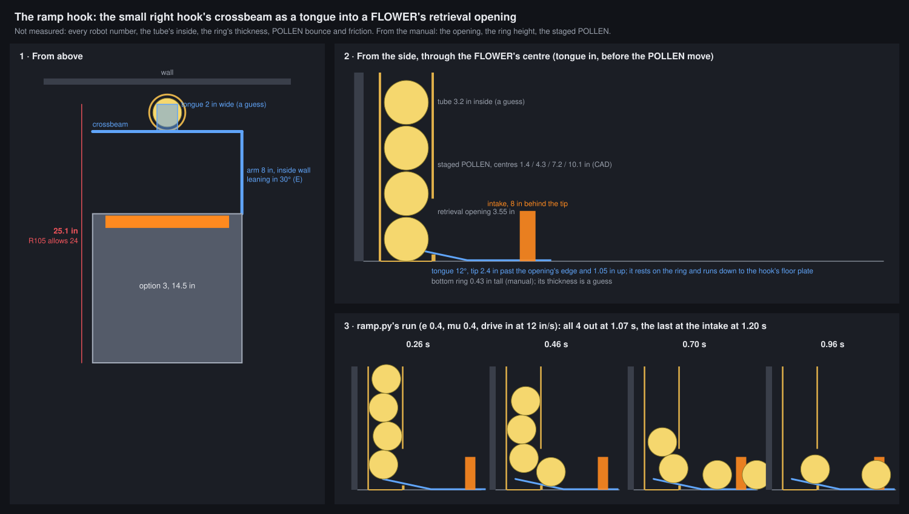

# The ramp hook: spill hook and FLOWER emptier in one arm

Exploring and simulating only. No robot was attached and nothing here was measured. Every robot number is a
placeholder for Thursday's cardboard to replace.

## Meeting notes, 6 Oct 2026

Present: Travis, Nathan, CJ and a mentor.

- **The design options and the simulation work.** We went through the body shapes on
  `claude/biobuzz-robot-body-designs-hi386c` (README "The best of them" and "On option 3"): the **rigid V**, the
  **front C**, the **large and small right hooks**, and the ones we did less with (the funnels, the long U).
  Travis understood the rigid V especially well. The students followed the reasoning, and the rules questions
  behind it: G409 touches from a falling spill, and G407's 4-piece limit inside the guides.
- **The new idea.** One student remembered a video of another team: a **thin ramp, rotated down and driven into a
  FLOWER**, emptied it very fast. The team suggested **combining it with the small hook**: give the hook's
  outside edge an inward ramp. Put it down and drive it into the FLOWER, and the POLLEN roll out and are guided
  into the intake. The same hook, held out while we wait for a TIP or pick up, deadens the pieces that land in it.
- **Hungry Hungry Hippos.** We talked about hippo-style grabbers and found no rule either way. No clear answer
  expected, so **the plan is the hook**.
- **Next:** cardboard prototypes on Thursday. The mentor will post the other team's video.

## The idea

The small right hook (design 14: an 8 in arm and a crossbeam, hinged at the bottom of the chassis' front face) gets
two "inward ramps":

1. **A tongue on the arm's outer side** (version B, drawn). A thin plate, about 2 in wide, sticking out through a gap
   in the arm's wall at floor level, about 2 in ahead of the chassis, and sloping down into the hook. The robot
   runs along the wall and strafes into the FLOWER. The tongue slides under the bottom POLLEN, and the column rolls
   down it, into the hook and along the intake's face. The arm keeps its full 8 in, so the hook's spacing for
   catching the spill in AUTO doesn't change. (Version A, the tongue on the crossbeam, empties more directly but
   costs that spacing: see "Where the tongue goes".)
2. **The arm's inside wall leans in** over the hook's floor. A piece rolling into the wall is sent down into the
   tiles instead of back out across the hook. That's the "deadening".

Redraw it with `python3 tools/ramp-hook/draw.py` and rerun the tables with `python3 tools/ramp-hook/ramp.py`
(about 15 s on 4 cores, no build).

**Short answer.**

- **Physics:** it works in the model, and quickly: all 4 POLLEN at the intake in **1.1 to 1.4 s**, counted from
  an inch short of the FLOWER. The simulator's placeholder, `RobotDesign.flowerPullS`, gives 2.0 s, plus 0.35 s a
  piece through the intake. Two numbers decide it:
  - the tongue's **slope: 10 to 15°**;
  - **how far in its tip goes: at least 2.1 in** past the opening's edge.
- **Size:** on the arm's outer side the tongue fits R105 with the full 8 in arm: 17.15 in across of 18, and 22.5 in
  long of 24. On the crossbeam it would need the arm cut to 6.85 in, which loses the spacing that catches the
  spill.
- **Rules:** use it only before 1:00 left. After that a NECTAR can be at the bottom of a FLOWER, and pushing it
  out breaks G418.

## What the FLOWER gives us

- **It already matters.** The Qualifier Auto (qual-right-v3, README on the body-designs branch) makes TIP 2 from our
  preloads plus **the far FLOWER's 4 POLLEN**, and its FLOWER step is 2.3 s long. A faster FLOWER is time the route
  can spend on PARK, which the hooks cost.
- **4 POLLEN per FLOWER**, 16 on the field at the start (§10.3.1). Two of the FLOWERs (W and N) are on red's side
  in AUTO.
- **POLLEN only comes out of the bottom** (§9.7, G418.B *"only remove POLLEN from the bottom"*), through the
  retrieval opening: 3.55 in tall, above a bottom ring 0.43 in tall.

## The rules it touches

Quotes and section numbers are from Competition Manual TU03, as `doc/flower-backboard.md` on
`spike/158-flower-backboard` quotes them. Check later Team Updates and the Q&A before relying on them.

- **G418.B: POLLEN only, out of the bottom.** Emptying the column through the retrieval opening is exactly that.
  **NECTAR may never come out.** G410 keeps NECTAR out of FLOWERs until 1:00 left, so before then a FLOWER holds
  only POLLEN and the tongue is safe. After 1:00 the bottom piece may be a NECTAR (the Bottom NECTAR Bonus is
  for exactly that one), and the tongue would push it out. **Rule for drivers: no tongue in a FLOWER after 1:00.**
- **G418 intent and G415: contact is fine.** G418 allows *"contacting the FLOWER while attempting to enter or
  remove SCORING ELEMENTS"*. G415 forbids *"grabbing, grasping, attaching to"* field elements, but allows a
  concave shape that wraps round a FLOWER to align. A tongue that slides in and rests on the ring is probably on
  the right side of that, but it is the first question for the Q&A. The other team doing it is not a ruling.
- **G407: 4 pieces.** The hook's inside counts. Arrive empty, or with few enough pieces that 4 more stay legal
  (the README's "Over 4 inside" column counts this for spills). In the Qualifier Auto we reach the far FLOWER
  having fired, so we arrive empty.
- **G409: the spill.** Held down while we wait for a TIP, the hook is the spill hook. Touches are already counted
  for design 14 (README: touched in most runs). A leaning wall covers more floor from above, so expect a few
  more touches.
- **R105: 18 × 24 in.** See "Where the tongue goes".

**Questions for the Q&A:**

1. Is driving a thin robot ramp into a FLOWER's retrieval opening, so that the staged POLLEN roll out, allowed
   under G415 and G418?
2. If a NECTAR is at the bottom of a FLOWER and a robot's ramp pushes it out by accident, what's the penalty?

## Where the tongue goes

The tongue has to reach 2.65 in in front of the crossbeam's face: the tip 2.4 in past the opening's edge, plus the
ring's thickness (0.25 in, a guess). Two places it can go:

| | **A. On the crossbeam** | **B. On the arm's outer side** (drawn) |
|---|---|---|
| How you use it | Drive straight at the FLOWER | Strafe sideways into it (mecanum) |
| Where the POLLEN go | Down the tongue, straight back to the intake | Across the arm into the hook, then sideways along the intake toward the open left side |
| R105 on option 3 | 14.5 + 8 + 2.65 = **25.1 in > 24**: the arm has to be **≤ 6.85 in** | 14.5 + 2.65 = 17.15 in wide ≤ 18: fits with the 8 in arm |
| R105 on design 14 (18 wide × 16) | 16 + 8 + 2.65 = 26.65: the arm ≤ 5.35 in | Already 18 wide: doesn't fit |
| As the spill hook | Unchanged, but a shorter arm moves its line | The ramp over the arm is a way out for pieces rolling outward |

**Or shorten the chassis (A2).** Version A only breaks R105 by 1.15 in, so a chassis 13.35 in long (14.5 wide)
keeps the full 8 in arm and the tongue on the crossbeam: 13.35 + 8 + 2.65 = 24.0 in. There's precedent: design 13
is 14 in long, the front C 12 in. The hook's spacing for the spill doesn't change, because the chassis gets
shorter at the back, not the hook. It costs the build team 1.15 in of length for the drivetrain, intake and
launcher, and it leaves zero margin. The 2.65 in comes from a tip 2.4 in in plus a 0.25 in ring thickness that
is a guess. With the minimum 2.1 in tip and the ring measured, the chassis may only need to be 13.6 to 13.7 in.
**Measure the ring on Thursday before anyone cuts metal.** If the build team can give up the length, A2 is
simpler to drive than B: straight in, no strafing, and the POLLEN roll straight to the intake.

**B is the one that does both jobs.** The 8 in spacing is what catches the spill in AUTO: the arm runs from the
spill's near 90% line to its far one. Cutting it to 6.85 in for A would put the near edge of the spill on the
chassis, and a spill piece touching the chassis is the G409 foul. So **build B**, and keep A only as a fallback if
B's sideways roll doesn't feed the intake.

What B has to get right:

- **The gap in the arm's wall** has to be wider than a POLLEN (2.8 in) for the FLOWER's POLLEN to come in: 3.2 in
  is drawn. During a spill, a piece rolling outward meets the tongue there, rising 12° to about 1.05 in at its
  tip. It escapes only if it's rolling faster than about 37 in/s (a hollow shell climbing 1.05 in); slower ones
  roll back in. Put the gap near the chassis, where the spill runs thinnest (README: the arm's far end sits
  under the spill's edge).
- **The roll along the intake.** The POLLEN come off the tongue at about 15 to 20 in/s, heading across the hook
  toward its open side, along the intake's face. A full-width intake has about 0.7 s of contact to grab each one,
  and table E's lean on the walls slows any rebound. Whether the rollers catch POLLEN going sideways is the
  cardboard test.
- **Driving:** strafe into the FLOWER with the robot running along the wall. Mecanum can do that, but it's the
  one move a driver hasn't practised. Route it in AUTO; in TELEOP the drivers will need practice.
- **Which side:** the arm is on whichever side faces the centre line at the end we start (README, the hooks in
  the Qualifier Auto). The tongue only works with the FLOWER on the arm's side. Check this for the far FLOWER on
  both alliances before committing to an arm side.

## Physics

`tools/ramp-hook/ramp.py`, in the same style as `tools/flower-backboard/plate.py`. `FieldSim` can't answer this.
It takes a FLOWER's POLLEN one at a time and has no ring, window or ramp.

The model is a 2-D slice through the FLOWER's centre:

- **From the manual:** the 4 staged POLLEN (2.8 in, centres 1.4 / 4.3 / 7.2 / 10.1 in), the 0.43 in ring and the
  3.55 in opening.
- **The tongue:** straight and thin, resting on the ring's outer top corner. So inside the tube it rises toward its
  tip, and outside it runs down to the hook's floor plate.
- **The run:** the robot drives the tongue in from an inch out and stops with the tip a set depth in. The intake is
  8 in behind the tip.
- **The POLLEN:** hollow shells, with bounce (e) and friction (mu) swept because nobody has measured them.

Each cell below gives the time until the last POLLEN is out of the tube, then the time it reaches the intake.

**A. The tongue's slope** (ring 0.43 in, drive in at 12 in/s, tip 2.4 in in):

| ramp slope | e 0.25, mu 0.3 | e 0.4, mu 0.4 | e 0.55, mu 0.6 |
|---|---|---|---|
| 5° | 1.56 s / 1.74 s | 1.46 s / 1.65 s | 1.34 s / 1.51 s |
| 10° | 1.26 s / 1.40 s | 1.13 s / 1.26 s | 1.22 s / 1.36 s |
| 15° | 1.03 s / 1.15 s | 1.01 s / 1.13 s | 1.12 s / 1.25 s |
| 20° | 1 stays in | 1 stays in | 1 stays in |

**B. How far in, how fast** (slope 10°, e 0.4, mu 0.4):

| tip past the opening's edge | drive 6 in/s | drive 12 in/s | drive 24 in/s |
|---|---|---|---|
| 1.5 in | 4 stay in | 4 stay in | 4 stay in |
| 1.8 in | 4 stay in | 1.50 s / 1.66 s | 4 stay in |
| 2.1 in | 1.40 s / 1.55 s | 1.10 s / 1.25 s | 0.97 s / 1.12 s |
| 2.4 in | 1.42 s / 1.56 s | 1.13 s / 1.26 s | 1.01 s / 1.15 s |
| 2.7 in | 1.43 s / 1.55 s | 1.13 s / 1.25 s | 1.02 s / 1.14 s |

**C. If the ring isn't what we think** (slope 10°, 12 in/s, tip 2.4 in): 1.26 to 1.44 s to the intake for every ring height
from 0 to 0.6 in. The ring doesn't change the answer, because the tongue rests on it either way.

**D. The simulator's FLOWER pull, for comparison:** 4 × 0.5 s = 2.0 s with the robot held against the tube, plus
the intake's 0.35 s a piece.

**E. The arm's inside wall** (a POLLEN rolling outward hits it, e 0.4):

| wall | speed back across the hook | hop after, at 60 in/s |
|---|---|---|
| vertical | 40% of what it came in with | 0 in |
| leaning in 15° | 18% | 0.1 in |
| leaning in 30° | 3%: it stops at the wall | 0.3 in |
| leaning in 45° | −18%: it's pressed into the wall's foot | 0.4 in |

What the tables say:

- **Why 20° fails.** At 20° the tip is 1.45 in up, above the bottom POLLEN's centre (1.4 in). It pushes the POLLEN
  down and back instead of getting under it. 15° leaves only 0.2 in to spare, so **build 10 to 12°**.
- **Why 1.8 in fails.** A POLLEN pressed against the back of the tube has its centre 1.8 in past the opening's
  edge (with the tube's guessed 3.2 in inside). A tip that stops right there balances it, and it stays in. Past
  2.1 in the tip is under every POLLEN's centre and the depth stops mattering. **The tongue must reach past the
  middle of the tube.** If the tube is wider than we guessed, that depth grows with it: measure it.
- **Driving speed hardly matters** once the tip is deep enough. The bottom POLLEN is lifted by the tongue, and the
  rest drop down onto it.
- **A 30° lean stops a rolling POLLEN dead at the wall.** A vertical wall sends 40% of its speed back across the
  hook, toward the open side. The lean costs little height, and a 4 in wall leaned 30° still stands 3.5 in tall.

What the model can't tell us, and the video or cardboard can:

- the 3-D fit: does a 2 in tongue get through the window and under the POLLEN?
- drag along the tube wall;
- POLLEN that aren't round (§9.8);
- whether the robot shoves the FLOWER (it's bolted to the wall).

## What the other team's video shows

Team 19705's reel, "This is what the ramp is for" (two stills shared 6 Oct 2026; the video itself not yet seen):

- **Their FLOWER isn't a closed tube.** The POLLEN (yellow wiffle balls) stack between green posts. A black
  bracket holds the posts about one POLLEN above a black base plate. The bottom POLLEN sits on that plate, in the
  open gap under the bracket: that gap is the retrieval opening. So `ramp.py`'s "tube" is really posts, and its
  "ring" is probably the base plate's edge. Table C says the ring's height barely changes the answer.
- **Their ramp is a thin red plate across the front of the robot, at floor level**, with a red arm on the side
  that looks like its pivot. That fits "rotated down".
- **Their intake sits right at the FLOWER.** The white star-wheel rollers press against the base, and the ramp
  slides under the bottom POLLEN. In the second still the column is dropping, blurred, into the rollers. **The
  intake pulls the POLLEN out, and the ramp only bridges from the base plate to the rollers.** Our model rolls
  them out by gravity alone, 8 in back to an intake. Theirs is probably faster, about one drop per POLLEN
  (about 0.12 s each, from 2.9 in).

What that changes:

- **There are two ways to copy it.** The doc's version A puts the tongue on the hook's crossbeam, 8 in in front
  of the intake, and lets gravity do the work. Version C is theirs: a thin ramp on the intake's own mouth, with
  the hook swung up. C is likely faster and needs no R105 trade, because nothing reaches past the hook. But it
  is a second moving part, and the hook does only one job. A only works if gravity is enough, which the model
  says it is, in 1.1 to 1.4 s.
- **Wiffle balls bounce little and catch on edges through their holes.** That points to the low-e, high-mu
  columns of the tables, where A still empties.

**19705's "Behind the Bot"** (FUN Robotics Network, 19 Sep 2026, 7.5 min). YouTube refused the video, so this
comes from its thumbnail and preview frames, about one every 5 s. It's mostly interview and close-ups of the robot.
No preview frame shows the FLOWER being emptied, so the timing question is still open. What the close-ups show:

- **Their "ramp" is a pivoting front C.** Two red arms hinge low at the chassis' front corners, joined by a red
  crossbar. Swung down, the C lies flat on the tiles in front of the intake, and the crossbar is the thin edge
  that goes into the FLOWER. Swung up, it stands in front of the rollers. It's the same family as our front C
  (design 8) and the hooks, which supports the meeting's idea of making the hook do both jobs.
- **The crossbar is only a few inches in front of the intake** (white molded star-wheel rollers, the full
  width), not our hook's 8 in. Their intake is right there to pull each POLLEN as it comes out. A shorter arm on
  our hook would get the same effect and fix our R105 problem (version A needs the arm at 6.85 in or less on
  option 3).

**A second team: 25620 Hexadecimal Nibble, "Passive Flower Intake"** (YouTube Short, 10 s, 4 Oct 2026, "Early
flower intake testing"). Only its thumbnail could be fetched; YouTube refused the video. What the one frame shows:

- **A metal strip and a yellow printed wedge, with no motor.** The wedge's thin foot sits flat on the tiles,
  right at the FLOWER's leg under the bracket. The strip climbs from there to the robot's own intake wheels.
  Measured off one frame, with the perspective, that's roughly 35° and about 5 in up. Treat both as rough.
- **The ramp slopes up toward the robot,** the opposite of our tongue, which slopes down to let gravity roll the
  POLLEN out. The bottom POLLEN is on the wedge's low end, blurred, moving toward the robot.
- **The bottom POLLEN sits low, with no lip in front of it,** so a foot flat on the tiles can get under it.
- **One frame can't show what drives the POLLEN up the ramp.** It could be the robot's push, the intake wheels
  reaching down, or the falling column. The 10 s video would show it.

So the cardboard test should try both slopes: down toward the robot (ours, gravity) and up to the intake (theirs,
a scoop).

**Timing, read off 19705's reel by eye (6 Oct 2026): 4 POLLEN in from the FLOWER in about 1 s.** That's about
0.25 s a POLLEN, half of `RobotDesign.flowerPullS` (0.5 s), and inside `ramp.py`'s range. In the model, the last
POLLEN leaves the FLOWER 1.0 to 1.3 s after the tip starts an inch out, at 10 to 15° (tables A and B). The
physical floor is the column dropping one POLLEN at a time: about 0.12 s each from 2.9 in, so about 0.5 s for 4.
Their 1 s says the POLLEN don't come out as fast as they can fall, and that the gravity-fed version A should
come close.

- **For the simulator:** `flowerPullS` 0.25 s, for a robot with a FLOWER ramp, is supported by one video read by
  eye. Change it on the simulator branch, not here, and only for a design that has the ramp. The plain intake
  stays at 0.5 s until someone times it.
- **Still worth timing from a frame-by-frame recording:** first contact to the last POLLEN in, to the nearest
  0.1 s, and whether the robot keeps pushing.

## Thursday: cardboard checklist

Needs a FLOWER (or a tube of the real inside diameter with a 3.55 in window above a 0.43 in ring), 4 POLLEN,
cardboard and tape, a phone at 240 fps and a tape measure.

1. **Measure the FLOWER first:** its inside diameter, how thick the ring is, the window's width, and how far
   the bottom POLLEN sits from the window's edge. These replace the model's guesses.
2. **Tongue:** cut one 2 in wide and about 4 in long, out of a stiff card or a 1/16 in polycarb offcut. Tape it to
   a board at 10°, 12° and 15°, resting on the ring.
3. **Push it in by hand** to 1.5, 2.1 and 2.7 in, 5 times each, with the 4 POLLEN staged. Count how many come out
   and film it. Tables A and B predict nothing at 1.5 in, all 4 from 2.1 in, and 15° no faster than 12° by much.
4. **Floor and intake:** add 8 in of flat card behind the tongue and a stop where the intake would be. Time the
   last POLLEN from first contact until it reaches the stop.
5. **Wall:** stand a 4 in card wall at the side, vertical and then leaning in 30°. Roll POLLEN into it at a few
   speeds and film how far they come back.
6. **Hook B on a cardboard 14.5 in chassis** with the full 8 in arm and a 3.2 in gap near the chassis. Check it
   against an 18 × 24 rectangle taped on the floor. Strafe it into the FLOWER by hand, with a stand-in intake
   (spinning rollers or a drill), and count how many POLLEN it grabs as they roll along it. Then drop and roll
   POLLEN at the gap from inside the hook, to see how many escape.
7. **25620's scoop:** a wedge on the floor rising about 35° to where the intake would be. Push it in and see
   what carries the POLLEN up.
8. **Version C, 19705's way:** tape the tongue to the front of the intake (or a box standing in for it), hook up.
   Push it in, spin the rollers by hand or with a drill, and time it against A.

Bring the numbers back here. They replace the guesses in `ramp.py` (`TUBE_R`, `RING_T`, the tongue's size) and in
`RobotDesign.flowerPullS`.
