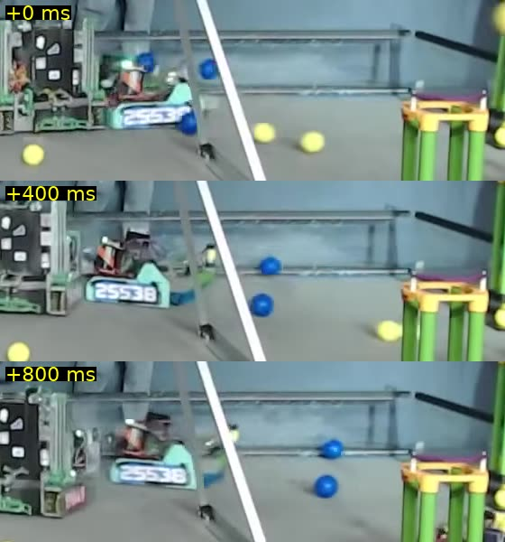
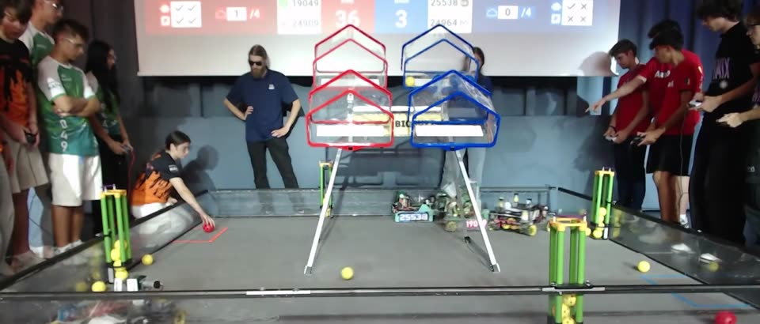

# How far spilled pieces roll

Measured 6 Oct 2026 from a match video, no new testing. The simulator's rolling model changed to match
(`FieldSim.FILMED_ROLLING_DECEL_IN_PER_S2`, `FILMED_BOUNCE_SCATTER`, checked by `FieldSimTest` and
`SpillLandingTest`). No sims have been rerun on it yet: the published numbers predate it.

## The video

The 124-point World Record match, 19049 & 24909 against 25538 & 24964 ([YouTube](https://www.youtube.com/watch?v=495akYrSr2U);
copy in the team's [Drive folder](https://drive.google.com/drive/folders/1rOUkQG-33c22QKkhaK9vAbaH6GRpNq1T)).
Tripod at the side of the field, 1080p, 30 fps. Two TIPs had spills on open floor:

- **Blue TIP, 1:16** (spill away from the camera). Two NECTAR rolled side by side across open tiles. Tracked
  by colour at 10 fps, they moved about 17 px every 0.1 s for 1.3 s, steady to within the noise, then stopped
  against something. The ball itself (26 px across = 3.6 in) gives the scale: **about 23 in/s, with no slowing
  the video can show**.
  
- **Red TIP, 0:49** (spill toward the camera). The NECTAR landed past the HIVE's feet and rolled to the wall
  within about 1.5 s. Two seconds after the TIP, none was left on the open floor.
  

## What changed in the simulator

| | Before | Now |
|---|---|---|
| Drag while rolling on the tiles | 2.5 × speed per second, plus 12 in/s² | 4 in/s² only |
| Drag touching a robot, wall, the HIVE or a CELL | 2.5 × speed per second, plus 12 in/s² | unchanged |
| A piece at 23 in/s, 1.3 s later | about 1 in/s (stopped) | about 18 in/s |
| A piece landing at 60 in/s rolls | about 19 in | to a wall, unless something stops it |
| Sideways kick on a hard landing (bounce scatter) | 0.45 | 0.3, refitted to the same 3 Oct films |
| Tile unevenness | up to 3 in/s² | up to 1.5 in/s², under the rolling drag, so a slope steers a piece but never keeps it rolling |

The old drag was meant for sliding, but it applied while rolling too, so spills stopped two to three times too
short and bunched up near the HIVE. With it gone, the bounce scatter fitted against it spread spills too far,
so it was refitted to the same targets: 0.5 s after landing, pieces 21 in from where they landed (films: about
24, p90 41 against 44); 3 s after the TIP, anywhere from the wall to 86 in out (films: to 85).

**What it means for the Autos:** spilled pieces end up further away and more of them against walls, so they are
harder to pick up, and they cross the Drop Zone faster. Expect lower pickup counts when the sims are rerun.

## Limits

- One match, from a low side angle: good for where pieces end up and roughly how fast, not a precise number. 4 in/s²
  is an upper bound (at 12, the blue pieces would have lost over half their speed in that 1.3 s).
- Only NECTAR could be tracked; the POLLEN is lost among the other yellow on the field. A clip of a POLLEN spill
  rolling across open floor would check it.
- A match field has robots in the way; the 3 Oct films had none. Both agree on the spread.
