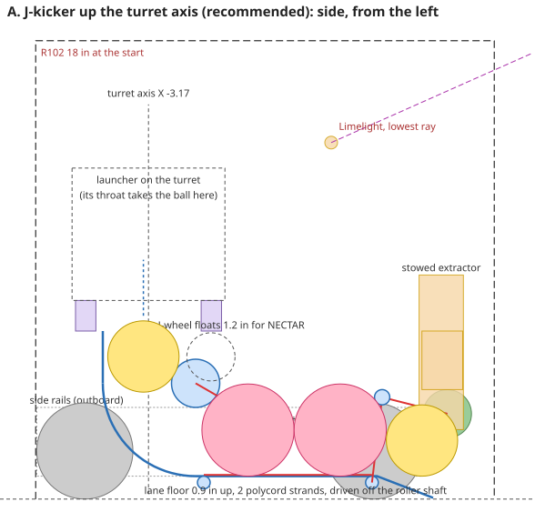
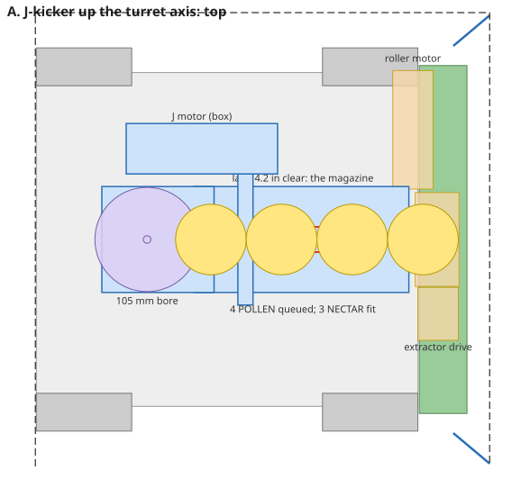
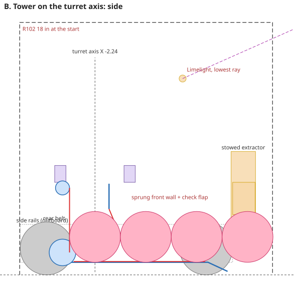
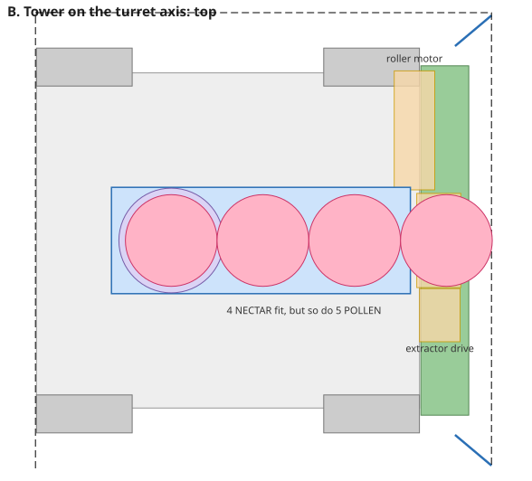
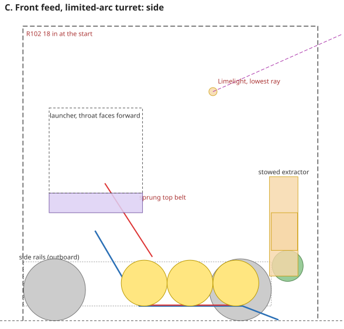
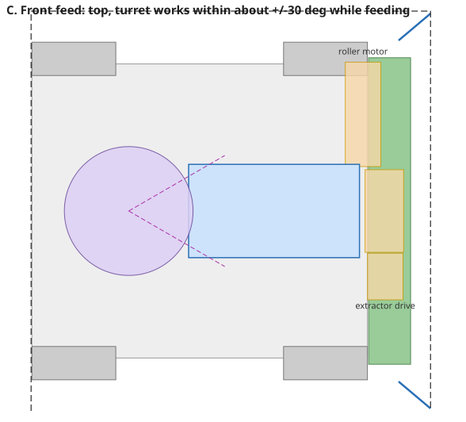

# The transfer: intake roller to turret launcher

Issue #164. Owner: the "Intake-to-turret transfer" chat (session_019KDmb4SvV5VjdaM2USg71K). Written 6 Oct 2026.
Everything here is calculated from the CAD numbers in `doc/unified-design.md` and `doc/robot-cad.md`, and checked
by the physics in this file and the simulator's 60-run Autos. **The decision (6 Oct 2026): it goes straight to CAD**
(`cad/transfer/`, by the Flower Extracter chat) from the build spec below. The few things the physics can't settle,
friction coefficients nobody has measured, are built in as adjustments, not tests.

**Frame:** robot frame, +X forward, +Y left, +Z up, inches. The origin is on the floor under the chassis centre, 7.56 in
behind the front face. The sketches are in `doc/transfer/` (`sketch.py` draws them from the numbers in this file).

## The answer

**A floor lane that is also the magazine, then one floating wheel that kicks each piece up through the hollow turret
bearing.** One new motor and no sensor. Because the hand-off is on the turret's axis, it works at every turret angle.

1. **The lane.** The roller drives each piece up a short ramp into a 4.2 in wide lane along the centreline. The lane
   floor is 0.9 in off the tiles. Two polycord strands run along the floor, driven off the roller's shaft, and pull
   the pieces back. Pieces queue in single file. The lane holds 4 POLLEN or 3 NECTAR, never 5 pieces.
2. **The J-kicker.** At the back of the lane, a 48 mm gecko wheel sits over a fixed J-shaped curve. When the J motor is
   stopped, the wheel is the stop the queue rests against. When it runs, it takes the front piece under itself,
   round the J, and throws it straight up the turret axis. The wheel floats on a banded arm, so it grips both sizes.
3. **The turret.** A hollow bearing (goBILDA's 105 mm ID turret) lets each piece fly up through the turret's centre
   into the launcher's throat. The throat turns with the turret, so the hand-off point never moves.

**Firing:** the J runs at full speed and the roller at about half. The lane's speed decides how often a piece
arrives, so it sets the shot interval: **about 0.25 s**. A volley of 4 takes about 0.9 s.

 

## Read this first: the pieces are stiff

The launcher study (TeamCode/README.md, "Choosing a launcher for POLLEN and NECTAR") found that both pieces are
26-hole plastic balls, like pickleballs: POLLEN is 2.80 in and NECTAR 3.62 in. They can't be squeezed more than about
0.25 in. So anything that grips a piece by pinching it needs **one side on a spring, resting on a hard stop**. The
stop is set so POLLEN is lightly gripped, and NECTAR pushes the spring side about an inch further out. The study's
launcher works the same way. Gravity is the only thing that grips both sizes without a spring. The design uses both:
gravity in the lane, a floating wheel in the J.

**This is also a problem for the intake as drawn, and it blocks everything after it.** The roller's bottom is 2.4 in
off the tiles and its axle is at 3.35 in. A NECTAR on the tiles is 3.62 in tall, which is taller than the axle. So a
NECTAR can't pass under a fixed roller at that height. It would have to be squeezed 1.2 in. The roller needs to float
too, or the NECTAR has to come in some other way. This goes to the Intake Design and Flower Extracter chats. The
transfer assumes the roller delivers pieces moving rearward at about 50 in/s, 7.2 in in front of the origin.

## Three concepts

| | **A. J-kicker up the axis** | B. Tower on the axis | C. Front feed, limited turret arc |
|---|---|---|---|
| Turret angle while feeding | **Any** | Any | About ±30° around straight back. Outside that, the drive aims |
| New motors | **1** (J). The lane runs off the roller | 1 (tower) | 1 (ramp belt) |
| Holds | 4 POLLEN or 3 NECTAR (3–4 mixed). **Never 5** | 4 of anything, **but also 5 POLLEN**, so something has to count | Same as A |
| Shot interval | 0.25 s (lane-metered, adjustable 0.15–0.4) | 0.25 s | 0.25 s |
| Turret bearing | Hollow, ≥ 4.0 in clear (goBILDA 105 mm) | Hollow, ≥ 4.0 in clear | Any, including a plain lazy susan |
| Moving parts in the path | 1 floating arm | Belt, floating wall, check flap | Floating top belt |
| Main jam risk | NECTAR lifting the arm at the J's mouth | The bottom corner: the last piece has nothing pressing it into the belt | The seam between the fixed ramp and the turning throat |

### A. J-kicker up the turret axis (recommended)

**Piece path.**
- The roller drives the piece up a 22° ramp onto the lane floor (z 0.05 → 0.9 between X 8.0 and 5.8). The ramp
  starts under the roller's rear half, so the roller presses the piece onto it and pushes it up, rather than throwing it.
- Two polycord strands on the floor carry it back at about 27 in/s, and it joins the queue.
- When the J runs, the front piece goes under the J-wheel and round a quarter circle. It leaves straight up along the
  turret axis, moving at about 70 in/s, and passes through the bearing into the throat.

**Geometry.**

| | Value |
|---|---|
| Lane floor | z 0.9, from X 5.8 back to the J. Walls 4.2 in apart (POLLEN can't sit side by side) |
| Floor strands | 3/16 in polycord at **Y ±0.5** (at ±0.75 a POLLEN sags 0.22 in between them and rides the floor; at ±0.5 it sags 0.09 and rides the strands), on 0.5 in pulleys at X 5.6 and −1.0, z 0.65 |
| J-wheel | 48 mm gecko ×2 (the roller's wheels). Axle at **(−1.32, 4.54)** when resting on its hard stop |
| Floating arm | 60 mm (2.36 in) pivot to axle, set by a 40T HTD5 belt on two 16T pulleys inside the left arm; pivot at **(0.72, 3.36)**, 30° above horizontal. The wheel lifts up to 1.2 in for a NECTAR. A soft band (surgical tubing, about 1 lbf preload) returns it to the stop |
| Why 30° | The queue's push on the stopped wheel must turn the arm **onto** its stop. From the torque about the pivot, a POLLEN's push closes the arm at any angle up to about 50°, a NECTAR's only below about 42°. At 30° both close with margin; at the 45° first drawn, a NECTAR was neutral |
| Outer J | Radius 3.64 in about the wheel's resting axle, from the lane floor round to a vertical rear wall at X **−4.96** |
| Gap | POLLEN gripped by 0.1 in at the stop. NECTAR lifts the arm 0.8–1.2 in |
| Piece column | NECTAR centred at X −3.15, which is on the axis. POLLEN at −3.56. Both are inside the bore (X −5.24 to −1.10) |
| Turret axis | X **−3.17**, Y 0. This is the position from the scorer chat's read of the CAD, kept as it is |
| Bearing | Its bottom at z 6.6 or higher. The wheel's highest point (NECTAR) is 6.3 |

**Why it holds 4 POLLEN but only 3 NECTAR.** The stopped wheel is what the queue rests against. A NECTAR is taller, so
it touches the wheel sooner, and its centre stops at X +0.73. A POLLEN stops at −0.64. The last piece is "in" when the
roller still holds it, with its centre at most 8.56 (the roller's axle).

| Pieces | Last piece's centre | Fits? |
|---|---|---|
| 4 POLLEN | 7.76 | Yes. The 4th sits in the roller's grip |
| 5 POLLEN | 10.56 | No |
| 3 NECTAR | 7.97 | Yes |
| 4 NECTAR | 11.59 | No |

Mixed loads give 3 or 4. So **G407 holds by geometry: no load of 5 fits.** A 4th NECTAR would need the turret axis at
X −4.9. That's too far back, because the turret's base would cross the start line at X −7.60. At the start, a 4th
preload can sit in the J itself (on the stopped wheel), so **4 preloads of any mix fit**.

**Motors.** The J motor: a goBILDA Yellow Jacket at **1620 rpm** (5203-2402-0003), 1:1 to the J-wheel: 160 in/s at
the tread. A ball driven round a fixed curve by one wheel leaves at 0.4–0.5 of the tread speed (the launcher
study's hood figure to the pure-rolling limit): **64–80 in/s** at the wheel's rearmost point, z 4.54. From there it
coasts up: it peaks at z 9.9–12.9 and passes z 8 at 38–61 in/s. **The 1150 rpm motor is not enough** (peak z
7.2–8.7, barely past the bearing), so 1620 is the one. The lane runs off the roller shaft, 2:1 up: at the roller's
1150 rpm the floor strands move at 60 in/s and pieces at about 24 in/s, since a hollow ball driven only by a belt
under it settles at 0.4 of the belt's speed.

**Time per piece.**
- Intake to ready (at the J): about 0.35 s for the first piece (it leaves the roller at about 50 in/s and slows to the
  strands' 24 in/s over the 9 in). Later pieces have less far to go.
- Command to the piece leaving the J: about 0.15 s. That's about 0.05 s for the J to spin up, plus about 0.08 s round
  the J and up the chute.
- Shot interval: the J clears each piece in about 0.08 s, much faster than pieces arrive. So the interval is the piece's
  diameter divided by the lane's speed. With the roller at 60% while firing, pieces move at about 14.5 in/s: **0.25 s
  for NECTAR, 0.19 s for POLLEN**. Set the power to match the launcher's recovery. Software only: no sensor needed.

**Firing at any turret angle.** The J and the chute are fixed to the chassis. The turret turns around them. Each piece
crosses the bearing on the axis (NECTAR) or 0.4 in behind it (POLLEN), so the throat needs a mouth about 4 in across,
centred on the axis. That holds at every angle. Only the launcher's wires have to cross the rotating joint, so the
turret's travel is however much its cable loop allows.

**Jam risks, and the fix for each.**
- *A piece at the J's mouth with the wheel stopped.* It can't pass: the gap on the stop is 0.1 in less than a POLLEN,
  the balls can't squeeze (about 10 lbf per 0.1 in), and the piece's push on the wheel turns the arm **onto** its stop
  (torque about the pivot: −1.6 for POLLEN, −0.5 for NECTAR, in units of arm length × push; negative closes). The
  push itself is tiny, about 0.03 lbf per ball from the strands, or 0.06 lbf for a 1 g bump. So the hold is geometric
  and doesn't depend on the motor's brake. Brake mode anyway.
- *A bump while driving.* The gap between the wheel's top (5.5) and the bearing (6.6) is too small for a ball, so a
  bounced piece can't get over the wheel. A lid over the last 3 in of the lane is cheap insurance.
- *Two pieces in the J at once.* This can't happen while the lane delivers slower than the J clears. Keep the J at full
  speed whenever it runs.
- *A piece stuck on the ramp.* The roller has to throw it at 25 in/s or more. If it doesn't, lower the ramp's angle.
- *The holes in the balls catching a polycord strand or gecko tread.* Check with real pieces.

**Where a sensor would help later.** None is needed. In order of value:
1. Counting shots with the launcher's flywheel encoder: a shot shows as a speed dip. It's free, and it tells the code
   when the robot is empty.
2. A break-beam at the J's mouth. It says "a piece is ready", so the code can fire the moment it's aimed.
3. A break-beam at the lane's front. It knows when the lane is full, so the intake can stop at 4. It could also step one
   NECTAR into the J, which would raise the NECTAR capacity to 4.

### B. Tower on the turret axis

The same lane, ending against a **vertical belt behind the piece column**. It's two shafts with polycord and gecko
wheels at the bottom to catch the piece off the floor, driven by one motor. In front there's a **sprung wall on a hard
stop**, starting above the lane (z 4.6). A **sprung check flap** at the foot presses the last piece into the belt. The
column is the turret axis, at **X −2.24**.

- *For:* the first piece's centre is on the axis, so the lane holds 4 NECTAR.
- *Against:*
  - It also holds 5 POLLEN, so G407 needs a count: a sensor, or the driver.
  - It has three moving parts in the path, not one.
  - The bottom corner is the classic tower jam. The last piece arrives with nothing behind it to push it into the
    belt, so it depends on the flap.
  - The axis moves 0.9 in forward of the CAD's position.

 

### C. Front feed into a limited-arc turret

The same lane, then a ramp up at about 55° with a sprung belt over the top. It throws the piece into a throat on the
turret's front edge. No hollow bearing is needed, so any turntable works. That matters because goBILDA's 105 mm
turret was out of stock on 6 Oct.

- *For:* the simplest turret.
- *Against:* the turret can feed only within about ±30° of straight back, set by how wide its throat is. Shots outside
  that need the drive to turn the robot, so the turret loses most of its point.
- Keep it as the fallback if no hollow bearing can be had.

 

## Recommendation: A, and the space it takes

**Envelope boxes** for the CAD chat. Robot frame, inches. "Keep-out" means nothing else goes there.

| Part | X | Y | Z |
|---|---|---|---|
| Ramp | 5.8 .. 8.0 | −2.1 .. 2.1 | 0.05 .. 0.9 |
| Lane: floor, strands, pulleys, walls (keep-out inside the walls) | −1.3 .. 7.2 | −2.35 .. 2.35 | 0.25 .. 5.0 |
| Lane drive (outside the left wall): roller shaft → countershaft at (6.0, 4.0) → lane shaft, two polycord loops | 5.2 .. 9.1 | 2.35 .. 2.9 | 0.2 .. 4.6 |
| J-wheel, arms, pivot stubs (full float) | −2.3 .. 0.8 | −2.6 .. 2.6 | 1.9 .. 6.3 |
| Outer J and chute (keep-out inside) | −5.1 .. −1.0 | −2.2 .. 2.2 | 0.25 .. 6.6 |
| J motor (position open; any spot in this box, belted to the left pivot stub) | −4.0 .. 2.0 | 2.6 .. 4.6 | 0.8 .. 4.0 |
| Turret bearing (the launcher's) | centred on (−3.17, 0) | | bottom at 6.6 or higher |
| Piece column through the bearing (keep-out) | −5.24 .. −1.10 (the bore) | | 6.6 .. the throat |

What it needs from the rest of the robot:
- **The centreline strip, 4.7 in wide from X −5.1 to 7.2, has to be free below z 5.0.** So the battery, the hubs and
  any cross-channels between the rails go to the sides, or onto a deck above 5.2 in.
- **A drive pulley on the roller's shaft at Y +2.6.** It sits clear of the extractor's arm bearings (±1.8) and under
  the roller motor.
- **The turret on the axis at X −3.17, with its bearing's bottom at 6.6 in or higher,** and a throat that takes a piece
  rising through the bore at about 70 in/s.
- **Motor ports.** The transfer adds one motor. With 4 drive motors, the roller, the J, a flywheel and the turret,
  that's 8, the two hubs' limit. A second flywheel motor means the turret has to be a servo.
- **Inside R102.** Everything is between X −5.1 and 9.0 and below z 6.6. The start line is at X −7.60.

**Parts list.**

| Part | goBILDA or source | Qty |
|---|---|---|
| J motor, Yellow Jacket 1620 rpm (3.7:1) | 5203-2402-0003 (1150 rpm is not enough: the piece wouldn't clear the bearing) | 1 |
| 48 mm gecko wheels (the roller's) | as for the roller | 2 |
| 8 mm REX shaft: J-wheel about 130 mm, countershaft about 30 mm | REX shaft, cut | 2 |
| 6 mm D-shafts for the strand pulleys, about 115 mm, with 6 mm-bore flanged bearings | goBILDA 2100 series + bearings, to confirm | 2 + 4 |
| Flanged bearings, 8 mm REX bore, 14 mm OD: the J shaft, the pivot stubs, the lane shafts | 1611-0514-4008 (2-pack) | 8 bearings |
| Arm drive, 1:1 inside the left arm, 60 mm centres | 3417-4008-0016 HTD5 16T ×2 (to confirm) + 3412 belt 40T | 1 set |
| Lane drive: roller shaft → countershaft (6.0, 4.0) → lane shaft, 2:1 up. V-groove pulleys 32 mm (roller shaft), 16 mm ×2 (countershaft), 16 mm (lane shaft); two 3/16 in polycord loops, about 8.3 and 8.7 in at pitch, welded 5% short | printed pulleys + polycord; countershaft in one 1611-0514-4008 bearing on the wall | 1 set |
| Polycord, 3/16 in urethane round belt, welded into loops | any FRC supplier | 4 loops: two floor strands about 14 in, the lane drive's two, about 7.5 and 9 in |
| Strand pulleys, 0.5 in V-groove, 6 mm D bore | printed | 4 |
| Arms (2), the hard stop, the outer J and chute (3 pieces), the ramp | printed PETG or nylon, 1/8 in walls | |
| Lane floor and walls | 1/16 in polycarbonate | about 9 × 4.5 in floor, 2 walls |
| 1/4 in surgical tubing for the arm bands | | about 12 in |
| Turret with a 105 mm ID (the launcher's purchase; the transfer needs its bore) | 3208-0004-0001. If it's still out of stock, a ring-type lazy susan with at least 4.0 in clear through the middle, driven by a printed ring gear | 1 |

## Fit against the robot CAD (Flower Extracter chat, 6 Oct 2026)

Checked against the part boxes in the team's STEP and `cad/intake-b/`.

| In the lane's strip (X −5.1..7.2, Y ±2.35, below z 5.0) | Where | What changes |
|---|---|---|
| The old intake's 11-hole cross-channel (bracing the front uprights; part of the old intake) | X 5.03..5.51, full width, z 4.43..6.32 | **A NECTAR's top is at 4.52 in the lane (floor 0.9 + 3.62), so it would hit the channel by 0.09 in. Decided: raise the channel 8 mm (one hole step) to a bottom at 4.75, which leaves 0.22 in of clearance, and remove the two 8 mm pattern spacers on top of it** (X 5.03..6.29, Y −4.29..−3.03). The extractor doesn't depend on this channel. Check that the uprights' back faces have holes at that step |
| The front drive motors' encoder caps | X 2.36..3.93, \|Y\| 1.87..2.59, z 3.48..5.05 | They're inside the walls by 0.23 in, but not in the pieces' way: a NECTAR is ±1.64 wide at z 3.48 and narrower above. Cut the walls down to 3.4 in for X 2.3..4.0 |
| The extractor's servo gear and down-stop | moved to the right end over the roller (\|Y\| ≥ 5.4) with the vertical float | No longer in the strip. The walls run to X 7.2 |
| The CAD's "Launcher Concept" (cross-channels, beams, flywheels, a 312 rpm motor) | X −5.52..0.95 | Replaced by the turret. It must go, or it fills the J and the chute |
| A pulley on the roller shaft at Y +2.6 | in the roller's solid left segment | Costs a 0.6 in gap in the gecko wheels there. Clear of the roller motor and the extractor's arm |

Nothing else is in the strip: no battery, hub, chassis cross-member or pod. Under the turret (X −5.3..−0.9,
\|Y\| ≤ 2.7, z 0..9), with the "Launcher Concept" removed, the CAD has nothing at all, so the J, the chute and the
bearing's bottom at 6.6 have that space to themselves. The old intake's motor mount (X 5.75..7.47, Y 2.79..3.28)
sat next to the countershaft's belt; it goes with the old roller.

On the robot: raise the 11-hole channel 8 mm and remove the two spacers before the lane goes in.

## The floating roller (Intake Design chat, 6 Oct 2026)

The roller now floats, **vertically**: its bearings ride in slots in the side plates at X 8.56. It rises 0.85 in
under the intake's rule (the slots are cut to 1.3 in for margin), and a spring returns it to a down stop at 2.4 in.
The roller motor rides on the same carriage, 77.5 mm above the roller, so the roller's own belt stays the same length.
Drawn in `cad/intake-b/` (commit 70b2561 on `claude/robotics-meeting-notes-lq2y55`). The extractor turns on its own
shaft at (9.96, 4.5), always ahead of X 8.7, clear of the ramp.
(A pivot arm on the motor shaft was ruled out: it swings the roller sideways, and the roller's rear is 0.06 in ahead
of the front uprights.) Checked against the transfer:

- **The lane's entry meets the bite at both ends of the float.** The ramp now starts at X 8.0, under the roller's
  rear half. The roller's rear edge is at X 7.6 whether its bottom is at 2.4 or 3.7, so the piece is always pressed
  onto the ramp as it leaves the roller. The pinch is set by the float spring, not by the ramp's height, so the ramp
  can't jam a NECTAR. Pieces reach the lane floor at X 5.8, 1.8 in behind the roller's rear edge.
- **The lane's drive runs from a shaft that moves** (the roller's, (8.56, 3.35) rising to (8.56, 4.65) at the top
  of the slot). A belt straight from it to the lane shaft at (5.6, 0.55) would change length by about 0.6 in over
  the working rise (the span is √(2.96² + Δz²), and Δz goes from 2.8 to 3.65). So **the drive goes through a
  countershaft at (6.0, 4.0)**, level with the roller shaft's mid-travel: that span is 2.64 in at the bottom of the
  slot and at the top, and 2.56 in as the roller passes level with it (the CAD chat's check). That 0.16 in is about
  2% of the loop, which polycord's stretch takes, so it needs no idler and no spring. A second, fixed-length belt runs from the
  countershaft down to the lane shaft. Both are polycord loops on V-groove pulleys; the 1.5:1 step-up is on the
  lower one. The countershaft sits outside the left lane wall at Y +2.6, on the wall itself. Its pulley
  (X 5.5..6.5, z 3.5..4.5) clears the raised 11-hole channel (X 5.03..5.51, z 4.75 up). Belt box: X 5.2..9.1,
  Y 2.35..2.9, z 0.2..4.6. The J-wheel is at X −1.3, 6.5 in behind: clear.
- **Ramp height under a lifted roller.** With a NECTAR under the roller, the roller's bottom is at about 3.5, and
  the NECTAR's centre at 1.81 on the tiles. The ramp starts 0.05 in up at X 8.0, under the piece's rear half, so it
  touches the piece only once the roller has pushed it rearward.

## Build spec for CAD (6 Oct 2026)

Front entry only. Robot frame, inches unless mm is written. Where a goBILDA number is given, check it on gobilda.com
before ordering; where it says "to confirm", the type is decided and the exact number isn't.

### Lane

| Item | Spec |
|---|---|
| Floor | 1/16 in polycarbonate, top face at z 0.90, X −1.3 to 7.2, Y ±2.1 inside the walls. Slots for the four strand pulleys |
| Walls | 1/16 in polycarbonate, inner faces at Y ±2.1, from the floor to z 5.0; cut to 3.4 over X 2.3–4.0 (front drive encoder caps) and to 4.4 under the raised 11-hole channel (X 5.0–5.55) |
| Ramp | 1/16 in polycarbonate or printed, from (8.0, 0.05) to (5.8, 0.90), 22°, Y ±2.1. The roller's rear edge (X 7.6) presses pieces onto it at any float height |
| Strands | Two loops of 3/16 in (4.8 mm) 83A urethane round belt at **Y ±0.5**, top run on the floor from X 5.6 to −1.0, return under it. Loop about 14.8 in at pitch; weld 5% short |
| Strand pulleys | Four printed V-groove pulleys, 0.5 in OD, on two 6 mm D-shafts (goBILDA 2100 series, to confirm) at (5.6, 0.65) and (−1.0, 0.65), in 6 mm-bore flanged bearings in the walls. Front shaft driven; rear idles |
| Mounting | Two printed hangers from the raised 11-hole channel (X 5.03–5.51) to the walls; the rear end and the J shell to the turret's rear cross-channel; the ramp to the roller's side plates |

### Lane drive (2:1 up, so strands run at 60 in/s and pieces at 24 in/s)

| Item | Spec |
|---|---|
| Roller-shaft pulley | 32 mm V-groove, 8 mm REX bore, printed, in the roller's gap at Y +2.35..+2.9 |
| Countershaft | 8 mm REX, about 30 mm, at (6.0, 4.0), Y +2.6, in one 1611-0514-4008 flanged bearing on the left wall's outer face. Two 16 mm V pulleys on it |
| Upper loop | Roller shaft → countershaft, 2.64 in centres (2.56 at the roller's mid-travel: 2% of the loop, taken by stretch). 3/16 in polycord, about 8.3 in at pitch |
| Lower loop | Countershaft → front strand shaft (5.6, 0.65), 16 mm → 16 mm, 3.37 in centres, fixed. About 8.7 in at pitch |

### J-kicker

| Item | Spec |
|---|---|
| Wheel | Two 48 mm gecko wheels side by side (the roller's wheels), about 2 in wide, on an 8 mm REX shaft about 130 mm long (Y −2.4 to +2.75). Axle at rest **(−1.32, 4.54)** |
| Wheel drive | 16T HTD5 pulley (3417-4008-0016, 8 mm REX, to confirm) on the shaft at Y +2.2..+2.55, outboard of the left wall; 40T 3412-series belt (9 mm) to a matching 16T pulley on the motor shaft at the pivot. 60 mm centres |
| Arms | Two, 1/8 in aluminium, 60 mm pivot-to-axle, at Y +2.6 (left, carrying the belt) and Y −2.4 (right). Pivot **(0.72, 3.36)**, the arm 30° above horizontal toward the rear. The shaft passes through arc slots in the walls, 1.2 in of travel, perpendicular to the arm (up-forward, 60° from horizontal) |
| Pivot | Left: the J motor's output shaft is the pivot axis; the arm rides on it on a round-bore flanged bearing (1611-0514-0008). Right: a dead 8 mm stub in a printed block on the wall, same bearing |
| Hard stop | A printed block on each wall's outer face under the arm, bolted through a ±0.1 in slot: the resting gap under the wheel is tuned from 2.6 to 2.8 in without reprinting. Design position: 2.7 (POLLEN squeezed 0.1) |
| Band | 1/4 in surgical tubing from a post at each arm's tip to a post on the wall, forward and above; preload about 1 lbf; the wall post has three holes so the preload is tuned by moving it |
| J motor | goBILDA 5203-2402-0003 Yellow Jacket, 1620 rpm, 3.7:1. Body along +Y from Y 2.75, about 1.5 in dia × 3.5 in, centred on z 3.36, X 0.72; mounted to the left wall by a printed face bracket at the pivot. Runs only to fire, forward only; brake mode when stopped. Torque needed: under 2 kg·cm (a 2 lbf pinch at 0.945 in) against 4.4 at stall |
| Outer J and chute | Printed PETG, 1/8 in wall, inner radius 3.64 about the resting axle, from the lane floor round to a vertical rear wall at X −4.96, up to z 6.6; inner width Y ±2.1. Two halves, bolted to the walls and to the rear cross-channel. A 1/16 in lid over the pocket from the wheel's front to X 0.5 at z 5.0 (keeps a bounced piece in) |

### Turret bearing and the launcher's end

| Item | Spec |
|---|---|
| Bearing | goBILDA 3208-0004-0001 (105 mm ID, 2.75:1 geared turret), or any ring bearing with ≥ 4.0 in clear through the middle. Axis **(−3.17, 0)**; bottom face at **z 6.6** |
| Mounting | Two 1120-series U-channels across the rails, at X −5.6..−5.1 and X 0.0..0.5, tops at z 6.6, carrying the ring. (The 1103 channel at X −6.15..−5.67 stays.) The wheel at full float reaches z 6.3 at X −2.27..−0.37 and the arm's top about 5.9: both clear the front channel |
| Hand-off | The piece leaves the J at z 4.54 at 64–80 in/s, on the axis (NECTAR) or 0.4 in behind it (POLLEN), and coasts up through the bore. **The launcher must take it between z 6.6 and 10**, where it is still rising at 38 in/s or more. Its throat mouth: about 4 in across, centred on the axis, at any turret angle |

### Mass and motor count

About 0.9 kg: motor 0.35, wheels and shafts 0.2, polycarbonate 0.15, prints and pulleys 0.2. One motor port.

### What the physics can't settle, and the adjustment that covers it

| Unknown | Covered by |
|---|---|
| Gecko tread's grip on a holed ball (0.4 or 0.5 of tread speed) | Both ends clear the bearing; the launcher's intake wheel, not a fixed hood, takes the piece, so arrival speed needn't be exact |
| The POLLEN gap that grips without stalling | The stop's ±0.1 in slot |
| The band's preload | The three-hole post |
| Polycord's drive on a ball (0.4 of belt speed assumed) | Pulley swap on the countershaft (16 → 12 or 20 mm) changes lane speed ±25%; firing interval is software anyway |
| The 4th piece's arrival in the roller's pinch | The ramp's slotted mounting, ±0.5 in in X |

## Numbers for the simulator

| | Value |
|---|---|
| Hand-off to the launcher | On the turret axis, (X −3.17, Y 0) for NECTAR and (−3.56, 0) for POLLEN, crossing z 6.6 upward at about 70 in/s. The launcher's own exit is the launcher's. The simulator's current one (12 in up, 4 in behind the centre) is close to this axis |
| Intake to ready to fire | 0.35 s. The intake's own 0.35 s a piece is unchanged; the lane doesn't slow it |
| Fire command to the first piece leaving the transfer | 0.15 s, plus the launcher's own time in the throat |
| Shot interval | **0.25 s** (NECTAR 0.27, POLLEN 0.21). It can be set anywhere from 0.15 to 0.4 s, so the launcher's recovery decides it |
| Volley of 4 | about 0.9 s (0.15 + 3 × 0.25) |
| Capacity | The first piece's centre stops at X −0.64 (POLLEN) or +0.73 (NECTAR). Each later piece's centre is half of each neighbour's diameter further forward. The intake refuses a piece whose centre would land ahead of X 8.56 (the roller's axle). That gives 4 POLLEN, 3 NECTAR, 3–4 mixed, never 5. At the start: 4 preloads of any mix |
| Turret angle | No limit from the transfer |

## In the simulator (robot body designs chat, 6 Oct 2026)

The three qualifier baselines, 60 runs each, on the drawn Rigid V. The routes are unchanged, still timed for 0.45 s
shots. "Lane only" means the lane's capacity rule (`RobotDesign.laneCapacity`). Points · 3-TIP runs of 60:

| Design | Partner shoots | Stages, angled | Stages, wall |
|---|---|---|---|
| Baseline | 71.2 · 48 | 51.6 · 0 | 55.3 · 26 |
| 0.25 s shots | 69.2 · 42 | **56.6 · 14** | **58.0 · 26** |
| Lane only | 70.5 · 46 | 51.3 · 0 | 54.3 · 23 |
| Both | 68.5 · 40 | 54.3 · 7 | 58.0 · 26 |

- **Faster shots pay with a staging partner.** TIP 2 comes 1.6–1.9 s sooner, and the angled Auto gets 3 TIPs for the
  first time.
- **Partner shoots loses 2 points** only because its spill waits are fixed times tuned for 0.45 s. The route needs
  retiming. G409 touches rise for the same reason.
- **Holding only 3 NECTAR costs 0.3–1.0 points.** That's worth paying for A's G407-by-geometry over B's counter.

## Rear entry: loading from a FLOWER extractor at the back (asked and decided 6 Oct 2026)

**Decided: the extractor stays at the front, and none of this is built.** The reason is in the mechanism itself:
rear entry needs the J-wheel running in reverse, so the robot can't shoot while it extracts, and shooting while
extracting was the rear's main point. The front path runs one way (roller → lane → J → turret) and can do both at
once. The study is kept for the record.

The scorer chat asked whether the transfer can take pieces from its rear end, if the FLOWER extractor moves to the
back of the robot. **Yes, through the chute, with the J-wheel run in reverse.** Nothing in the front path changes.

**How it works.**
- A piece enters the chute's rear wall through a **window at X −4.96, Y ±2.1, z 3.0 to 6.6**. It lands on the outer
  J's curve and rolls down to the pocket under the wheel. The curve is the funnel: that's why the entry is high, not
  at floor level, where the curve is a wall.
- **J-wheel in reverse** pulls the piece under itself, forward, into the lane: the same pinch firing uses, backwards.
  Each new piece pushes the queue forward against the floor strands, which slip. The roller runs slowly inward (or
  sits stopped in brake mode) so the front of the lane stays shut.
- **Firing is unchanged.** The J runs forward: a piece in the pocket fires first (the wheel's rear face moves up, so
  it drags the pocket piece round the curve), then the lane's rearmost piece, and so on. Last in, first out.
- **Timing:** about 0.3 s a piece (0.2 s down the curve, 0.1 s under the wheel), the same as the front intake.

**Capacity, and the one thing it costs.** The pocket under the wheel is a spot the front intake can never fill, so
from the rear the robot holds the lane plus the pocket: **5 POLLEN** (only POLLEN ever comes from a FLOWER). That
breaks the geometric G407 guarantee. So rear loading needs a count: the extractor stops after 4, or
one break-beam at the window. That's the cheapest sensor on the list, and only the rear path needs it.

**What the window needs** (checked by the CAD chat against the chassis, 6 Oct 2026):
- A clear tunnel from the back face to the chute: **X −7.57 to −4.96, Y ±2.15, z 3.0 to 6.6.** Two frame
  cross-members are in it: the back channel (1107-0013-0336, X −7.56..−7.09, z 3.84..5.73) and a second full-width
  channel (1103-0041-0328, X −6.15..−5.67, z 5.26..5.73). Both would need a 4.3 in cut-out and a replacement tie
  below z 3.0 or above 6.6. They're the only cross-members at the back, so that's a frame change for the robot's
  designer to agree to. The rear drive motors' encoder caps also pinch the tunnel to ±1.85 at X −7.4..−5.8; a POLLEN
  (±1.4) still passes.
- The lip at z 3.0 is set by the J curve (at X −4.5 the curve is at z 2.8). The top, 6.6, is the turret bearing's
  bottom. A POLLEN (2.8) clears both with 0.8 in. NECTAR is never extracted from a FLOWER (the user, 6 Oct), so the
  rear path only carries POLLEN and the window's 3.6 in is enough.
- The extractor has to deliver the piece **moving forward at about z 4.5 (centre)**, so it lifts the piece about
  3 in from the tiles behind the robot. The CAD chat finds no passive rear extractor that does this inside the 18 in
  start: the one that fits delivers pieces rolling on the tiles, so a lift needs its own motor or servo and more
  depth, and its stowed outline sits in the tunnel's mouth.
- Under the turret deck nothing conflicts: the CAD has nothing in X −5.3..−0.9 below 9 in, and the J motor is at
  Y +2.6..4.6, outside the tunnel.

**A floor-level door instead of the high window** (the CAD chat's passive rear extractor, 6 Oct 2026: a low plate
and a 2 in ramp bring a FLOWER's 4 POLLEN out at **lane-floor height, 0.9**, on their own speed; all 4 are past the
block in about 1.0 s). This is the rear version to build, if any:
- **The ball arrives on a 0.9 in floor** that runs from the back face to the J (X −7.57 to −4.96). Its top is at
  3.7: under the back channel (bottom 3.84, 0.14 in to spare), the encoder caps (4.0) and the second channel (5.26).
  **No cross-member is cut**, and the pocket floor stays at 0.9, so the J, the wheel and the arm are unchanged.
- **The J shell's lower-rear quarter becomes a one-way door.** That surface is the firing pinch, so it can't be
  missing; it has to open for a ball from behind and hold against a ball from inside. The door that fits is
  **side-hinged**: a vertical hinge on one lane wall at X −4.9, the door 4.2 in wide and about 3 in tall, curved to
  the J's profile, sprung shut, with a stop on the frame so it can't open rearward. An entering ball swings it
  forward flat against the wall (where it clears the pocket ball by 0.6 in and the wheel by more); it springs
  back once the ball is past. A bottom-hinged flap would lie under the balls, and a top-hinged one swings into the
  wheel; neither works.
- **The J runs in reverse throughout extraction**, pulling each ball through the pocket into the lane as it arrives
  (about 0.1 s each, against 0.25 s between arrivals).
- **The count.** With an empty lane, a FLOWER's 4 POLLEN fill the lane exactly and the pocket ends empty: G407 holds
  with no count. Extracting with pieces already aboard can leave a 5th in the pocket, so either the robot only
  extracts when empty, or a break-beam at the door counts.
- **The door's spring is light.** The CAD chat's `ramp.py` has balls 1–3 reaching the door at 21–38 in/s, but the
  4th, last out of the FLOWER, at only 9–12 in/s. So the door must open for a POLLEN at about 8 in/s, or the
  reversed wheel must reach a ball that has barely pushed it open. Test the 4th ball slowly.
- **Risks** (cardboard): a ball's holes catching the door's edge; the door's stop; the 0.14 in under the back
  channel; the slow 4th ball stalling in the doorway (the floor from the back face to the pocket is flat, 2.6 in).

**Showstoppers:** none mechanical. With the floor-level door the rear path would cost the transfer one sprung door
and a J motor that reverses. What decided it was the reversed J: no shooting while extracting.

## On the robot, once built (not a gate for CAD)

The adjustments above are set on the robot in this order, with 6 POLLEN and 4 NECTAR:

1. The stop: slide it until a POLLEN is just gripped by the stopped wheel and a NECTAR lifts the arm without stalling
   the motor. Then: with the wheel stopped, push the queue at a NECTAR in the mouth; it must hold.
2. The band post: the lowest preload at which the arm returns in under 0.1 s.
3. Fire 4 at the launcher's throat; film at 240 fps if any fails to reach it (then the launcher's intake wheel comes
   down toward z 7).
4. The lane: 4 POLLEN and 3 NECTAR queue single file; a 5th POLLEN and a 4th NECTAR stay out.
5. Volleys of 4 at roller power 40, 60 and 80%: pick the power for the launcher's recovery.
6. The turret: confirm 3208-0004-0001's OD and mounting from goBILDA's CAD, and its stock.

## In the whole-robot model

The transfer is in `cad/advantagescope/Robot_BIOBUZZ/model.glb` as fixed placeholder solids (lane, notches, ramp,
J-wheel and arms, outer J and chute, countershaft pulley, J motor, turret ring), commit 11d79b7 on
`claude/robotics-meeting-notes-lq2y55`. The simulator draws held pieces at the positions above. Real parts or a STEP
replace the placeholders; the J arm can become a moving component if the logs should show it.

## Who this goes to

- **Flower Extracter (CAD and whole-robot model):** the envelope boxes, and the roller-shaft pulley at Y +2.6.
- **Robot body designs (simulator):** the numbers above.
- **NECTAR scorer:** for information only. Its rear scorer is dropped, so it doesn't share the path.
- **Intake Design:** the NECTAR-under-the-roller problem (through the CAD chat and the unified design).
